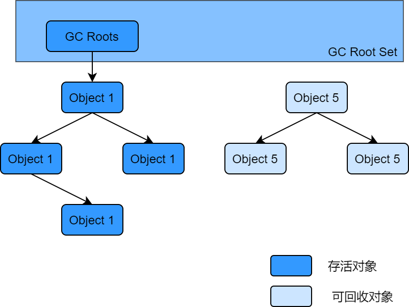
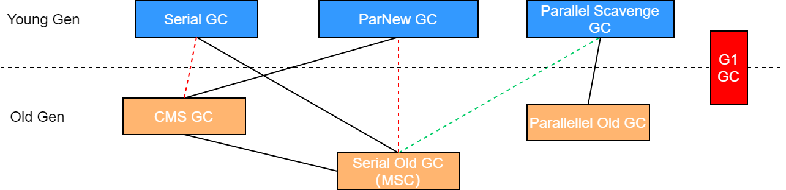
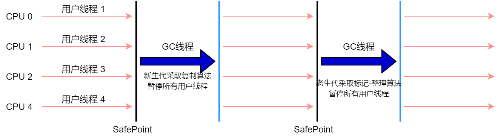
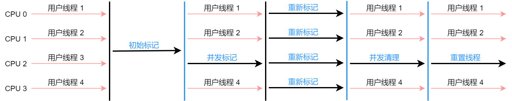

# 垃圾回收概念

## System.gc()

**理解** 

在默认情况下，通过System.gc()或者Runtime.getRuntime().gc()的调用，会显示触发Full GC，同时对老年代和新生代进行回收，尝试释放被丢弃对象占用的内存。然而System.gc()调用附带一个免责声明，无法保证对垃圾收集器的调用。JVM实现者可以通过System.gc()调用来决定JVM的GC行为。而一般情况下，垃圾回收应该是自动进行的，无须手动触发，否则就太过于麻烦了。在一些特殊情况下，如我们正在编写一个性能基准，我们可以在运行之间调用System.gc()。

## 内存溢出与内存泄漏

### 内存溢出（OOM）概念

- 内存溢出相对于内存泄漏来说，尽管更容易被理解，但是同样的，内存溢出也是引发程序崩溃的罪魁祸首之一。


- 由于GC一直在发展，所有一般情况下，除非应用程序占用的内存增长速度非常快，造成垃圾回收已经跟不上内存消耗的速度，否则不容易出现OOM的情况。


- 大多数情况下，GC会进行各种年龄段的垃圾回收，实在不行就放大招，来一次独占式的Full GC操作，这时候会回收大量的内存，供应用程序继续使用。


- javadoc中对OutOfMemoryError的解释是，没有空闲内存，并且垃圾收集器也无法提供更多内存。


- 首先没有空闲内存情况：说明java虚拟机的内存不够，原因有二：            

  （1）Java虚拟机的堆内存设置不够。            

  （2）代码中创建了大量大对象，并且长时间不能被垃圾收集器收集（存在被引用）

### 内存泄漏（Memory Leak）概念

严格来说，只有对象不会再被程序用到，但是GC又不能回收他们的情况，才叫内存泄漏。但实际情况很多时候一些不太好的实践（或疏忽）会导致对象的生命周期变得很长甚至导致OOM，也可以叫做宽泛意义上的“内存泄漏”。尽管内存泄漏并不会立刻引起程序崩溃，但是一旦发生内存泄漏，程序中的可用内存就会被逐步蚕食，直至耗尽所有内存，最终出现OutOfMemory异常，导致程序崩溃。

**注意**     

这里的存储空间并不是指物理内存，而是指虚拟内存大小，这个虚拟内存大小取决于磁盘交换区设定的大小。

举例：    

​	1）单例模式    单例的生命周期和应用程序是一样长的，所以单例程序中，如果持有对外部对象的引用的话，那么这个外部对象是不能被回收的，则会导致内存泄漏的产生。    

​	2）一些提供close的资源未关闭导致内存泄漏    数据库连接(DataSource.getConnection()),网络连接（socket）和io连接必须手动close，否则是不能被回收的。

## Stop The World

简称STW，指的是GC事件发生过程中，会产生应用程序的停顿。停顿产生应用程序的停顿。停顿产生时，整个应用程序线程都会被暂停，没有任何响应，有点像卡死的感觉，整个停顿就被称为STW。
可达性分析算法中枚举根节点（GC Roots）会导致所有Java执行线程停顿。

- 分析工作必须在一个确保一致性的快照中进行


- 一致性是指整个分析期间整个执行系统看起来像被冻结在某个时间点上


- 如果出现分析过程中对象引用关系还在不断变化，则分析结果的准确性无法保证

## 垃圾回收的并行与并发

**并行** 

指多条垃圾收集器线程并行工作，但此时用户线程仍处于等待状态。

​	如ParNew、Parallel Scavenge、Parallel Old；

**并发** 

指用户线程与垃圾收集器线程同时进行（但不一定是并行的，可能会交替执行），垃圾回收线程在执行时不会停顿用户程序的运行。

​	用户程序继续运行，而垃圾收集程序线程运行于另一个CPU上

​	如：CMS、G1

## 安全点与安全区域

### 安全点（Safe Point）

程序执行时并非在所有地方都能停顿下来开始GC，只有在特定的位置才能停顿下来开始GC，这些位置称为“安全点（Safepoint）”。

Safe Point的选择很重要，如果太少可能会导致GC等待时间太长，如果太频繁可能导致运行时的性能问题。大部分指令的执行时间都非常短暂，通常会根据“==是否具有让程序长时间执行的特征== ”为标准。比如：选择一些执行时间较长的指令作为Safe Point，如**方法调用、循环跳转和异常跳转**等。

### 安全区域（Safe Region）

安全区域是指在一段代码片段中，对象的引用关系不会发生变化，在这个区域中的任何位置开始GC都是不安全的。

---

**如何在GC发生时，检查所有线程都跑到最近的安全点停顿下来呢？** 

抢先式中断（目前没有虚拟机采用）            

​	首先中断所有线程。如果还有线程不在安全点，就恢复线程，让线程跑到一个安全点。

主动式中断            

​	设置一个中断标志，各个线程运行到Safe Point的时候主动轮询这个标志，如果中断标志为真，则将自己进行中断挂起。

**安全区域实际执行** 

​	当线程运行到Safe Region的代码时，首先标识已经进入了Safe Region，如果这段时间内发生GC，JVM会忽略标识为Safe Region状态的线程；

​	当线程即将离开Safe Region时，会检查JVM是否已经完成GC，如果完成了，则继续运行，否则线程必须等待直到收到可以安全离开Safe Region的信号为止；

## 引用

**强引用（StrongReference）** ：最传统的“引用”的定义，是指在程序代码之中普遍存在的引用赋值，即类似“Object obj=new Object()”这种引用关系。无论在任何情况下，只要强引用关系还存在，垃圾收集器就永远不会回收掉被引用的对象。

**软引用（SoftReference）** ：在系统将要发生内存溢出之前，将会把这些对象列入回收范围之中进行第二次回收。如果这次回收后还没有足够的内存，才会抛出内存溢出异常。

**弱引用（WeakReference）**：被弱引用关联的对象只能生存到下一次垃圾收集之前。当垃圾收集器工作时，无论内存空间是否足够，都会回收掉被弱引用关联的对象。

**虚引用（PhantomReference）**：一个对象是否有虚引用的存在，完全不会对其生存时间构成影响，也无法通过虚引用来获得一个对象的实例。为一个对象设置虚引用关联的唯一目的就是能在这个对象被收集器回收时收到一个系统通知。

---

1、强引用（造成Java内存泄漏的主要原因之一）

普通系统99%以上都是强引用强引用的对象是可触及的，垃圾收集器就永远不会回收掉被引用的对象。特点：强引用可以直接访问目标对象。强引用所指向的对象在任何时候都不会被系统回收，虚拟机宁愿抛出OOM异常，也不会回收强引用所指向对象强引用可能导致内存泄漏

2、软引用

软引用是用来描述一下还有用，但非必要的对象。软引用通常用来实现内存敏感的缓存。比如：高速缓存就用到软引用。如果还有空闲内存，就可以暂时保留缓存，当内存不足时清理掉，这样就保证了使用缓存的同时，不会耗尽内存。垃圾回收器在某个时刻决定回收软可达的对象的时候，会清理软引用，并可选地把引用存放到一个引用队列

```java
Object obj = new Object();
SoftReference<Object> sf = new SoftReference<>(obj);obj = null; //销毁强引用
```

3、弱引用（发现就回收）由于垃圾回收器的线程通常优先级很低，因此，并不一定能很快地发现持有弱引用的对象，在这种情况下，弱引用对象可以存在较长的时间

**面试题:你开发中用过WeekHashMap吗？** 
4、虚引用-对象回收跟踪

为一个对象设置虚引用关联的唯一目的在于跟踪垃圾回收过程。比如：能在这个对象被垃圾回收器回收到一个系统通知。

5、终结器引用

​	它用以实现对象的finalize()方法，也可以称为终结器引用。

​	无需手动编码，其内部配合引用队列使用在GC时，终结器引用队列入队。

​	由Finalizer线程通过终结器引用被引用对象并调用它的finalize()方法，第二次GC时才能回收被引用对象。

# 垃圾回收算法

## 垃圾标记阶段：对象存活

在堆里存放着几乎所有的Java对象实例，在GC执行垃圾回收之前，首先需要区分出内存中哪些是存活对象，哪些是已经死亡的对象。只有被标记为已经死亡的对象，GC才会在执行垃圾回收时，释放掉其所占用的内存空间，因此这个过程我们可以称为垃圾标记阶段。

那么在JVM中究竟是如何标记一个死亡对象呢？简单来说，当一个对象已经不被任何存活对象继续引用时，就可以宣判为已经死亡。

判断对象存活一般有两种方式：引用计算算法和可达性分析算法。

### 引用计数算法

引用计数算法比较简单，对每个对象保存一个整型的引用计数器属性。用于记录对象被引用的情况。

对于一个对象A，只要有任何一个对象引用了A，则A的引用计数器就加1；当引用失效时，引用计数器就减一。只要对象A的引用计数器的值为0，即表示对象A不可能再次被使用，可进行回收。

优点：实现简单，垃圾对象便于辨识；判定效率高，回收没有延迟性。

缺点：               

​	1）、它需要单独的字段存储计数器，这样的做法增加了存储空间的开销。               

​	2）、每次赋值都需要更新计数器，伴随着加法和减法操作，这增加了时间开销。                

​	3）、引用计数器有一个严重的问题，即无法处理循环引用的情况。这是一条致命缺陷，导致在Java的垃圾回收器中没有使用这类算法。

### 可达性分析算法（根搜索算法、追踪性垃圾收集）

相对于引用计数算法而言，可达性分析算法不仅同样具备实现简单和执行高效等特点，更重要的是该算法可以有效地解决在引用分析算法中循环引用的问题，防止内存泄漏的发生。

相较于引用计数算法，这里的可达性分析就是Java、C#选择的。这种类型的垃圾收集通常也叫作追踪性垃圾收集。



### GC Roots    

在java语言中，GC Roots包括以下几类元素：

- 虚拟机栈中引用的对象；比如，各个线程被调用的方法中使用到的参数、局部变量等。


- 本地方法栈内JNT（通常说的本地方法）引用的对象


- 方法区中类静态属性引用的对象；比如，Java类的引用类型静态变量


- 方法区中常量引用的对象；比如，字符串常量池里的引用


- 所有被同步锁synchronized持有的对象


- Java虚拟机内部的引用；基本数据类型对应的Class对象，一些常驻的异常对象（如：NullPointerException、OutOfMemoryError）,系统类加载器


- 反映Java虚拟机内部情况的JMXBean、JVMTI中注册的回调、本地代码缓存等


- 除了这些固定的GC Roots集合以外，根据用户所选用的垃圾收集器以及当前回收的内存区域不同，还可以有其他对象“临时性”地加入，共同构成完整的GC Roots集合。比如，分代收集和局部回收（Partial GC）            

如果只针对Java堆中的某一块区域进行垃圾回收（比如，典型的只针对新生代），必须考虑到内存区域是虚拟机自己的实现细节，更不是孤立封闭的，这个区域的对象完全有可能被其他区域的对象所引用，这时候就需要一并将关联的区域对象也加入GC Roots集合中考虑，才能保证可达性分析的准确性。

**小技巧** ：由于Root采用栈方式存放变量和指针，所以如果一个指针，它保存了堆内存里面的对象，但是自己又不存放在堆内存里面，那它就是一个Root。
 **注意** ：

- 如果要使用可达性分析算法来判断内存是否可回收，那么分析工作必须在一个能保障一致性的快照中进行。这点不满足的话分析结果的准确性就无法保证。


- 这点也是导致GC进行时必须“Stop The World”的一个重要原因。即使是号称（几乎）不会发生停顿的CMS收集器中，枚举根节点时也是必须要停顿的。

## 对象的finalization机制

- Java语言提供了对象终止（finalization）机制来允许开发人员提供对象被销毁之前的自定义处理逻辑。


- 当垃圾回收器发现没有引用指向一个对象，即：垃圾回收此对象之前，总会先调用这个对象的finalize()方法。


- finalize()方法允许在子类中被重写，用于在对象被回收时进行资源释放。通常在这个方法中进行一些资源释放和清理工作，比如关闭文件、套接字和数据库连接等。


- 永远不要主动调用某个对象的finalize()方法，应该交给垃圾回收机制调用。理由包括下面三点：            

  1）、在finalize()时可能会导致对象复活。            

  2）、finalize()方法的执行时间是没有保障的，它完全由GC线程决定，极端情况下，若不发送GC，则finalize()方法将没有机会执行。            

  3）、一个糟糕的finalize()会严重影响GC的性能。

- 从功能上来说，finalize()方法与C++中的析构函数比较相似，但是Java采用的是基于垃圾回收器的自动内存管理机制，所以finalize()方法在本质上不同于C++中的析构函数。


- 由于finalize()方法的存在，虚拟机中的对象一般处于三种可能的状态。

### 生存还是死亡

如果从所有的根节点都无法访问到某个对象，说明对象已经不再使用了。一般来说，此对象需要被回收。但事实上，也并非是“非死不可”的，这时候它们暂时处于“缓刑”阶段。一个无法触及的对象有可能在某一个条件下“复活”自己，如果这样，那么对它的回收就是不合理的，为此，定义虚拟机中的对象可能的三种状态。如下：

- 可触及的：从根节点开始，可以到达这个对象。


- 可复活的：对象的所有引用被释放，但是对象有可能在finalize()中复活


- 不可触及的：对象的finalize()被调用，并且没有复活，那么就会进入不可触及状态。

不可触及的对象不可能被复活，因为finalize()只会被调用一次。

以上3种状态中，是由于finalize()方法的存在，进行的区分。只有在对象不可触及时才可以被回收。

**具体过程** 

判断一个对象ObjA是否可回收，至少要经历两次标记过程：

1、如果对象ObjA到GC Roots没有引用链，则进行第一次标记。

2、进行筛选，判断此对象是否有必要执行finalize()方法    

​	1）如果对象ObjA没有重写finalize()方法，或者finalize()方法已经被虚拟机调用过，则虚拟机视为“没有必要执行”，ObjA被判定为不可触及的。    

​	2）如果对象ObjA重写了finalize()方法，且还未执行过，那么ObjA会被插入到F-Queue队列中，由一个虚拟机自动创建的，低优先级的Finalizer线程触发其finalize()方法执行。    

​	3）==finalize()方法是对象逃脱死亡的最后机会== ，稍后GC会对F-Queue队列中的对象进行第二次标记。如果ObjA在finalize()方法中与引用链上的任何一个对象建立联系，那么在第二次标记时，ObjA会被移出“即将回收”集合。之后对象会再次出现没有引用存在的情况。在这个情况下，finalize()方法不会再次被调用，对象会直接变成不可触及的状态，也就是说，一个对象finalize()方法只会被调用一次。

## MAT与JProfiler的GC Roots溯源

## 垃圾清除阶段

### 标记-清除算法

**执行过程** 

当堆中的有效内存空间被耗尽的时候，就会停止整个程序（也被称为stop the world），然后进行两项工作，第一项则是标记，第二项则是清除。

- 标记：Collector从引用根节点开始遍历，标记所有被引用的对象。一般是在对象的Header中记录为可达对象。


- 清除：Collector对堆内存从头到尾进行线性的遍历，如果发现某个对象在其Header中没有标记为可达对象，则将其回收。

**缺点** 

- 效率不算高


- 在进行GC的时候，需要停止整个应用程序，导致用户体验差


- 这种方式清理出来的空闲内存是不连续的，产生内存碎片。需要维护一个空闲列表

==注意：何为清除？== 

这里所谓的清除并不是真的置空，而是把需要清除的对象地址保存在空闲的地址列表里。下次有新对象需要加载时，判断垃圾的位置是否够，如果够，就存放。

### 复制算法

**核心思想：** 

将活着的内存空间分为俩块，每次只使用其中的一块，在垃圾回收时将正在使用的内存中的存活对象复制到未被使用的内存块中，之后清除正在使用的内存块的所有对象，交换两个内存的角色，最后完成垃圾回收。

**优点：** 

- 没有标记和清除过程，实现简单，运行高效


- 复制过去以后保证空间的连续性，不会出现“碎片”问题

**缺点：** 

- 此算法的缺点也是很明显的，就是需要两倍的内存空间。


- 对于G1这种分拆成为大量region的GC，复制而不是移动，意味着GC需要维护region之间对象引用关系，不管是内存或者时间开销也不小。

**特别的：** 

如果系统中的垃圾对象很多，复制算法不会很理想，因为复制算法需要复制的存活对象数量并不会太大，或者说非常低才行。

**应用场景：** 

在新生代，对常规应用的垃圾回收，一次通常可以回收70%-99%的内存空间。回收性价比很高，所以现在商业虚拟机都是用这种收集算法回收新生代。

### 标记-压缩（或标记-整理、Mark-compact）算法

**执行过程** 

第一阶段和标记-清除算法一样，从根节点开始标记所有被引用对象

第二阶段将所有的存活对象压缩到内存的一端，按顺序排放。

之后，清理边界外所有的空间。

----

标记-压缩算法的最终效果等同于标记-清除算法执行完成后，再进行一次内存碎片整理，因此，也可以把它称为标记-清除-压缩算法

二者的本质差异在于标记-清除算法是一种非移动式的回收算法，标记-压缩是移动式的。是否移动回收后的存活对象是一项优缺点并存的风险决策。

可以看到，标记的存活对象将会被整理，按照内存地址异常排列，而未被标记的内存会被清理掉。如此一来，当我们需要给新对象分配内存时，JVM只需要持有一个内存的起始地址即可，这比维护一个空闲列表显然少了许多开销。

---

优点：

- 消除了标记-清除算法当中，内存区域分散的缺点，我们需要给新对象分配内存时，JVM只需要持有一个内存的起始地址即可。


- 消除了复制算法中，内存减半的高额代价。

缺点：

- 从效率上来说，标记-整理算法要低于复制算法。


- 移动对象的同时，如果对象被其他对象引用，则还需要调整引用的地址。


- 移动过程中，需要全程暂停用户应用程序。即：STW

4、总结

|      | Mark-Sweep | Mark-Compect | Copying             |
| ---- | ---------- | ------------ | ------------------- |
| 速度   | 中等         | 最慢           | 最快                  |
| 空间开销 | 少（会堆积碎片）   | 少（不堆积碎片）     | 通常需要活对象的2倍大小（不堆积碎片） |
| 移动对象 | 否          | 是            | 是                   |

效率上来说，复制算法是当之无愧的老大，但是缺浪费了太多内存。

而为了尽量兼顾上面提到的三个指标，标记-整理算法相对来说更平滑一些，但是效率上不尽如人意，它比复制算法多了一个标记阶段，比标记-清除多了一个整理内存阶段。

## 分代收集算法

分代收集算法，是基于这样一个事实：不同的对象的生命周期是不一样的。因此，不同生命周期的对象可以采用不同的收集方式，以便提高回收效率。一般是把Java堆分为新生代和老年代，这样就可以根据各个年代的特点使用不同的回收算法，以提高垃圾回收效率。

**年轻代** 

特点：区域相对老年代较小，对象生命周期短、存活率低，回收频繁。

这种情况复制算法的回收整理，速度是最快的。复制算法的效率只和当前存活对象大小有关，因此很适用于年轻代的回收。而复制算法内存利用率不高的问题，通过hotspot中的两个survivor的设计得到缓解。

**老年代** 

特点：区域比较大，对象生命周期长、存活率高，回收不及年轻代频繁。

这种情况存在大量存活率高的对象，复制算法明显不合适。一般是由标记-清除或者是标记-清除与标记-整理的混合实现。

- Mark阶段的开销与存活对象的数量成正比


- Sweep阶段的开销与所管理区域的大小成正相关


- Compact阶段的开销与存活对象的数据成正比。

## 增量收集算法

**基本思想**

如果一次性将所有的垃圾进行处理，需要造成系统长时间的停顿，那么就可以让垃圾收集线程和应用程序线程交替执行。每次，垃圾收集线程只收集一小片区域的内存空间，接着切换到应用程序线程。依次反复，直到垃圾收集完成。

总的来说，增量收集算法的基础仍是传统的标记-清除和复制算法。增量收集算法通过对线程间冲突的妥善处理，允许垃圾收集线程以分阶段的方式完成标记、清理或复制工作。

**缺点：** 

使用这种方式，由于在垃圾回收过程中，间断性地还执行了应用程序代码，所以能减少系统的停顿时间。但是，因为线程切换和上下文转换的消耗，会使得垃圾回收的总体成本上升，造成系统吞吐量的下降。

## 分区算法

一般来说，在相同条件下，堆空间越大，一次GC时所需要的时间越长，有关GC产生的停顿也越长。为了更好地控制GC产生的停顿时间，将一块大的内存区域分割成多个小块，根据目标的停顿时间，每次合理地回收若干小区间，而不是整个堆空间，从而减少一次GC所产生的停顿。

分代算法将按照对象的生命周期长短划分成两个部分，分区算法将整个堆空间划分成连续的不同小区间。

每一个小区间都独立使用，独立回收。这种算法的好处是可以控制一次回收多少个小区间。

# 垃圾回收器

## GC分类与性能指标

性能指标：

- 吞吐量：运行用户代码的时间占总运行时间的比例（运行时间：程序的运行时间+内存回收的时间）


- 垃圾收集开销：吞吐量的补数，垃圾收集所用时间与运行时间的比例


- 暂停时间：执行垃圾收集时，程序的工作线程被暂停的时间。


- 收集频率：相对于应用程序的执行，收集操作发生的评率。


- 内存占用：Java堆区所占的内存大小。


- 快速：一个对象从诞生到被回收所经历的时间。



查看默认垃圾收集器的命令

```
-XX:+PrintCommandLineFlags:查看命令行相关参数（包含使用的垃圾收集器）
使用命令行指令:jinfo -flag 相关垃圾回收器参数 进程ID
```

## Serial回收器：串行回收

- Serial收集器采用复制算法、串行回收和“Stop-the-world”机制的方式执行内存回收。


- Serial Old收集器同样采用了串行回收和“Stop-the-world”机制，只不过内存回收算法使用的是标记-压缩算法。



优势：    

​	简单而高效（与其他收集器的单线程相比），对于限定单个CPU的环境来说，Serial收集器由于没有线程交互的开销，专心做垃圾收集器自然可以 获得最高的单线程收集效率。
​	在用户的桌面应用场景中，可用内存一般不大（几十MB至一两百MB），可以在较短时间内完成垃圾收集（几十ms至一百多ms），只要不频繁发生，使用串行回收器是可以接受的。

在HotSpot虚拟机中，使用-XX:+UseSerialGC参数可以指定年轻代和老年代都使用串行收集器。

## ParNew回收器：并行回收

- 如果说Serial GC是年轻代中的单线程垃圾收集器，那么ParNew（Par是Parallel的缩写，New：只能处理的是新生代）收集器则是Serial收集器的多线程版本。


- ParNew收集器除了采用并行回收的方式执行内存回收外，俩款垃圾收集器之间几乎没有任何区别。ParNew收集器在年轻代中同样也是采用复制算法、“Stop-the-World”机制。


- ParNew是很多JVM运行的Server模式下新生代的默认垃圾收集器。

由于ParNew收集器是基于并行回收，那么是否可以断定ParNew收集器的回收效率在任何场景下都会比Serial收集器更高效？

- ParNew收集器运行在多CPU的环境下，由于可以充分利用多CPU、多核心等物理硬件资源优势，可以更快速地完成垃圾收集，提升程序的吞吐量。


- 但是在单个CPU的环境下，ParNew收集器不比Serial收集器更高效。虽然Serial收集器是基于串行回收，但是由于CPU不需要频繁地做任务切换，因此可以有效避免多线程交互过程中产生的一些额外开销。

## Parallel回收器：吞吐量优先

- 采用复制算法、并行回收和“Stop the World”


- 那么Parallel收集器的出现是否多此一举？            

  1）、和ParNew收集器不同，Parallel Scavenge收集器的目标则是达到一个可控制的吞吐量，它也被称为吞吐量优先的垃圾收集器。            

  2）、自适应调节策略也是Parallel Scavenge与ParNew一个 重要区别。


- 高吞吐量则可以高效率地利用CPU时间，尽快完成程序的运算任务，主要适合在后台运算而不需要太多交互的任务。因此，常见在服务器环境中使用。例如，那些执行批量处理、订单处理、工资支付、科学计算的应用程序。


- Parallel收集器在JDK1.6时提供了用于执行老年代垃圾收集的Parallel Old收集器，用来代替老年代的Serial Old收集器。


- Parallel Old收集器采用了标记-压缩算法，但同样也是基于并行回收和“stop-the-world”机制。

```
-XX:+UseParallelGC    手动指定年轻代使用Parallel并行收集器执行内存回收任务。
-XX:+UserParallelOldGC    手动指定老年代都是使用并行回收收集器。 1)分别适用于新生代和老年代。默认jdk8是开启的。2)上面两个参数，默认开启一个，另一个也会被开启（互相激活）
-XX:ParallelGCThreads    设置年轻代并行收集器的线程数。一般地，最好与CPU数量相等，避免过多线程数影响垃圾收集性能。
    1)在默认情况下，当CPU数量少于8个，ParallelThreads的值等于CPU数量。
    2)当CPU数量大于8个，ParallelGCThreads的值等于3+[5*CPU_Count]/8
-XX:MaxGCPauseMillis 设置垃圾收集器最大停顿时间（即STW的时间）。单位是毫秒。
    1)为了尽可能地把停顿时间控制在MaxGCPauseMillis以内，收集器在工作时会调整Java堆大小或其他参数。
    2)对于用户来讲，停顿时间越短体验越好。但是在服务器端，我们注重高并发，整体的吞吐量。所以服务器端适合Parallel，进行控制。
    3)该参数使用需谨慎。
-XX:GCTimeRatio    垃圾收集时间占总时间的比例(=1/(N+1))。用于衡量吞吐量的大小。
-XX:+UserAdaptiveSizePolicy    设置Parallel Scavenge收集器具有自适应调节策略
```

## CMS回收器：低延迟

采用标记-清除算法，并且也会“stop-the-world”

目前很大一部分的Java应用集中在互联网站或者B/S系统的服务端上，这类应用尤其重视服务的响应速度，希望系统停顿时间最短。



- **初始标记阶段** ：在这个阶段中，程序中所有的工作线程都会将会因为“stop-the-world”机制而出现短暂的暂停，这个阶段的主要任务==仅仅是标记出GC Roots能直接关联到的对象。== 一旦标记完成之后就会恢复之前被暂停的所有应用线程。由于直接关联对象比较小，所以这里的==速度非常快== 。
- **并发标记阶段** ：从GC Roots的==直接关联对象开始遍历整个对象图的过程== ，这个过程==耗时较长== 但是==不需要停顿用户线程== ，可以与垃圾收集线程一起并发运行。
- **重新标记阶段** ：由于在并发标记阶段中，程序的工作线程会和垃圾收集线程同时运行或交叉运行，因此为了==修正并发标记期间，用户程序继续运作而导致标记产生变动的那一部分对象的标记记录== ，这个阶段的停顿时间通常会比初始阶段标记阶段稍长一些，但是也远比并发标记阶段的时间短。
- **并发清除阶段** ：此阶段==清理删除标记阶段判断的已经死亡的对象，释放内存空间== 。由于不需要移动存活对象，所以这个阶段也是可以与用户线程同时并发的。

，优点

- 并发收集


- 低延迟

弊端

- 会产生内存碎片，导致并发清除后，用户线程可用的空间不足。在无法分配大对象的情况下，不得不提前触发Full GC。


- CMS收集器对CPU资源非常敏感。在并发阶段，它虽然不会导致用户停顿，但是会因为占用了一部分线程而导致应用程序变慢，总吞吐量会降低。


- CMS收集器无法处理浮动垃圾。可能出现“Concurrent Mode Failure”失败而导致另一次Full GC的产生。在并发标记阶段由于程序的工作线程和垃圾收集线程是同时运行或者交叉运行的，那么在并发标记阶段如果产生新的垃圾对象，CMS将无法对这些垃圾对象进行标记，最终会导致这些新产生的垃圾对象没有被及时回收，从而只能在下一次执行GC时释放这些之前未被回收的内存空间。

> 用户线程的关系修改只有两种：新增引用和删除引用
>
> 这就导致有用的对象都会被标记上，保护其不被回收。而因为CMS忽略记录到的删除关系，所以并发期间CMS只会监听到的新增的引用，比如再并发标记过程中new对象，就会有新增引用，CMS的并发标记过程，除了标记，还在监听用户线程对引用关联的修改。简而言之，就是宁可浪费，不可错杀，因为Object = null之类语句参数的游离对象将不被再次检查，其依然被标记保护。

## G1回收器：区域化分代式

### 优势

- 并行与并发            

  ①并行性：G1在回收期间，可以有多个GC线程同时工作，有效利用多核计算能力。此时用户线程STW            

  ②并发性：G1拥有与应用程序交替执行的能力，部分工作可以和应用程序同时执行，因此，一般来说，不会在整个回收阶段发生完全阻塞应用程序的情况

- 分代收集            

  ①从分代上看，G1依然属于分代型垃圾收集器，它会区分年轻代和老年代，年轻代依然有Eden区和Survivor区。但从堆的结构上看，它不要求整个Eden区、年轻代或者老年代都是连续的，也不再坚持固定大小号固定数量。            

  ②将堆空间分为若干区域，这些区域中包含了逻辑上的年轻代和老年代。           

   ③和之前的各类回收器不同，它同时兼顾年轻代和老年代。对比其他回收器，或者工作在年轻代，或者工作在老年代；


- 空间整合           

   ①CMS：“标记-清除”算法、内存碎片、若干次GC后进行一次碎片整理。           

   ②G1将内存划分为一个个的region。内存的回收是以region作为基本单位的。region之间是复制算法，但整体上实际可看作是标记-压缩算法，两种算法都可以避免内存碎片。这种特性有利于程序长时间运行，分配大对象时因为无法找到连续内存空间而提前触发下一次GC。尤其是当Java堆非常大的时候，G1的优势更加明显。


- 可预测的停顿时间模型（即：软实时soft real-time）            

  另一大优势            

  ①由于分区的原因，G1可以只选取部分区域进行内存回收，这样缩小了回收的范围，因此对于全局停顿情况的发生也能得到较好的控制。            

  ②G1跟踪各个Region里面的垃圾堆积的价值大小（回收所获得的空间大小以及回收所需时间的经验值），在后台维护一个优先列表，每次根据允许的收集时间，优先回收价值最大的region。保证了G1收集器在有限的实际内可以获取尽可能的收集效率。           

   ③相比于CMS GC，G1未必能做到CMS在最好情况下的延时停顿，但是最差情况要好很多。


### 缺点：

​	相比较CMS，G1还不具备全方位、压倒性优势。比如在用户程序运行过程中，G1无论是为了垃圾收集产生的内存占用还是程序运行时的额外负载都要比CMS高。

​	从经验上来说，在小内存应用上CMS的表现大概率会优于G1，而G1在大内存应用上发挥其优势。平衡点在6~8GB之间。

### 操作步骤

第一步：开启G1垃圾收集器

第二步：设置堆的最大内存

第三步：设置最大的停顿时间

### 适用场景

- 面向服务端应用，针对具有大内存、多处理器的机器。（在普通大小的堆里表现并不惊喜）
- 最主要的应用是需要低GC延迟，并具有大堆的应用程序提供解决方案
- - 在堆大小约6GB或更大时，可预测的暂停时间可以低于0.5s；
- 以下G1可能比CMS好：
- - 超过50%的Java堆被活动数据占用；
  - 对象分配频率或年代提升频率变化很大；
  - GC停顿时间过长（长于0.5至1s）

### 回收过程 

​	应用程序分配内存，当年轻代的Eden区用尽时开始年轻代回收过程；G1的年轻代收集阶段是一个并行的独占式收集器。在年轻代回收期，G1 GC暂停所有应用程序线程，启动多线程执行年轻代回收。然后从年轻代区间移动存活对象到Survivor区间或者老年区间，也有可能是两个区间都会涉及。

​	当堆内存使用达到一定值（默认45%）时，开始老年代并发标记过程。

​	标记完成马上开始混合回收过程。对于一个混合回收期，G1 GC从老年区间移动存活对象到空闲区间，这些空闲区间也就成为了老年代的一部分。和年轻代不同，老年代的G1回收器和其他GC不同，G1的老年代回收器不需要整个老年代被回收，一次只需要扫描/回收一部分老年代的Region就可以了。同时，这个老年代Region是和年轻代一起被回收的。


**年轻代GC** 

==第一阶段，扫描根== 

根是指static变量指向的对象，正在执行的方法调用链条上的局部变量等。根引用连同RSet记录的外部引用作为扫描存活对象的入口。

==第二阶段，更新RSet==

处理dirty card queue中的card，更新RSet。此阶段完成后，RSet可以准确的反应老年代对所在的内存分段中对象的引用。

==第三阶段，处理RSet== 

识别被老年代对象指向的Eden中的对象，这些被指定的Eden中的对象被认为是存活的对象。

==第四阶段，复制对象== 

此阶段，对象树被遍历，Eden区内存段中存活的对象会被复制看到Survivor区中空的内存分段，Survivor区内存活的对象如果年龄未达到阈值，年龄就会加1，达到阈值会被复制到Old区中空的内存分段。如果Survivor空间不够，Eden空间的部分数据会直接晋升到老年代空间。

==第五阶段，处理引用== 

处理Soft，Weak，Phantom，Final，JNT Weak等引用。最终Eden空间的数据为空，GC停止工作，而目标内存中的对象都是连续存储的，没有碎片，所以复制过程可以达到内存整理的效果，减少碎片。

**并发标记过程** 

​	①初始标记阶段：标记从根节点直接可达的对象。这个阶段是STW的，并且会触发一次年轻代GC。

​	②根区域扫描：G1 GC扫描Survivor区直接可达的老年代区域对象，并标记被引用的对象。这一过程必须在young GC之前完成。

​	③并发标记：在整个堆中进行并发标记（和应用程序并发执行），此过程有可能被young GC中断。在并发标记阶段，若发现区域对象中的所有对象都是垃圾，那这个区域会被立即回收。同时，并发标记过程中，会计算每个区域的对象活性（区域中存活对象的比例）。

​	④再次标记：由于应用程序持续进行，需要修正上一次的标记结果。是STW的。G1中采用了比CMS更快的初始快照算法：snapshot-at-the-beginning（SATB）。

​	⑤独占清理：计算各个区域的存活对象和GC回收比例，并进行排序，识别可以回收的区域。为下阶段做铺垫。是STW的。（这个阶段并不会实际上去做垃圾的收集）

​	⑥并发清理阶段：识别并清理完全空闲的区域。

**混合回收** 

​	并发标记结束以后，老年代中百分百为垃圾的内存分段被回收了，部分为垃圾的内存分段被计算出来。默认情况下，这些老年代的内存分段会分8次（通过 -XX:G1MixedGCCountTarget设置）被回收。

​	混合回收的回收集包括八分之一的老年代内存分段，Eden区内存分段，Survivor区内存分段。混合回收的算法和年轻代回收的算法完全一样，只是回收集多了老年代的内存分段。具体过程请参考年轻代回收过程。

​	由于老年代中的内存分段默认分8次回收，G1会优先回收垃圾多的内存分段。垃圾占内存分段比例越高的，越会被先回收。并且有一个阈值会决定内存分段是否被回收，-XX:G1MixedGCLiveThresholdPercent，默认为65%，意思是垃圾占内存分段比例要达到65%才会被回收。如果垃圾占比太低，意味着存活的对象占比高，在复制的时候会花费更多的时间。

​	混合回收并不一定要进行8次。有个阈值-XX:G1HeapWastePercent，默认值为10%，意思是允许整个堆内存有10%的空间被浪费，意味着如果发现可以回收的垃圾占堆内存的比例低于10%，则不再进行混合回收。因为GC会花费很多的时间但是回收到的内存却很少。

**Full GC**

导致G1 Full GC的原因可能有两个：

- Evacuation的时候没有足够的to-space来存放晋升的对象；
- 并发处理过程完成之前空间耗尽。


### 优化建议

- 年轻代大小
- - 避免使用-Xmn或-XX:NewRatio等相关选项显示设置年轻代大小
  - 固定年轻代的大小或覆盖暂停时间目标
- 暂停时间目标不要太过苛刻
- - G1 GC的吞吐量目标是90%的应用程序时间和10%的垃圾回收时间
  - 评估G1 GC的吞吐量时，暂停时间目标不要太严苛。目标太过严苛表示你原因承受更多的垃圾回收开销，而这些会直接印象到吞吐量。

## 垃圾回收器总结

- 想要最小化地使用内存和并行开销，选择Serial GC
- 想要最大化应用程序的吞吐量，选择Parallel GC
- 想要最小化GC的中断或停顿时间，选择CMS GC

| 垃圾收集器        | 分类      | 作用位置     | 使用算法         | 特点     | 适用场景                    |
| ------------ | ------- | -------- | ------------ | ------ | ----------------------- |
| Serial       | 串行运行    | 作用于新生代   | 复制算法         | 响应速度优先 | 适用于单CPU环境下的client模式     |
| ParNew       | 并行运行    | 作用于新生代   | 复制算法         | 响应速度优先 | 多CPU环境Server模式下雨CMS配合使用 |
| Parallel     | 并行运行    | 作用于新生代   | 复制算法         | 吞吐量优先  | 适用于后台运算而不需要太多交互的场景      |
| Serial Old   | 串行运行    | 作用于老生代   | 标记-压缩算法      | 响应速度优先 | 适用于单CPU环境下的client模式     |
| Parallel Old | 并行运行    | 作用于老生代   | 标记-压缩算法      | 吞吐量优先  | 适用于后台运算而不需要太多交互的场景      |
| CMS          | 并行运行    | 作用于老生代   | 标记-清除算法      | 响应速度优先 | 适用于互联网或B/S业务            |
| G1           | 并发、并行运行 | 作用于新、老生代 | 标记-压缩算法、复制算法 | 响应速度优先 | 面向服务端应用                 |


# 相关命令/参数配置

- -XX:+PrintCommandLineFlags:查看命令行相关参数（包含使用的垃圾收集器）
- 使用命令行指令：jinfo -flag 相关垃圾收集器参数 进程ID
- - jinfo -flag UseParalleGC 6164
  - jinfo -flag UseG1GC 6164
- -XX:+UseSerialGC：可以指定年轻代和老年代都使用创新收集器
- -XX:+UseParNewGC：表明新生代使用ParNew GC
- -XX:+UseParallelGC：新生代使用Parallel GC
- -XX:+UseParallelOldGC：新生代使用ParallelOld GC
- - 二者可以相互激活
- -XX:ParallelGCThreads：设置年轻代并行收集器的线程个数。一般地，最好与CPU数量相等，以避免过多的线程数影响垃圾收集性能。
- - 在默认情况下，当CPU数量小于8个，ParallelGCThreads的值等于CPU数量
  - 当CPU数量大于8个，ParallelGCThreads的值等于3+[5*CPU_count]/8
- -XX:GCTimeRatio：垃圾收集占总时间的比例(=1/(N+1))。用于衡量吞吐量的大小。
- - 取值范围（0,100），默认值99，也就是垃圾回收时间不超过1%


- -XX:+UseCMSCompactAtFullCollection：用于指定在执行完Full GC后对内存空间进行压缩整理，以此避免内存碎片的产生。不过由于内存压缩整理过程无法并发执行，所带来的问题就是停顿时间变得更长了。
- -XX:CMSFullGCsBeforeCompaction：设置在执行多少次Full GC后对内存空间进行压缩整理。
- -XX:ParallelCMSThreads：设置CMS的线程数量。
- - CMS默认启动的线程数是(ParallelGCThreads+3)/4

> ParallerGCThreads是年轻代并行收集器的线程数。当CPU资源比较紧张时，受到CMS收集器线程的影响，应用程序的性能在垃圾回收阶段可能会非常糟糕。

- -XX:+UseConcMarkSweepGC：手动指定使用CMS收集器执行内存回收任务。
- - 开启该参数配置后会自动将-XX:+UseParNewGC打开。即：ParNew+CMS的组合
- -XX:CMSlnitiatingOccupanyFraction：设置堆内存使用率的阈值，一旦达到该阈值，便开始进行回收。
- -XX:+UseG1GC：手动指定使用G1收集器执行内存回收任务。
- -XX:G1HeapRegionSize：设置每个Region的大小。值是2的次幂，范围是1MB到32MB之间，目标是根据最小的Java堆大小划分出约2048个区域。默认是堆内存的1/2000
- -XX:MaxGCPauseMillis：设置期望达到的最大GC停顿时间指标，默认值200ms
- -XX:ParallelGCThread：设置STW工作线程数的值，最多设置为8
- -XX:ConcGCThreads：设置并发标记的线程数。将n设置为并行垃圾回收线程数的1/4左右。
- -XX:InitatingHeapOccupancyPercent：设置触发并发GC周期的Java堆占用阈值。默认值是45


# GC日志分析

- -XX:+PrintGC：输出GC日志
- -XX:+PrintGCDetail：输出GC详细日志
- -XX:+PrintGCTimeStamps：输出GC的时间戳
- -XX:+PrintGCDateStamps：输出GC的时间戳，以日期的形式
- -XX:+PrintHeapAtGC：在进行GC的前后打印出堆的信息
- -Xloggc:../logs/gc.log：日志文件的输出路径


# ZGC

- ZGC与Shenandoah目标高度相似，在尽可能对吞吐量影响不大的前提下，实现在任意堆内存大小都可以把垃圾收集器的停顿时间限制在十毫秒以内的低延迟。
- 《深入理解Java虚拟机》的定义是：ZGC收集器是一款基于Region内存布局的，（暂时）不设分代的，使用度屏障、染色指针和内存多重映射等技术来实现可并发标记-压缩算法的，以低延迟为首要目标的一款垃圾收集器。
- ZGC的工作过程可以分为4个阶段：并发标记-并发预备重分配-并发重分配-并发重映射等。
- ZGC几乎在所有地方并发执行的，除了初始标记是STW。

```
-javaagent:C:\Users\Public\.BetterIntelliJ\BetterIntelliJ-1.16.jar
```