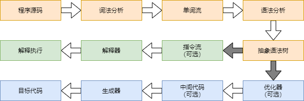

# 执行引擎概述

- 执行引擎是Java虚拟机核心的组成部分之一
- “虚拟机”是一个相对于“物理机”的概念，这两种机器都有代码执行能力，其区别是物理机的执行引擎是直接建立在处理器、缓存、指令集和操作系统层面上的，而==虚拟机的执行引擎则是由软件自行实现的== ，因此可以不受物理条件制约地制定指令集与执行引擎的结构体系，==能够执行那些不被硬件直接支持的指令集格式。== 
- JVM的主要任务是负责==装载字节码到其内部== ，但字节码并不能够直接运行在操作系统上，因为字节码指令并非等价于本地机器指令，它内部包含的仅仅只是一些能够被JVM失败的字节码指令、符号表，以及其他辅助信息。
- 那么，如果想要让一个Java程序运行起来，**执行引擎** 的任务就是==将字节码指令解释/编译为对应平台上的本地机器指令才可以。== 简单来说，JVM中的执行引擎充当了将高级语言翻译为机器语言的译者。

执行引擎的工作过程：

1. 执行引擎在执行的过程中究竟需要执行什么样的字节码指令完全依赖于PC寄存器。
2. 每当执行完一项指令操作后，PC寄存器就会更新下一条需要被执行的指令地址。
3. 当然方法在执行过程汇总，执行引擎有可能会通过存储在局部变量表中的对象引用准确定位到存储在Java堆区中的对象实例信息，以及通过对象头中的元数据指针定位到对象的类型信息。

# Java代码编译和执行过程

大部分的程序代码转换成物理机的目标代码或虚拟机能执行的指令集之前，都需要经过上图中的各个步骤。

**什么是解释器，什么是JIT编译器？** 

- 解释器：当java虚拟机启动时会根据预定义的规范对字节码采用逐行解释的方式执行，将每条字节码文件中的内容“翻译”为对应平台的本地机器指令执行。
- JIT编译器：就是虚拟机将源代码直接编译成和本地机器平台相关的机器语言。

# 字节码文件

- 字节码是一种**中间状态（中间码）的二进制代码** （文件），它比机器码更抽象，需要直译器转译后才能成为机器码
- 字节码主要为了实现特定软件运行和软件环境、与硬件环境无关。
- 字节码的实现方式是通过编译器和虚拟机器。编译器将源码编译成字节码，特定平台上的虚拟机器字节码转译为key直接执行的命令。（==跨平台性== ）

# 解释器

- 解释器真正意义上所承担的角色就是一个运行时“翻译者”，将字节码文件中的内容“翻译”为对应平台的本地机器指令执行。
- 当一条字节码指令被解释完成后，接着再根据PC寄存器中记录的下一条需要被执行的字节码指令执行解释操作。

分类：

- 字节码解释器（古老）
- 模板解释器

# JIT编译器

概念：

- Java语言的“编译期”其实是一段“不确定”的操作过程，因为它可能是指一个**前端编译器** （其实叫编译器的前端更准确一些）把.java文件转变成.class文件的过程；
- 也可能是指虚拟机的**后端运行期编译器** （JIT编译器）把字节码转换成机器码的过程。
- 还可以是指使用**静态提前编译器** 直接把.java文件编译成本地机器代码的过程。

**热点代码及探测方式** 

- 一个被多次调用的方法，或者是一个方法体内部循环次数较多的循环体都可以被称之为“热点代码”，因此都可以通过JIT编译器编译为本地机器指令。由于这种编译方式发生在方法的执行过程中，因此也被称之为栈上替换，或简称OSR编译
- 主要依靠 热点探测功能 判断一个方法是否是热点代码，Hotspot采用的热点探测方式是基于计数器的热点探测
- - 基于计数器的热点探测，Hotspot VM会为每一个方法都建立2个不同类型的计数器，分别为方法调用计数器和回边计数器
  - - 方法调用计数器用于统计方法的调用次数
    - 回边计数器则用于统计循环体执行的循环次数

> 方法调用计数器
>
> > 默认阈值在Client模式下是1500次，在Server模式下是10000次。超过这个阈值就会触发JIT编译。
> >
> > 可以通过-XX:CompileThreshold设定
> >
> > 当一个方法被调用时，会先检查该方法是否存在被JIT编译过的版本，如果存在，则优先使用编译后的本地代码来执行。如果不存在已被编译过的版本，则将此方法的调用计数器值加1，然后判断方法调用计数器与回边计数器值之和是否超过方法调用计数器的阈值。如果已超过阈值，那么会向即时编译器提交一个该方法的代码编译请求。
> >
> > >热度衰减
> > >
> > >> 如果不做任何设置，方法调用计数器的并不是方法被调用的绝对次数，而是一个相对的执行频率，即一段时间之内方法被调用的次数。当超过一定的时间限度，如果方法的调用次数仍然不足以让它提交即时编译器编译，那么这个方法的调用计数器就会被==减少一半== ，这个过程为方法调用计数器==热度衰减== ，而这段时间就称为方法统计的半衰周期。
> > >>
> > >> -XX:-UseCounterDecay:关闭热度衰减
> > >>
> > >> -XX:CounterHalfLiftTime：设置半衰周期的时间，单位是秒。
>
> 回边计数器
>
> > 它的作用是统计一个方法中**循环体代码执行的次数** ，在字节码中遇到控制流向后跳转的指令称为“回边”

---

当Java虚拟机启动时，解释器可以首先发挥作用，而不必等待即时编译器全部编译完成后再执行，这样可以省去很多不必要的编译时间。随着时间的推移，编译器发挥作用，把越来越多的代码编译成本地代码，获得更高的执行效率。