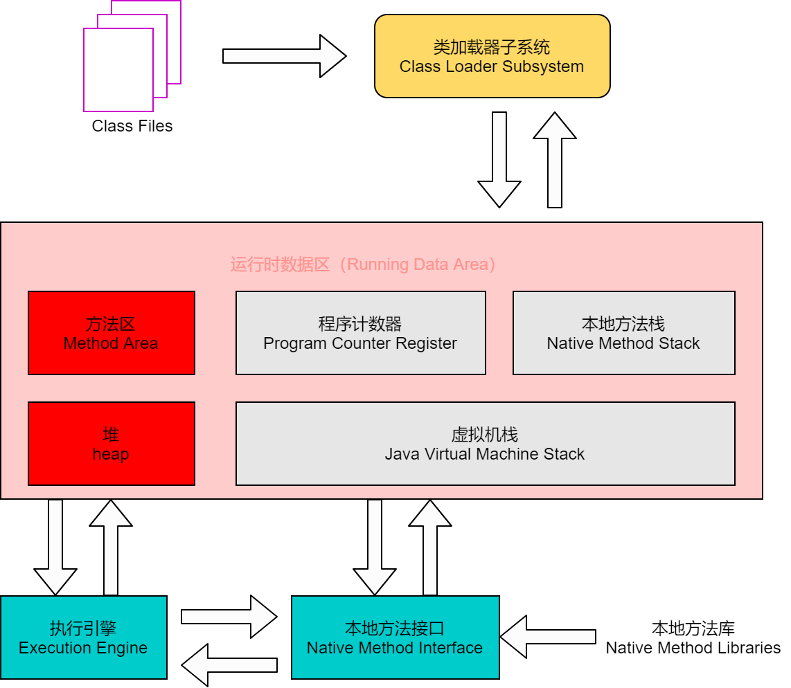
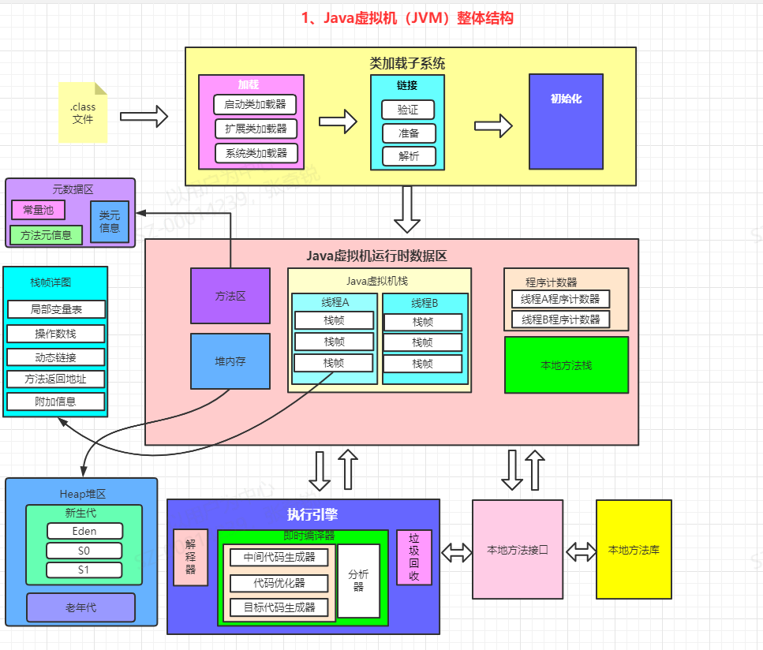
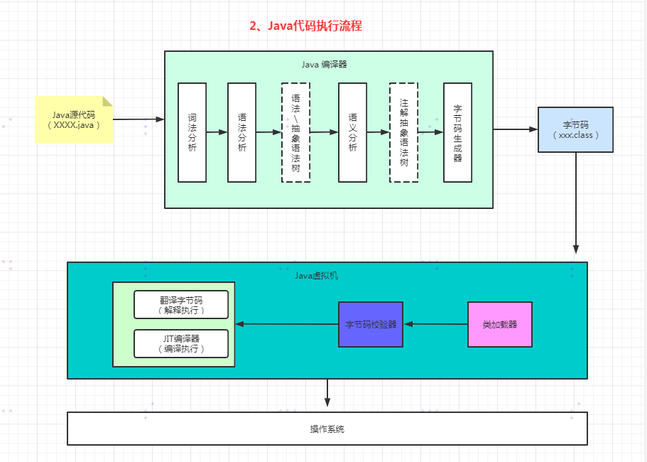

# 整体结构

# java代码执行流程

# JVM的架构模型

## 基于栈的指令集架构

**优点**

- 设计和实现简单，适用于资源受限的系统
- 避开了寄存器的分配难题：使用**零地址指令** 方式分配

> 零地址指令是机器指令的一种，是指令系统中的一种不设地址字段的指令，只有操作码，没有操作数。

- 指令流中大部分都是零地址指令，执行过程依赖操作栈，指令集更小，编译器容易实现
- 不需要硬件支持，可移植性更好，更容易实现跨平台

**缺点**

- 性能下降，实现同样的功能需要更多的指令

## 基于寄存器的指令集架构

**优点**

- 性能优秀，执行更加高效
- 花费更少的指令去完成一项操作

**缺点**

- 指令集架构完全依赖硬件，可移植性差
- 典型应用是X86的二进制指令集，比如传统的PC以及安卓的Davlik虚拟机
- 大部分情况下，指令集往往一地址指令，二地址指令和三地址指令为主。

## 小总结

==由于跨平台性的设计，Java的指令都是根据栈来设计的。== 不同平台CPU架构不同，所以不能设计为基于寄存器的。**优点** 是跨平台，指令集小，编译器容易实现，**缺点** 是性能下降，实现同样的功能需要更多的指令。

# JVM的生命周期

## 虚拟机的启动

通过引导类加载器（bootstrap class loader）创建一个初始化类来完成的，这个类是由虚拟机的具体实现指定的。

## 虚拟机的执行

执行一个Java程序的时候，真正执行的是一个叫Java虚拟机的进程

## 虚拟机的退出

- 程序正常执行结束
- 执行过程遇到异常或错误而异常终止
- 操作系统错误导致java虚拟机进程终止
- Runtime类或System类的exit方法、runtime类的halt方法，并且Java安全管理器允许这次exit或halt操作
- JNI（Java Native Interface）规范描述了用JNI Invocation API来加载或卸载Java虚拟机时，Java虚拟机退出的情况

# JVM发展历程

**sun Classic VM**

​	第一款商用JAVA虚拟机

​	JDK1.4被淘汰

​	只提供了解释器

​	如果使用JIT编译器，就需要外挂，但是JIT和解释器不能配合工作

**Exact VM**

​	为了解决上一个虚拟机问题，JDK1.2时，sun提供了此虚拟机

​	Exact Memory Management：准确式内存管理

​	具有现代高性能虚拟机的雏形：热点探测；编译器与解释器混合工作模式

​	只在Solaris平台短暂使用，其他平台还是Classis VM

**hotspot虚拟机**

​	最初由Longview Technologies的小公司设计，1997年被sun收购，2009年sun公司被甲骨文收购

​	JDK1.3时，HotSpot VM成为默认虚拟机

​	热点代码探测技术：

​		通过计数器找到最具编译价值代码，触发及时编译或栈上替换

​		通过编译器与解释器协同工作，在优化响应时间和最佳执行性能中取得平衡

**JRockit**

**IBM J9**

**KVM和CDC/CLDC HotSpot**

**Azul VM**

**Liquid VM**

**Apache Harmony**

**Microsoft JVM**

**TaobaoJVM**

**Dalvik VM**

**Grall VM**

