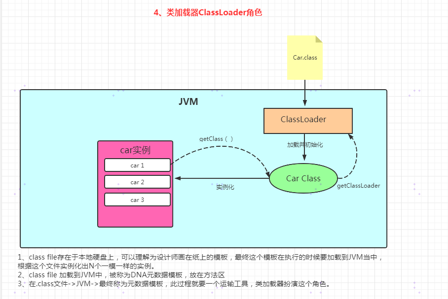
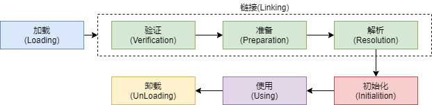
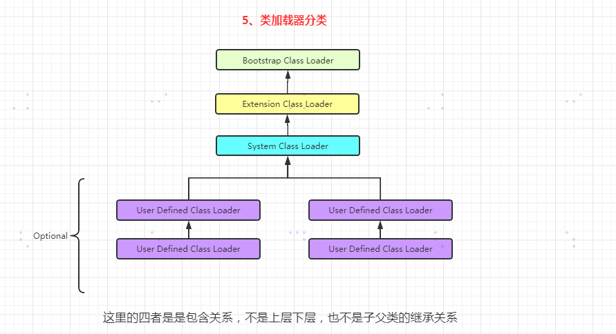
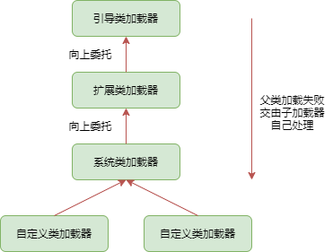

# 作用

- 负责从文件系统或网络中加载Class文件，Class文件开头有特定标识。
- Classloader只负责class文件的加载，至于是否可运行，则由执行引擎决定
- 加载的类信息存放于称为方法区的内存空间，除了类信息，方法区还会存放运行时常量池信息，还可以包括字符串字面量和数字常量（常量池运行时加载到内存中，即运行常量池）

# 角色




# 类加载过程

整体过程




## 加载

1、通过一个类的全限定名获取定义此类的二进制字节流

>加载.class文件的方式
>
>>本地方法系统获取
>>
>>网络获取，Web Applet
>>
>>zip压缩包获取，jar，war
>>
>>运行时计算生成，动态代理
>>
>>有其他文件生成，jsp
>>
>>专有数据库提取.class文件，比较少见
>>
>>加密文件中获取，防止Class文件被反编译的保护措施

2、将这个字节流所代表的静态存储结果转化为方法区的运行时数据结构

3、将内存中生成一个代表这个类的java.lang.Class对象，作为方法区这个类的各种数据访问入口


## 链接

### 验证

**目的**

确保Class文件的字节流中包含信息符合当前虚拟机要求，保证被加载类的正确性，不会危害虚拟机自身安全

**四种验证**

1、文件格式验证

> CA FE BA BE (魔数，Java虚拟机识别)
>
> 主次版本号
>
> 常量池的常量中是否有不被支持的常量类型
>
> 指向常量的各种索引值中是否有指向不存在的常量或不符合类型的常量

2、元数据验证

> 对字节码描述的信息进行语义分析，确保描述符合Java规范
>
> 类是否有父类，除了Object之外，所有的类都应该有父类
>
> 类的父类是否继承了不允许被继承的类（被final修饰的类）
>
> 如果这个类不是抽象类，是否实现了其父类或接口中要求实现的所有方法
>
> 类的字段，方法是否与父类的产生矛盾。例如方法参数都一样，返回值不同

3、字节码验证

> 通过数据流分析和控制流分析，确定程序语义是合法的，符合逻辑的。
>
> 对类的方法体，进行校验分析，确保在运行时不会做出危害虚拟机的行为
>
> 保证任意时刻操作数栈的数据类型与指令代码都能配合工作不会出现类似于在操作数栈放了一个int类型的数据，使用时却按照long类型加载到本地变量表中的情况
>
> 保障任何跳转指令都不会跳转到方法体之外的字节码指令上

4、符号引用验证

> 通过字符串描述的全限定名是否能找到对应的类
>
> 符号引用中类、字段、方法的可访问性是否可被当前类访问

### 准备

- 为类变量分配内存，并且设置该类变量的初始值，即零值


- 不包括用final修饰的static，因为final在编译的时候就会被分配了，准备阶段会显示初始化


- 不会为实例化变量分配初始化，类变量会分配在方法区中，实例变量会随着对象一起分配到Java堆中

### 解析

- 将常量池内的符号引用转换为直接引用空的过程
- 事实上，解析操作往往会伴随JVM在执行完初始化之后再执行
- 符号引用就是一组符号来描述引用的目标。符号引用的字面量形式明确定义在Java虚拟机规范的Class文件格式中
- 直接引用就是直接指向目标的指针，相对偏移量或一个间接定位到目标的句柄
- 解析动作主要针对类，或接口，字段，类方法，接口方法，方法类型等。对应常量池中的CONSTANT_Class_info、CONSTANT_Fieldref_info、CONSTANT_Methodref_info

## 初始化

- 初始化阶段是执行类构造器方法<clinit>()的过程
- 此方法不需要定义，是javac编译器自动收集类中的所有类变量的赋值动作和静态代码块中的语句合并而来

>非法的前向引用问题
>
>如果没有类变量的静态代码块，也不会有clinit

- 构造器方法中的指令按照语句在源文件中出现的顺序执行
- <clinit>()不同于类的构造器(关联：构造器是虚拟机视角下的<clinit>())已经执行完毕
- 虚拟机必须保证一个类的<clinit>()方法在多线程下被加锁

## 使用


## 卸载


## 补充说明

- 加载、验证、准备、初始化和卸载这五个阶段的顺序是确定的。
- 解析阶段不一定，在某些情况下可以在初始化阶段之后再开始，为了支持Java语言的运行时绑定特性（也称为动态绑定或晚期绑定）
- java虚拟机规范严格规定了，有且只有六种情况，必须立即对类进行初始化

> 1、遇到new，getstatic，putstatic或invokestatic这四条字节码指令时。
>
> > 使用new关键字实例化对象
> >
> > 读取或设置一个类型的静态字段（final修饰已在编译期将结果放入常量池的静态字段除外）
> >
> > 调用一个类型的静态方法的时候
>
> 2、对类型进行反射调用，如果类型没有经过初始化，则需要触发初始化
>
> 3、初始化类的时候，发现父类没有初始化，则先触发父类初始化
>
> 4、虚拟机启动时，用户需要指定一个要执行的主类（包含main方法的那个类），虚拟机会初始化这个主类
>
> 5、只用JDK7中新加入的动态语言支持，如果一个java.lang.invoke.MethodHandler实例最后的解析结果为REF_getStatic,REF_putStatic,Ref_incokeStatic,REF_newInvokeSpecial四种类型的方法句柄，并且这个方法对应的类没有进行初始化，则先触发器初始化
>
> 6、当一个接口中定了JDK8新加入的默认方法时，如果这个接口的实现类发生了初始化，要先将接口进行初始化

除了以上几种情况，其他使用类的方式被看做是对类的被动使用，都不会导致类的初始化


# 类加载器分类

JVM支持两种类型的类加载器，分别是==引导类加载器(Bootstrap ClassLoader)== 和==自定义类加载器(User-Defined ClassLoader)== 。

从概念来讲，自定义类加载器一般指的是程序中由开发人员自定义的一类加载器，但从Java虚拟机规范却没有这么定义，而是==将所有派生与抽象类ClassLoader的类加载器都划分为自定义类加载器== 。

事例：

```java
public class ClassLoaderTest {
    public static void main(String[] args) {

        //获取系统类加载器
        ClassLoader systemClassLoader = ClassLoader.getSystemClassLoader();
        System.out.println(systemClassLoader);

        //获取扩展类加载器
        ClassLoader classLoaderParent = systemClassLoader.getParent();
        System.out.println(classLoaderParent);

        //引导类加载器
        ClassLoader bootstrapClassLoader = classLoaderParent.getParent();
        System.out.println(bootstrapClassLoader);

        //对于用户自定义类来说:默认使用系统类加载器加载
        ClassLoader classLoader = ClassLoaderTest.class.getClassLoader();
        System.out.println(classLoader);
      
        //String类使用引导类加载器进行加载的。--->Java的核心类库都是使用引导类加载器进行加载的。
        ClassLoader classLoader1 = String.class.getClassLoader();
        System.out.println(classLoader1);
    }
}
```


## 引导类加载器（启动类加载器）

- C/C++语言实现，嵌套JVM内部
- 用来加载java核心类库，rt.jar,resources.jar,sun.boot.class.path路径下的内容
- 并不继承java.lang.ClassLoader，没有父类加载器
- 出于安全考虑，Bootstrap启动类加载器只加载包名为java\javax\sun等开头的类


## 扩展类加载器

- Java语言编写，由sun.misc.Launcher$ExtClassLoader实现
- 派生与ClassLoader类
- 父类加载器为启动类加载器
- 从java.ext.dirs系统属性所指定的目录中加载类库，或从jre/lib/ext子目录下加载类库


## 系统类加载器（应用程序类加载器）

- Java语言编写，由sun.misc.Launcher$AppClassLoader实现
- 派生与ClassLoader类
- 父类加载器为扩展类加载器
- 负责环境变量classpath或系统属性java.class.path指定路径下的类库
- 该类加载器是程序中默认的类加载器，一般来说，Java应用的类都是由他来完成加载
- 通过ClassLoader#getSystemClassLoader()方法可以后去到该类加载器


## 自定义类加载器

`具体在字节码与类的加载篇` 

**为什么要用自定义类加载器？**

- 隔离加载类
- 修改类加载的方式
- 扩展加载源
- 防止源码泄漏

**实现步骤**

- 继承抽象类java.lang.ClassLoader类的方式，实现自己的类加载器
- 1.2之前，继承并重写loadClass
- 1.2之后，建议把自定义的类加载逻辑写在findClass()方法中
- 如果没有太过复杂的需求，可以直接继承URLClassLoader类，可以避免直接编写findClass()方法以及获取字节码流的方式，使自定义类加载器编写更加简洁。


# ClassLoader

除了启动类加载器，其他类加载器都继承自他

| 方法名                                      | 描述                                       |
| ---------------------------------------- | ---------------------------------------- |
| getParent()                              | 返回该类加载器的超类加载器                            |
| loadClass(String nane)                   | 加载名称为name的类，返回结果为java.lang.Class类的实例     |
| findClass(String name)                   | 查找名称为name的类，返回结果为java.lang.Class类的实例     |
| findLoadedClass(String name)             | 查找名称为name的已经被加载过的类，返回结果为java.lang.Class类的实例 |
| defineClass(String name,byte[] b,int off,int len) | 把字节数组b中的内容转换为一个Java类，返回结果为java.lang.Class类的实例 |
| resolveClass(Class<?> c)                 | 连接指定的一个Java类                             |

**获取ClassLoader的途径**

方式一：获取当前类的ClassLoader

clazz.getClassLoader()

方式二：获取当前线程上下文的ClassLoader

Thread.currentThread().getContextClassLoader()

方式三：获取系统的ClassLoader

ClassLoader.getSystemClassLoader()

方式四：获取调用者的ClassLoader

DriverManager.getCallerClassLoader()


# 双亲委派机制

Java虚拟机对Class文件采用的是按需加载，而且加载Class文件时，Java虚拟机使用的是双亲委派模式，即把请求交由父类处理，它是异种任务委派模式。



过程：

1、如果一个类加载器收到了类加载请求，它并不会自己先去加载。而是把这个请求委托给父类的加载器去执行

2、如果父类加载器还存在其父类加载器，则进一步向上委托，依次递归，请求最终将达到顶层的启动类加载器

3、如果父类的加载器可以完成类加载任务，就成功返回，倘若父类加载器无法完成此加载任务，子加载器才会尝试自己去加载


**优势**

避免类的重复加载

保护程序安全，防止核心api被篡改


# 沙箱安全机制

保证对Java核心源代码的保护


# 补充

在JVM中表示两个class对象，是否为同一个类存在两个必要条件

> 类的完整类名必须一致，包括包名
>
> 加载这个类的ClassLoader必须相同

JVM必须知道一个类型是由启动类加载器加载的，还是由用户类加载器加载的。如果是用户类加载器加载的，JVM会==将这个类加载器的一个引用作为类型信息的一部分，保存到方法区中。== 当解析一个类型到另一个类型的引用的时候，JVM需要保证这两个类型的类加载器是相同的。


**类的主动使用和被动使用**

主动和被动的区别：看有没有执行过初始化

主动使用：

- 创建类的实例
- 访问某个类或接口的静态变量，或者对该静态变量赋值
- 调用类的静态方法
- 反射
- 初始化一个类的子类
- Java虚拟机启动时被标明为启动类的类
- JDK7开始提供的动态语言支持

> java.lang.invoke.MethodHandle实例的解析结果REF_getStatic、REF_putStatic、REF_invokeStatic句柄对应的类没有初始化，则被初始化

被动使用：除了以上主动使用就是被动使用