# 程序计数器（PC寄存器）

## 介绍

JVM中的程序计数器中，Register的命名源于CPU的的寄存器，寄存器存储指令相关的现场信息。CPU只有把数据装载到寄存器才能被运行。

这里，并非是广义上所指的物理寄存器，或许将其翻译为PC计数器会更加贴切，并且也不容易引起一些不必要的误会。==JVM中的PC寄存器是对物理寄存器的一种抽象模拟。== 

## 作用

PC寄存器用来存储指向下一条指令的地址，也即将要执行的指令代码。由执行引擎读取下一条指令。

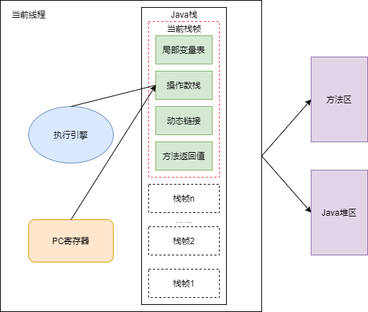

在JVM规范中，每个线程都有它自己的程序计数器，是线程私有的，生命周期与线程的生命周期保持一致。

唯一一个在Java虚拟机规范中没有规定任何OOM情况的区域。

## 举例说明

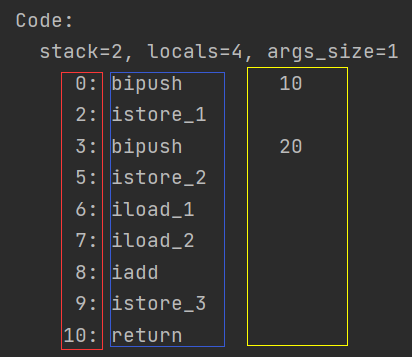

红框：偏移地址或指令地址，PC寄存器中所存储的结构

蓝框：操作指令

## 两个常见问题

==使用PC寄存器存储字节指令地址有什么用呢？==

==为什么使用PC寄存器记录当前线程的执行地址呢？== 

因为CPU需要不停的切换各个线程，这时候切换回来以后，就得知道接着从哪开始继续执行。

JVM的字节码解释器就需要通过改变PC寄存器的值来明确下一条应该执行什么样的字节码指令。


==PC寄存器为什么会被设定为线程私有？== 

**为了能够准确地记录各个线程在执行过程的当前字节码指令地址，最好的办法自然是为每一个线程都分配一个PC寄存器** ，这样一来各个线程之间便可以进行独立计算，从而不会出现互相干扰的情况。

由于CPU时间片轮限制，众多线程在并发执行过程中，任何一个确定的时刻，一个处理器或者多核处理器中的一个内核，只会执行某个线程中的一条指令。

这样必然导致经常中断或恢复，如何保证分毫不差呢？每个线程在创建后，都会产生自己的程序计数器和栈帧，程序计数器在各个线程之间互不影响。

> CPU时间片：CPU分配给各个程序的时间，每个线程被分配一个时间段，称作它的时间片。
>
> > 在宏观上：我们可以同时打开多个应用程序，每个程序并行不悖，同时运行
> >
> > 在微观上：由于只有一个CPU，一次只能处理程序要求的一部分，如何处理公平，一种方法就是引入时间片，每个程序轮流执行。


# 虚拟机栈

## 虚拟机栈概述

**优点：** 跨平台，指令集小，编译器容易实现

**缺点：** 性能下降，同样实现的功能需要更多的指令

**作用：** 

- 主管Java程序的运行，它保存方法的局部变量（8种基本数据类型、对象的引用地址）、部分结果，并参与方法空的调用和返回。
- 局部变量 vs 成员变量（或属性）
- 基本数据变量 vs 引用类型变量（类、数组、接口）


-Xss 设置线程最大栈空间；

## 栈的存储单位

栈中的数据都是以==栈帧== 的格式存在；

一条活动的线程中，一个时间节点上，只会有一个活动的栈帧。只有当前正在执行的方法的栈栈顶栈帧是有效的，这个称为当前栈帧，对应方法是当前方法，对应类是当前类；

执行引擎运行的所有字节码指令只对当前栈帧进行操作；

如果方法中调用了其他方法，对应的新的栈帧会被创建出来，放在顶端，成为新的当前帧


栈帧的内部结构：

- 局部变量表
- 操作数栈
- 动态链接
- 方法返回地址
- ​一些附加信息

### 局部变量表

- ==定义为一个数字数组，主要用于存储方法参数和定义在方法体内的局部变量== ，这些数据类型包括各类基本数据类型、对象引用、returnAddress类型
- 由于局部变量是建立在线程的栈上，是线程的私有数据，因此==不存在数据安全问题== 
- ==局部变量表所需的容量大小是在编译期确定下来的== ，并保存在方法的Code属性的maximum local variables数据项中。在方法运行期间是不会改变局部变量表的大小的。
- ==方法嵌套调用的次数由栈的大小决定。== 一般来说，栈越大，调用次数越多。
- ==局部比那里表中的变量只在当前方法调用中有效。== 在方法执行时，虚拟机通过使用局部变量表完成参数值到参数变量列表的传递过程。==当方法调用结束后，随着方法栈帧的销毁，局部变量表也会随之销毁。==  

#### 关于Slot的理解

- 参数值的存放总是在局部变量数组的index0开始，到数组长度-1的索引结束。
- 局部变量表，==最基本的存储单元是Slot== 
- 局部变量表中存放编译期可知的各种数据类型（8种），引用数据类型（reference），returnAddress类型的变量。
- 在局部变量表里，==32位以内的类型只占用一个Slot（包括returnAddress类型），64位的类型（long和double）占用两个Slot。== 
- - byte、short、char在存储前被转换为int，boolean也被转换为int，0表示false，1表示true。
  - long和double则占据两个Slot。
- JVM会为局部变量表中的每一个Slot都分配一个访问索引，通过这个索引即可成功访问到局部变量表中指定的局部变量值。
- 当一个实例方法被调用的时候，它的方法参数和方法体内部定义的局部变量将会==按照顺序复制== 到局部变量表中的每一个Slot上
- ==如果需要访问局部变量表中一个64bit的局部变量值时，只需要使用前一个索引即可。== （比如：访问long或double类型变量）
- 如果当前帧是由构造方法或实例方法创建的，那么==该对象引用this将会存放在index为0的Slot处== ，其余的参数按照参数表顺序继续排列。

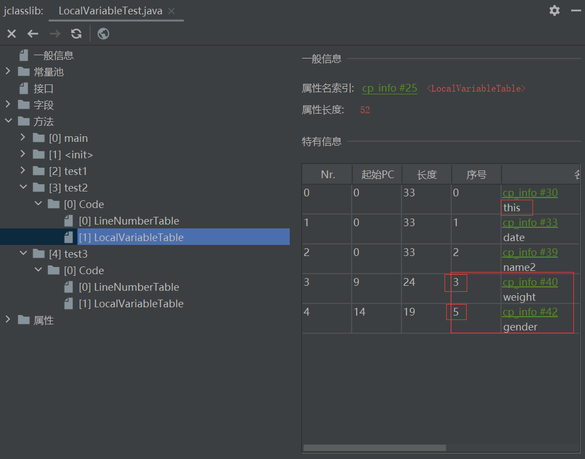

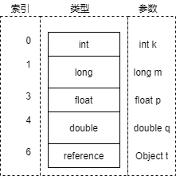

**Slot重复利用问题**

==栈帧中的局部变量表中的槽位可以重用的== ，如果一个局部变量过了其作用域，那么在其作用域之后申明的新的局部变量就很有可能会重复过期局部变量的槽位，从而==达到节省资源的目的。== 

```java
    public void test4() {
        int a = 0;
        {
            int b = 0;
            b = a + 1;
        }
        //变量c使用之前已经销毁的变量b的位置
        int c = a + 1;
    }
```

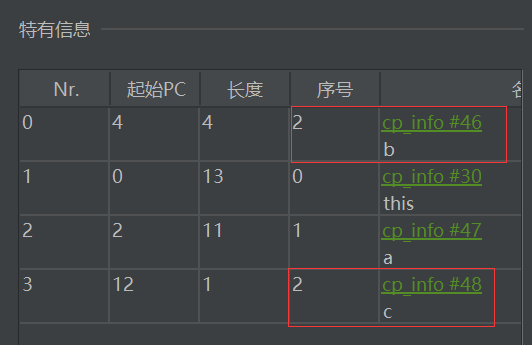

---

静态变量与局部变量的对比小结

- 按照数据类型分
- - 基本数据类型
  - 引用数据类型
- 按声明的位置
- - 成员变量，在使用前经历过初始化赋值
  - - 类变量 链接的准备阶段给类变量默认赋值，初始化阶段显示赋值，即静态代码块赋值
    - 实例变量 随着对象的创建，会在堆空间分配实例变量空间，并进行默认赋值
  - 局部变量 在使用前必须进行显示赋值，否则编译不通过

### 操作数栈

- 每一个独立的栈帧中除了包含局部变量表以外，还包含一个==后进先出== 的操作数栈，也可以称为==表达式栈== 
- ==操作数栈，在方法执行过程中，根据字节码指令，往栈中写入数据或提取数据，即入栈/出栈。== 
- ==如果被调用的方法带有返回值的话，其返回值将会被压入当前栈帧的操作数栈中，== 并更新PC寄存器中下一条需要执行的字节码指令
- 操作数栈中元素的数据类型必须与字节码指令的顺序严格匹配，这由编译器在编译期间进行验证，同时在类加载过程中的类检验阶段的数据流分析阶段要再次验证。
- 另外，我们说的Java虚拟机的==解释引擎是基于执行引擎，== 其中的栈指的是操作数栈。

---

**主要作用** 

​	==主要用于保存计算过程的中间结果，同时作为计算过程中的临时变量的存储空间。== 

---


- 操作数栈就是JVM执行引擎的一个工作区，当一个方法刚开始执行的时候，一个新的栈帧也会随之被创建出来，==这个方法的操作数栈是空的。== 
- 每一个操作数栈都会拥有一个明确的栈深度用于存储数值，其所需的最大深度在编译期就定义好了，保存在方法的Code属性中，为max_stack的值。
- 栈中的任何一个元素都是可以任意的Java数据类型。
- - 32bit的类型占用一个栈单位的深度
  - 64bit的类型占用两个栈单位的深度
- 操作数栈==并非采用访问索引的方式来进行数据访问的== ，而是只能通过标准的入栈和出栈操作来完成一次数据访问。

### 代码追踪

```java
    public void testAddOperation(){
        //byte short char boolean:都以int型保存
        byte i = 15;
        int j = 8;
        int k = i + j;
    }
```

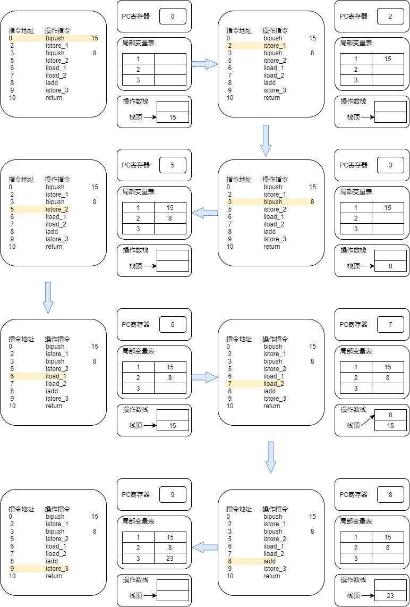

### 栈顶缓存技术

**将栈顶元素全部缓存在物理CPU的寄存器中，以此降低对内存的读/写次数，提升执行引擎的执行效率。** 

### 动态链接(或指向运行时常量池的方法引用)

- 每一个栈帧内部都包含一个指向**运行时常量池** 中==该栈帧所属方法的引用== 。包含这个引用的目的就是为了支持当前方法的代码能够实现==动态链接== 比如：invokedynamic指令
- 在Java源文件被编译到字节码文件中时，所有的变量和方法引用都作为符号引用保存在Class文件的常量池里。比如：描述一个方法调用了另外的其他方法的时，就通过常量池中指向方法的符号引用来表示的，那么==动态链接的作用就是为了将这些符号引用转换为调用方法的直接引用。== 

### 方法的调用：解析与分派

在JVM中，将符号引用转换为调用方法的直接引用与方法的绑定机制相关。

> 符号引用：以一组符号来描述所引用的目标，符号可以是任何形式的字面量，只要使用时能够无歧义的定位到目标即可，使用符号引用时，被引用的目标不一定已经加载到内存中。
>
> 直接引用：可以是直接指向目标的指针，相对偏移量，一个能间接定位到目标的句柄，使用直接引用时，引用的目标必定已经存在于虚拟机的内存中了。

- ==静态链接== 

  当一个字节码文件被装进JVM内部时，如果被调用的**目标方法在编译期可知** ，且运行期保持不变时。这种情况下将调用方法的符号引用转换为直接引用的过程称之为静态链接。

- ==动态链接== 

  如果**被调用的方法在编译期无法被确定下来** ，也就是说，只能够在程序运行期将调用方法的符号引用转换为直接引用，由于这种引用转换过程具备动态性，因此也被称之为动态链接。

对应的方法绑定机制为：早期绑定和晚期绑定。**绑定是一个字段、方法或者类的符号引用被替换为直接引用的过程，这仅仅发生一次** 。

- ==早期绑定== 

  早期绑定就是指被调用的**目标方法如果在编译期可知，且运行期保持不变时** ，即可将这个方法与所属的类型进行绑定，这样一来，由于明确了被调用的目标方法与所属的类型进行绑定，这样一来，由于明确了被调用的目标方法究竟是哪一个，因此也就可以使用静态链接的方式将符号引用转换为直接引用。

- ==晚期绑定== 

  如果**被调用的方法在编译期无法被确定下来，只能够在程序运行期根据实际的类型绑定相关的方法** ，这种绑定方式也就被称为晚期绑定。


- ==非虚方法== 
- - 如果方法在编译期就确定了具体的调用版本，这个版本在运行时是不可变的。这样的方法称为==非虚方法== 
  - 静态方法、私有方法、final方法、实例构造器、父类方法都是非虚方法。
- ==虚方法== 
- - 除了非虚方法就是虚方法。


虚拟机中提供了以下几条方法调用指令：

- 普通调用指令：
- - invokestatic：调用静态方法，解析阶段确定唯一方法版本
  - invokespecial：调用<init> 方法，私有及父类方法，解析阶段唯一方法版本
  - invokevirtual：调用所有虚方法
  - invokeinterface：调用接口方法
- 动态调用指令：
- - invokedynamic：动态解析出需要调用的方法，然后执行

前四条指令固化在虚拟机内部，方法的调用执行不可人为干预，而invokedynamic指令则支持由用户确定方法版本。其中==invokestatic指令和invokespecial指令调用的方法称为非虚方法，其余的（final修饰的除外）称为虚方法。== 

> invokedynamic指令出现于Java7 ，**为了实现 动态类型语言 支持而做出的一种改进。** 
>
> > 动态类型语言：判断变量值的类型信息，变量没有类型信息，变量值才有类型信息；
> >
> > 静态类型语言：判断变量自身的类型信息；
> >
> > > 区别：对类型的检查是在编译期还是在运行期，满足前者就是静态类型语言，反之就是动态类型语言；
>
> 但是在Java7中并没有提供直接生成invokedynamic指令的方法，需要借助ASM这种底层字节码工具来产生invokedynamic指令。**直到Java8的Lambda表达式的会出现，invokedynamic指令的生成，在Java中才有了直接的生成方式。** 


**方法重写的本质** 

1. 找到操作数栈顶的第一个元素所执行的对象的实质类型，记作C
2. 如果类型C中找到与常量中的描述符合简单名称都相符的方法，则进行访问权限校验，如果通过则返回这个方法的直接引用，查找过程结束；如果不通过，则返回java.lang.IllegalAccessError异常。
3. 否则，按照继承关系从下往上依次对C的各个父类进行第2步的搜索和验证过程。
4. 如果始终没有找到合适的方法，则抛出java.lang.AbstractMethodError异常。

> IllegalAccessError介绍：
>
> 程序试图访问或修改一个属性或调用一个方法，这个属性或方法，你没有权限访问。一般的，这个会引起编译器异常。这个错误如果发生在运行时，就说明一个类发生了不兼容的改变。


**虚方法表** 

​	在面向对象的编程中，会很频繁的使用到动态分派，如果在每次动态分派的过程中都要重新在类的方法元数据中搜索合适的目标的话就可能影响到执行效率。因此，为提高性能，JVM采用在类的方法区建立一个虚方法表，使用索引表来代替查找。

​	每个类中都有一个虚方法表，表中存放各个方法的实际入口。

​	虚方法表在什么时候被创建？

​		虚方法表会在类加载的链接阶段被创建并开始初始化，类的变量初始值准备完成之后，JVM会把该类的方法表也初始化完毕。

### 方法返回地址

- 存放调用该方法的PC寄存器的值。
- 一个方法的结束，有两种方式：
- - 正常执行完成
  - - 字节码指令，返回指令包括ireturn（当返回值是boolean、byte、char、short、int类型使用）、lreturn、freturn、dreturn以及areturn，另外还有一个return指令供声明为void的方法、实例初始化方法
  - 出现未处理的异常，非正常退出
- 无论通过哪种方式退出，在方法退出后都返回到该方法被调用的位置。方法正常退出时，==调用者的PC寄存器的值作为返回地址，即调用该方法的指令的下一条指令的地址。== 而通过异常退出的，返回地址是要通过异常表来确定，栈帧中一般不会保存这部分信息。

> 正常完成出口和异常完成出口的区别在于：
>
> 通过异常完成出口退出的不会给他的上层调用者产生任何的返回值。

### 一些附加信息


## 栈的相关面试题

**开发中遇到的异常有哪些？** 

栈可能出现的异常

- Java虚拟机规范允许==Java栈的大小是动态的或者是固定不变的。== 

> 如果采用固定大小的Java虚拟机栈，那每一个线程的Java虚拟机栈容量可以在线程创建的时候独立选定。如果线程请求分配的栈容量超过Java虚拟机栈允许的最大容量，Java虚拟机就会抛出一个==StackOverflowException== 异常
>
> 如果Java虚拟机栈可以动态扩展，并且在尝试扩展的时候无法申请到足够的内存，或者在创建一个新的线程时没有足够的内存去创建对应的虚拟机栈，那Java虚拟机将会抛出一个==OutOfMemoryError== 异常。

- 通过-Xss设置栈的大小


**调整栈大小，就能保证不出现溢出的情况吗？** 

不能，只能使OutOfMemoryError出现的次数减少


**垃圾回收是否会涉及到虚拟机栈？** 

不会的

- 程序计数器不存在error，也不会有GC
- 虚拟机栈存在error，不存在GC
- 本地方法栈存在error，不存在GC
- 堆存在error，存在GC
- 方法区存在error，存在GC


**分配的栈内存越大越好吗？** 

内存是有限的，栈内存分配越大，会挤压其他的内存空间。


**方法中定义的局部变量是否线程安全？**  

安全(StringBuilderTest.java)


# 本地方法栈

- Java虚拟机栈用于管理Java方法的调用，而本地方法栈用于管理本地方法的调用。
- 本地方法栈，也是线程私有的。
- 栈溢出和虚拟机栈一样
- ==当一个线程调用一个本地方法时，它就进入了一个全新的并且不受虚拟机限制的世界。它和虚拟机拥有同样的权限。== 
- - 本地方法可以通过本地方法接口来==访问虚拟机内部的运行时数据区。== 
  - 它甚至可以直接使用本地处理器中的寄存器。
  - 直接从本地内存的堆中分配任意数量的内存。
- ==并不是所有的JVM都支持本地方法。因为Java虚拟机规范并没有明确要求本地方法栈的使用语言、具体实现方式、数据结构等。== 如果JVM产品不打算支持native方法，也可以无需实现本地方法栈。
- 在Hotspot JVM中，直接将本地方法栈和虚拟机栈合二为一。


# 堆

## 堆的核心概述

- 一个JVM实例只存在一个堆内存，堆也是Java内存管理的核心区域。
- Java堆区在JVM启动的时候即被创建，其空间大小也就确定了。是JVM管理的最大一块内存空间。
- - 堆内存大小是可以调节的。
- 《Java虚拟机规范》规定，堆可以处于物理上不连续的内存空间中，但在逻辑上是连续的。
- 所有的线程共享Java堆，在这里还可以划分线程私有的缓冲区
- 《Java虚拟机规范》中对Java堆的描述是：所有的对象实例以及数组都应当在运行时分配在堆上。
- - “几乎”所有的对象实例都在这里分配内存
- 数组和对象可能永远不会存储在栈上，因为栈帧中保存引用，这个引用指向对象或者数组在堆中的位置。
- 在方法结束后，堆中的对象不会马上被移除，仅仅在垃圾收集的时候才会被移除。
- 堆，是GC执行垃圾回收的重点区域。

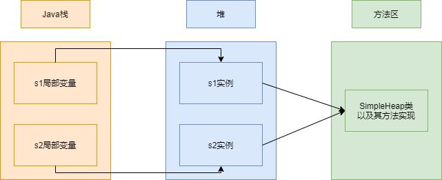


**内存细分** 

现代垃圾收集器大部分都基于分代收集理论设计

- Java7之前堆内存逻辑上分为三部分：新生区+养老区+永久区
- Java8及之后堆内存逻辑上分为三部分：新生区+养老区+元空间

加指令 -XX:+PrintGCDetails 可以查看细节(以下Java8)

```
Heap
 PSYoungGen      total 6144K, used 2313K [0x00000000ff980000, 0x0000000100000000, 0x0000000100000000)
  eden space 5632K, 41% used [0x00000000ff980000,0x00000000ffbc26a0,0x00000000fff00000)
  from space 512K, 0% used [0x00000000fff80000,0x00000000fff80000,0x0000000100000000)
  to   space 512K, 0% used [0x00000000fff00000,0x00000000fff00000,0x00000000fff80000)
 ParOldGen       total 13824K, used 0K [0x00000000fec00000, 0x00000000ff980000, 0x00000000ff980000)
  object space 13824K, 0% used [0x00000000fec00000,0x00000000fec00000,0x00000000ff980000)
 Metaspace       used 3467K, capacity 4496K, committed 4864K, reserved 1056768K
  class space    used 382K, capacity 388K, committed 512K, reserved 1048576K
```


---

查看堆内存

在安装的jdk的bin目录有个jvisualvm.exe双击打开或者控制台输入jvisualvm

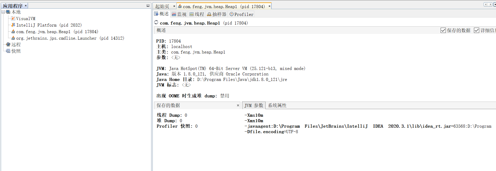

## 设置堆内存大小与OOM

**设置堆空间大小** 

- Java堆区用于存储Java对象实例，那么堆的内存大小在JVM启动时就已经设定号了，可以通过-Xmx 和 -Xms进行设置
- - -Xms:用于表示堆区的起始内存，等价于-XX:InitialHeapSize
  - -Xmx:用于表示堆的最大内存，等价与-XX:MaxHeapSize
- 一旦堆区的内存大小超过“-Xmx”所指定的最大内存时，将会抛出OutOfMemoryError异常
- 通常会将 -Xms 和 -Xmx两个参数配置相同的值，其目的是==为了能够在java垃圾回收机制清理完堆区后不需要重新分隔计算堆区的大小，从而提高性能。== 
- 默认情况下
- - 初始内存大小：物理电脑内存大小 / 64
  - 最大内存大小：物理电脑内存大小 / 4


**查看设置的参数** 

- 方式一：jps 查看进程号 ， jstat -gc 进程id
- 方式二：-XX:PrintGCDetails


**OutOfMemory** 


## 年轻代与老年代

**年轻代** 

- 可以划分为Eden区、Survivor0空间和Survivor1空间（有时也叫fromSurvivor区、to Survivor区）
- Eden区和两个Survivor空间缺省所占的比例是8:1:1
- - -XX:SurvivorRatio=8
  - -Xmn：设置新生代的空间的大小

配置新生代与老年代在堆结构的占比：

- 默认-XX:NewRatio=2，表示新生代占1，老年代占2，新生代占整个堆的1/3
- 可以修改-XX:NewRatio=4，表示新生代占1，老年代占4，新生代占整个堆的1/5

## 图解对象分配过程

为新对象分配内存是一件非常严谨和复杂的任务，JVM的设计者们不仅需要考虑内存如何分配、在哪里分配等问题，并且由于内存分配算法与回收算法密切相关，所以还需要考虑GC执行完内存回收后是否会在内存空间中产生内存碎片。

1. new的对象先放Eden区。此区有大小限制。
2. 当Eden区的空间填满时，程序又需要创建对象，JVM的垃圾回收器将对Eden区进行垃圾回收（Minor GC)，将Eden区中的不再被其他对象所引用的对象进行销毁。再加载新的对象放到Eden区。
3. 然后将Eden区中剩余对象移动到Survivor0区。
4. 如果再次触发垃圾回收，此时上次幸存下来的放到Survivor0区的，如果没有回收有，就会放到Survivor1区。
5. 如果再次经历垃圾回收，此时会重新放到Survivor0区，接着再去Survivor1区。
6. 默认经历过15次垃圾回收后，放入老年代
7. - 可以设置参数：-XX:MaxTenuringThreshold= N 进行设置


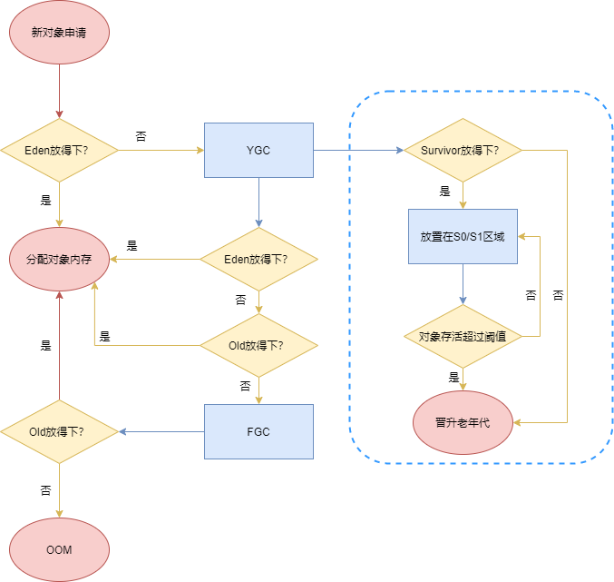


**小节** 

- 针对Survivor0，Survivor1区总结：复制之后有交换，谁空谁是to
- 关于垃圾回收：频繁在新生区收集，很少在养老区收集，几乎不再永久区/元空间收集。


**常用调优工具** 

- JDK命令行
- Eclipse：Memory Analyzer Tool
- Jconsole
- VisualVM
- JProfiler
- Java Flight Recorder
- GCViewer
- GC Easy

## Minor GC、Major GC、Full GC

JVM在进行GC时，并非每次都对上面三个内存(新生代、老年代、方法区)区域一起进行回收的，大部分时候回收的都是指新生代。

针对Hotspot VM的实现，它里面的GC按照回收区域又分为两大类型：一种是**部分收集(Partial GC)** ，一种是**整堆收集(Full GC)**

- 部分收集：不是完整收集整个Java堆的垃圾收集器。其中又分为：
- - 新生代收集（Minor GC/Young GC）：只是新生代的垃圾收集
  - 老年代收集（Major GC/Old GC）：只是老年代的垃圾收集
  - - 目前，只有CMS GC会有单独收集老年代的行为
    - ==注意，很多时候Major GC会和Full GC混淆使用，需要具体分辨是老年代回收还是整堆回收。== 
- - 混合回收（Mixed GC）：收集整个新生代以及部分老年代的垃圾收集。
  - - 目前，只有G1 GC会有这种行为
- 整堆收集（Full GC）：收集整个java堆和方法区的垃圾收集。


**年轻代GC（Minor GC）触发机制** 

- 当年轻代空间不足时，就会触发Minor GC，这里的年轻代满指的是Eden代满，Survivor满不会引发GC。（每次Minor GC会清理年轻代的内存。）
- 因为Java对象==大多都具备朝生夕灭== 的特性，所以Minor GC非常频繁，一般回收速度也比较快。这一定义即清晰又易于理解。
- Minor GC会引发STW，暂停其他用户的线程，等垃圾回收结束，用户线程才恢复运行。

**老年代GC（Major GC/Full GC）触发机制** 

- 指发生在老年代的GC，对象从老年代消失时，我们说“Major GC”或“Full GC”发生了。
- 出现了Major GC，经常会伴随至少一次的Minor GC（但非绝对的，在Parallel Scavenge收集器的收集策略里就会有直接进行Major GC的策略选择过程）。
- - 也就是在老年代空间不足时，会先尝试触发Minor GC。如果之后空间还不足，则会触发Major GC
- Major GC的速度一般会比Minor GC慢10倍以上，STW的时间更长。
- 如果Major GC后，内存还不足，就报OOM了。
- Major GC的速度一般会比Minor GC慢10倍以上。


**Full GC触发机制（细节在后面）** 

触发Full GC执行的情况有如下五种情况：

1. 调用System.gc()时，系统建议执行Full GC，但是不必然执行
2. 老年代空间不足
3. 方法区空间不足
4. 通过Minor GC后进入老年代的平均大小大于老年代的可用内存
5. 由Eden区、Survivor0区和Survivor1区复制时，对象大小大于To Space可用内存，则把该对象转存到老年代，且老年代的可用内存小于该对象大小

==Full GC是开发或调优中尽量避免的。这样暂时时间会短一些。== 

## 堆空间分代思想

==为什么需要把Java堆分代？不分代就不能正常工作了吗？== 

- 经研究，不同对象的生命周期不同。70%-99%的对象都是临时对象。
- - 新生代：有Eden区、两块Survivor区
  - 老年代：存放新生代中经历多次GC仍然存活的对象。
- 其实不分代完全可以，分代唯一理由就是**优化GC性能** 

## 内存分配策略

针对不同年龄段的对象分配原则如下：

- 优先分配到Eden
- 大对象直接分配到老年代
- - 尽量避免程序中出现过多的大对象
- 长期存活的对象分配到老年代
- 动态对象年龄判断
- - 如果Survivor区中相同年龄的所有对象大小的总和大于Survivor空间的一半，年龄大于或等于该年龄的对象可以直接进入老年代，无须等到MaxTenuringThreshold中要求的年龄。
- 空间分配担保
- - -XX:HandlePromotionFailure

## 为对象分配内存：TLAB

TLAB:Thread Local Allocation Buffer

==为什么有TLAB？== 

- 堆区是线程共享区域，任何线程都可以访问到堆区中的共享数据
- 由于对象实例的创建在JVM中非常频繁，因此在并发环境下从堆区中划分内存空间是线程不安全的。
- 为避免多个线程操作同一地址，需要使用加锁等机制，进而影响分配速度。

==什么是TLAB？==

- 从内存模型而不是垃圾收集的角度，对Eden区域继续进行划分，JVM为**每个线程分配了一个私有缓存区域** ，它包含在Eden空间内。
- 多线程同时分配内存时，使用TLAB可以避免一系列的非线程安全问题，同时还能够提升内存分配的吞吐量，因此我们可以将这种内存分配方式称之为**快速分配策略** 。
- 据我所知所有OpenJDK衍生出来的JVM都提供了TLAB的设计。

==TLAB再说明== 

- 尽管不是所有的对象实例都能够在TLAB中成功分配内存，但**JVM确实将TLAB作为内存分配的首选。** 
- 在程序中，开发人员可以通过选项"-XX:UseTLAB"设置是否开启TLAB空间。
- 默认情况下，TLAB空间的内存非常小，**仅占有整个Eden空间的1%** ，当然我们可以通过选项"-XX:TLABWasteTargetPercent"设置TLAB空间所占用Eden空间的百分比。
- 一旦对象在TLAB空间分配内存失败时，JVM就会尝试通过**使用加锁机制** 确保数据操作的原子性，从而直接在Eden空间中分配内存。

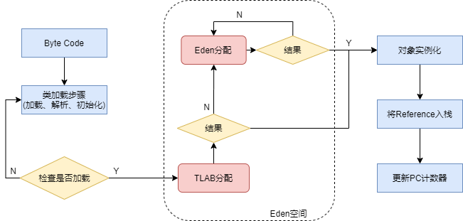

## 小结：堆空间的参数设置

- -XX:+PrintFlagsInitial:查看所有的参数的默认初始值
- -XX:+PrintFlagsFinal:查看所有的参数的最终值(可能会存在修改，不再是初始值)
- -Xms:初始堆空间内存(默认为物理内存的1/64)
- -Xmx:最大堆空间内存(默认为物理内存的1/4)
- -Xmn:设置新生代的大小(初始值及最大值)
- -XX:NewRatio:配置新生代与老年代在堆结构的占比
- -XX:SurvivorRatio:设置新生代中Eden和S0/S1空间的比例
- -XX:MaxTenuringThreshold:设置新生代垃圾的最大年龄
- -XX:+PrintGCDetails:输出详细的GC处理日志
- 打印gc简要信息：
- - -XX:+PrintGC
  - -verbose:gc
- -XX:HandlePromotionFailure:是否设置空间分配担保


在发生Minor GC之前，虚拟机会==检查老年代最大可用的连续空间是否大于新生代所有对象的总空间。== 

- 如果大于，则此次Minor GC是安全的
- 如果小于，则虚拟机会查看-XX:HandlePromotionFailure设置值是否允许担保失败。
- - 如果HandlePromotionFailure=true，那么会继续==检查老年代最大可用连续空间是否大于历次晋升到老年代的对象的平均大小。== 
  - - 如果大于，则尝试进行一次Minor GC，但这次Minor GC依然是有风险的；
    - 如果小于，则改为进行一次Full GC。
  - 如果HandlePromotionFailure=false，则改为进行一次Full GC。

在JDK6 Update24之后，HandlePromotionFailure参数不会再影响到虚拟机的空间担保策略，观察OpenJDK中的源码变化，虽然源码中还定义了HandlePromotionFailure参数，但是在代码中已经不会再使用它。JDK6 Update24之后的规则变为==只要老年代的连续空间大于新生代对象总大小== 或者==历次晋升的平均大小就会进行Minor GC== ，否则将进行Full GC.

## 堆是分配对象的唯一选择吗？

在《深入理解Java虚拟机》中关于Java堆内存中有这样一段描述：

> 随着JIT编译期的发展与==逃逸分析技术== 逐渐成熟，==栈上分配、标量替换优化技术== 将会导致一些微妙的变化，所有的对象都分配到堆上也逐渐变得那么“绝对”了。

在虚拟机中，对象是在Java堆中分配内存的，这是一个普遍的常识。但是，有一种特殊情况，那就是==如果经过逃逸分析（Escape Analysis）后发现，一个对象并没有逃逸出方法的话，那么就可能被优化成栈上分配。== 这样就无需在堆上分配内存，也无须进行垃圾回收了。这也是最常见的堆外存储技术。

此外，前面提到的基于OpenJDK深度制定的TaoBaoVM，其中创新的GCIH（GC invisible heap）技术实现off-heap，将生命周期较长的Java对象从heap中移至heap外，并且GC不能管理GCIH内部的Java对象，以此达到降低GC的回收频率和提升GC的回收效率的目的。


### 逃逸分析

#### 逃逸分析概述

- 如何将堆上的对象分配到栈，需要使用逃逸分析手段。
- 这种一种可以有效减少Java程序中同步负载和内存分配压力的跨函数全局数据流分析算法。
- 通过逃逸分析，Java Hotspot编译器能够分析出一个新的对象的引用的使用范围从而决定是否将这个对象分配到堆上。
- 逃逸分析的基本行为就是分析对象动态作用域：
- - 当一个对象在方法中被定义后，对象只在方法内部使用，则认为没有发生逃逸。
  - 当一个对象在方法中被定义后，它被外部方法所引用，则认为发生逃逸。例如作为调用参数传递到其他地方中。

> 就看new的对象实体有没有可能在方法外被调用

#### 代码优化

##### 栈上分配

将堆分配转化为栈分配。如果一个对象在子程序中被分配，要使指向该对象的指针永远不会逃逸，对象可能是栈分配的候选，而不是堆分配。

- JIT编译器在编译期间根据逃逸分析结果，发现如果一个对象并没有逃逸出方法的话，就可能被优化成栈上分配。分配完成后，继续调用栈内执行，最后线程结束，栈空间被回收，局部变量也被回收。这样就无须进行垃圾回收了。
- 常见的栈上分配的场景
- - 在逃逸分析中，已经说明了。分别是给成员变量赋值、方法返回值、实例引用传递。

##### 同步省略

如果一个对象被发现只能从一个线程被访问到，那么对于这个对象的操作可以不考虑同步。

- 线程同步的代价是相当高的，同步的后果是降低并发性和性能。
- 在动态编译同步块的时候，JIT编译器可以借助逃逸分析来==判断同步块所使用的锁对象是否只能够被一个线程访问而没有被发布到其他线程。== 如果没有，那么JIT编译器在编译这个同步块的时候就会取消对这部分代码的同步。这样就能大大提高并发性和性能。这个取消同步的过程就叫同步省略，也叫==锁消除== 。

##### 分离对象或标量替换

有的对象可能不需要作为一个连续的内存结构存在也可以被访问到，那么对象的部分(或全部)可以不存储在内存，而是存储在CPU寄存器中。

==标量== 是指一个无法再分解成更小的数据的数据。Java中的原始数据类型就是标量。

相对的，那些还可以分解的数据叫做==聚合量== ，Java中的对象就是聚合量，因为他可以分解成其他聚合量和标量。

在JIT阶段，如果经过逃逸分析，发现一个对象不会被外界访问的话，那么经过JIT优化，就会把这个对象拆解成若干个其中包含的若干个成员变量来代替。这个过程就是==标量替换== 。

**标量替换参数设置** 参数-XX:+EliminateAllocations：开启了标量替换（默认打开），允许将对象打撒分配在栈上。

##### 小结

- 逃逸分析的技术不是十分成熟。其根本原因就是==无法保证逃逸分析的性能消耗一定能高于他的消耗。虽然经过逃逸分析可以做标量替换、栈上分配、和锁消除。但是逃逸分析自身也是需要进行一系列复杂的分析的，这其实也是一个相对耗时的过程。== 
- 一个极端的例子，就是经过逃逸分析之后，发现没有一个对象是不逃逸的。那这个逃逸分析的过程就白白浪费掉了。
- 虽然这向技术并不十分成熟，但是它也==是即时编译器优化技术中一个十分重要的手段。== 


# 方法区

## 栈、堆、方法区的交互关系

从线程共享与否的角度来看

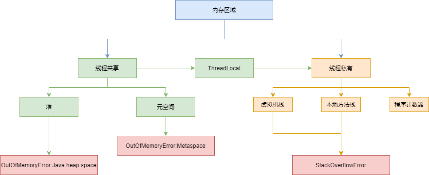


```java
Person person = new Person();
Person:方法区
person:Java栈
new Person():Java堆
```

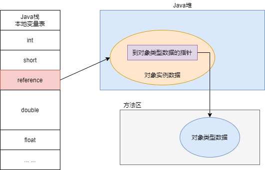


## 方法区的理解

《Java虚拟机规范》：尽管所有的方法在逻辑上是属于堆的一部分，但一些简单的实现可能不会选择去进行垃圾收集或者进行压缩。

所以：==方法区看作是一块独立于Java堆的内存空间。== 

- 方法区与Java堆一样，是各个线程共享的内存区域。
- 方法区在JVM启动的时候被创建，并且它的实际的物理内存空间中和Java堆区一样都可以是不连续的。
- 方法区的大小，跟堆空间一样，可以选择固定大小或者可扩展。
- 方法区的大小决定了系统可以保存多少个类，如果系统定义了太多的类，导致方法区溢出，虚拟机同样会抛出内存溢出错误：java.lang.OutOfMemoryError:PermGen space或者java.lang.OutOfMemoryError:Metaspace
- 关闭JVM就会释放这个区域的内存。


Hotspot中，jdk7前，习惯把方法区称为永久代，jdk8开始，使用元空间取代了永久代。

> 元空间和永久代最大的区别：元空间不在虚拟机设置的内存中，而是使用本地内存。

## 设置方法区大小与OOM

- jdk7以前
- - 通过-XX:PermSize来设置永久代初始分配空间。默认值是20.75M
  - -XX:MaxPermSize来设定永久代最大可分配空间。32位机器默认是64M，64位机器模式是82M
  - 当JVM加载的类信息容量超过了这个值，会报异常OutOfMemoryError:PermGenspace。
- jdk8以后
- - 元数据区大小可以使用参数：-XX:MetaspaceSize和-XX:MaxMetaspaceSize指定，代替上述原有的两个参数。
  - 默认值依赖于平台。windows下，-XX:MetaspaceSize是21M,-XX:MaxmetaspaceSize的值是-1，即没有限制。
  - 与永久代不同，如果不指定大小，默认情况下，虚拟机会耗尽所有的可用系统内存。如果元数据区发生溢出，虚拟机一样会抛出异常OutOfMemoryError:Metaspace
  - - -XX:MetaspaceSize:设置初始的元空间大小。64位机器默认21M


**如何解决这些OOM？** 

1. 要解决OOM异常或者heap space的异常，一般的手段是首先通过内存映像分析工具（如Eclipse Memory Analyzer）对dump出来的堆转存储快照进行分析，重点是确认内存中的对象是否是由必要的，也就是要先分清楚到底是出现了内存泄漏（Memory leak）还是内存溢出（Memory Overflow）。
2. 如果是内存泄漏，可进一步通过工具查看泄漏对象到GC Roots的引用链。于是就能找到泄漏对象是通过怎样的路径与GC Roots相关联并导致垃圾收集器无法自动回收它们的。掌握了泄漏对象的类型信息，已经GC Roots引用链的信息，就可以比较准确地定位出泄漏代码的位置。
3. 如果不存在内存泄漏，换句话来说就是内存中的对象确实都还必须存活着，那就应当检查虚拟机的堆参数（-Xmx与-Xms），与物理内存对比看是否可以调大，从代码上检查是否存在某些对象生命周期过程，持有状态时间过长的情况，尝试减少程序运行期的内存消耗。

## 方法区的内部结构

### 方法区（Method Area）存储什么？

《深入理解Java虚拟机》中对方法区存储内容描述如下：

​	它用于存储已被虚拟机加载的类型信息、常量、静态变量、即时编译器编译后的代码缓存等。

### 类型信息

对每个加载的类型（类class、接口interface、枚举enum、注解annotation），JVM必须在方法区中存储以下类型信息：

- 这个类型的完整有效名称（全名=包名.类名）
- 这个类型直接父类的完整有效名（对interface或是java.lang.Object，都是没有父类）
- 这个类型的修饰符（public，abstract，final的某个子集）
- 这个类型直接接口的一个有序列表

### 域（Field）信息--平常说的成员变量，属性

- JVM必须在方法区中保存类型的所在域的相关信息以及域的声明顺序。
- 域的信息包括：域名称、域类型、域修饰符（public，private，protected，static，final，volatile，transient的某个子集）

### 方法（Method）信息

JVM必须保存所有方法的以下信息，同域信息一样包括声明顺序：

- 方法名称
- 方法的返回类型（或void）
- 方法参数的数量和类型（按顺序）
- 方法的修饰符（public，private，protected，static，final，synchronized，native，abstract的一个子集）
- 方法的字节码（bytecodes）、操作数栈、局部变量表及大小（abstract和native方法除外）
- 异常表
- - 每个异常处理的开始位置、结束位置、代码处理在程序计数器中的偏移地址、被捕获的异常类的常量池索引

### non-final的类变量

- 静态变量和类联系在一起，随着类的加载而加载，它们成为类数据在逻辑上的一部分。
- 类变量被类的所有实例共享，即使没有类实例也可以访问它。

```java
public class MethodAreaTest {
    public static void main(String[] args) {
        Order order = null;
        order.hello();
        System.out.println(order.count);
    }
}

class Order {
    public static int count = 1;
    public static final int number = 2;

    public static void hello(){
        System.out.println("hello...");
    }
}
```

### 全局常量：static final

被声明为final的类变量的处理方法则不同，每个全局常量在编译的时候就会被分配了。


### 运行时常量池VS常量池

- 方法区，内部包含了运行时常量池。
- 字节码文件，内部包含了常量池。
- 要弄清楚方法区，需要理解清楚ClassFile，因为加载类的信息都在方法区。
- 要弄清楚方法区的运行时常量池，需要理解清楚ClassFile中的常量池。

> 一个有效的字节码文件中除了包含类的版本信息、字段、方法以及接口等描述信息外，还包含一项信息那就是常量池表，包含各种字面量和对类信息、域和方法的符号引用

**为什么需要常量池？** 

一个java源文件中的类、接口，编译后产生一个字节码文件。而Java中的字节码需要数据支持，通常这种数据会很大以至于不能直接存到字节码里，换另一种方式，可以存到常量池，这个字节码包含了指向常量池的引用。在动态链接的时候会用到==运行时常量池== 。

```java
public class SimpleClass {
  public void sayHello(){
    System.out.println("hello");
  }
}
```

虽然只有194字节，但是里面却使用了String ，System，PrintStream及Object等结构。这里代码量其实已经很小了。如果代码多，引用到的结构会更多！这里就需要用常量池了！

**常量池中有什么？** 

- 数量值
- 字符串值
- 类引用
- 字段引用
- 方法引用

**小结**

常量池，可以看做是一张表，虚拟机指令根据这张常量表找到要执行的类名、方法名、，参数类型、字面量等类型。

**运行时常量池** 

- 运行时常量池是方法区的一部分。
- 常量池表是Class文件的一部分，==用于存放编译期生成的各种字面量与符号引用，这部分内容将类加载后存放到方法区的运行时常量池中。== 
- 运行时常量池，在加载类和接口到虚拟机后，就会创建对应的运行时常量池。
- JVM为每个已加载的类型（类或接口）都维护一个常量池。池汇总的数据项像数组一样，是通过索引访问的。
- 运行时常量池中包含多种不同的常量，包括编译期就已经明确的数值字面量，也包括到运行期解析后才能够获得的方法或字段引用。此时不再是常量池中的符号地址了，这里换为了真实地址。
- - 运行时常量池，相对于Class文件常量池的另一重要特征是：具备动态性。
- 运行时常量池类似于传统编程语言中的符号表，但是它所包含的数据却比符号表要更加丰富一些。
- 当创建类或接口的运行时常量池时，如果构造运行时常量池所需的内存空间超过了方法区所能提供的最大值，则JVM会抛出OutOfMemoryError异常。

## 方法区使用举例


## 方法区的演进细节

1. 首先明确，只有Hotspot才有永久代。原则上如何实现方法区属于虚拟机实现细节，不受《Java虚拟机规范》管束，并不要求统一。
2. Hotspot中方法区的变化：

| jdk版本     | 变化                                       |
| --------- | ---------------------------------------- |
| jdk1.6及之前 | 有永久代，静态变量存放在永久代上                         |
| jdk1.7    | 有永久代，但已经逐步“去永久代”，字符串常量池、静态变量移除，但保存在堆中    |
| jdk1.8及以后 | 无永久代，类型信息、字段、方法、常量保存在本地内存的元空间，但字符串常量池、静态变量仍然在堆 |

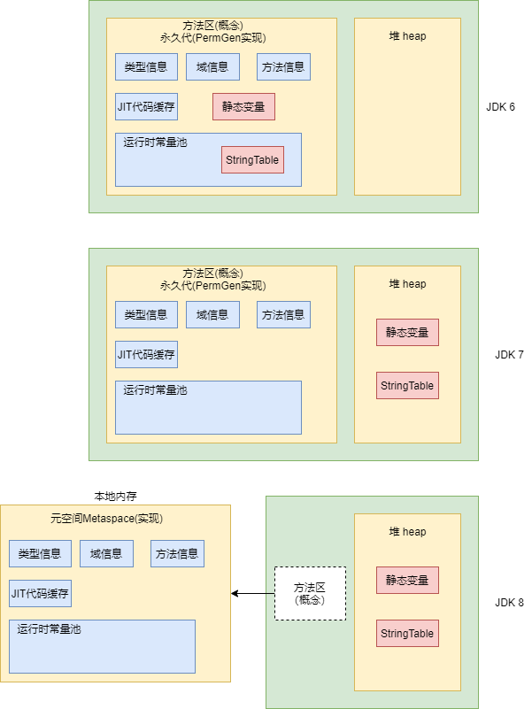

**永久代为什么要被元空间替换？** 

- 随着Java8的到来，Hotspot VM中再也见不到永久代了。但是则并不意味着类的元数据信息也消失了。这些数据被移到了一个与==堆不相连的本地内存区域，这个区域叫做元空间（metaspace）。== 
- 由于类的元数据分配在本地内存中，元空间的最大可分配空间就是系统可用内存空间。
- 这项改动是很有必要的，原因有：
- - ==为永久代设置空间大小是很难确定的。== 
  - - 在某些场景下，如果动态加载类过多，容易产生Perm区的OOM。比如某个实际Web工程中，因为功能点比较多，在运行过程中，要不断动态加载很多类，经常出现致命错误。
    - 而元空间和永久代之间最大的差别在于：元空间并不在虚拟机中，而使用本地内存。因此默认情况下，元空间的大小仅受本地内存限制。
  - 对永久代进行调优是很困难的。

**StringTable为什么要调整？** 

jdk7中StringTable放到了堆空间中。因为永久代的回收效率很低，在full GC的时候才会触发。而full gc是老年代的空间不足、永久代不足时才会触发。这就导致StringTable回收效率不高。而我们开发中会有大量的字符串被创建，回收效率低，导致永久代内存不足。放到堆里面，能够即时回收内存。

**静态变量放在哪？** 

静态引用的对象实体始终都存在堆空间。

jdk6，jdk7，jdk8都放在老年代

## 方法区的垃圾回收

一般来说==这个区域的回收效果比较难令人满意，尤其是类型的卸载，条件相当苛刻== 。但是这部分区域的回收有时又确实很有必要的。以前sun公司的bug列表中，曾经出现过若干个严重的Bug就是由于低版本的Hotspot虚拟机对此区域未完全而导致内存泄漏。

**方法区的垃圾收集主要回收两部分内容：常量池中废弃的常量和不再使用的类型。** 

- 方法区内常量池之中主要存放的两大类常量：字面量和符号引用。字面量比较接近Java语言层次的常量概念，如文本字符串、被声明为final的常量值等。而符号引用则属于编译原理方面的概念，包括下面三类常量：
- - 1、类和接口的全限定名
  - 2、字段的名称和描述符
  - 3、方法的名称和描述符
- Hotspot虚拟机对常量池的回收策略是很明确的，==只要常量池中的常量没有被任何地方引用，就可以被回收。== 
- 回收废弃常量与回收Java堆中的对象非常类似。
- 判断一个类型是否属于“不再被使用的类”的条件就比较苛刻了。需要同时满足下面三个条件：
- - 该类所有的实例都已经被回收，也就是Java堆中不存在该类及其任何派生子类的实例。
- - 加载该的类加载器已经被回收，这个条件除非是经过精心设计的可替换类加载器的场景，如OSGi、JSP的重加载等，否则通常是很难达成的。
  - 该类对应的java.lang.Class对象没有在任何地方被引用，无法再任何地方通过反射访问该类的方法。
- Java虚拟机被允许对满足上述三个条件的无用类进行回收，这里说的仅仅是“被允许”，而不是和对象一样，没有引用了就必然会回收。关于是否要对类型进行回收，Hotspot虚拟机提供了-Xnoclassgc参数进行控制，还可以使用-verbose:class以及-XX:+TranceClass-Loading、-XX:+TraceClassUnLoading查看类加载和卸载信息
- 在大量使用反射、动态代理、cglib等字节码框架，动态生成jsp以及OSGi这类频繁自定义类加载器的场景中，通常都需要Java虚拟机具备卸载的能力，以保证不会对方法区造成过大的内存压力。

# 总结

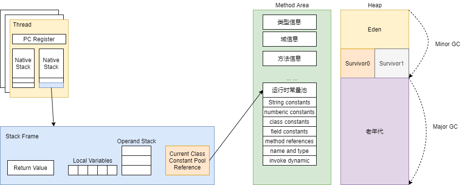


