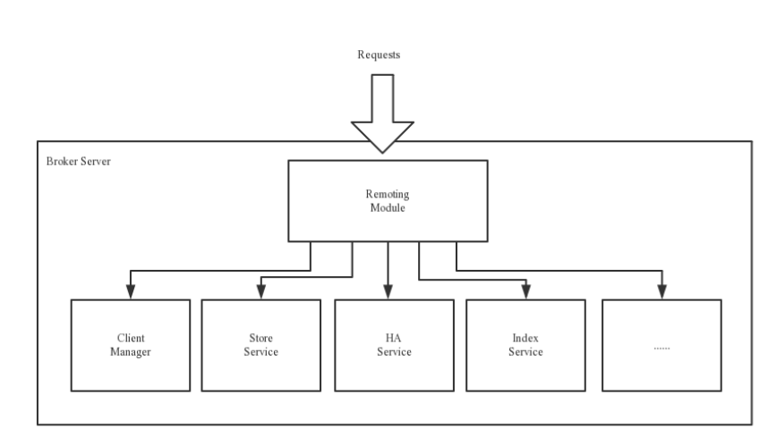
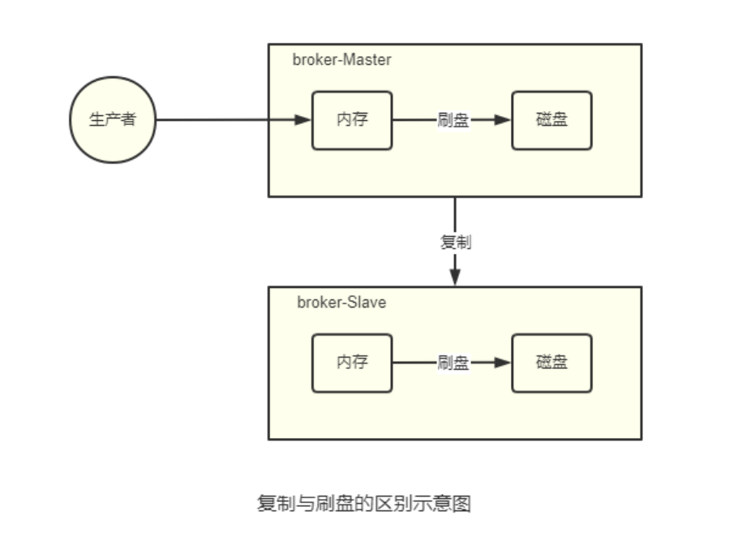
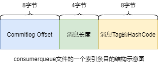
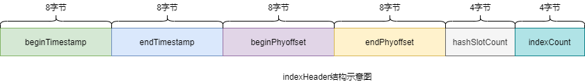
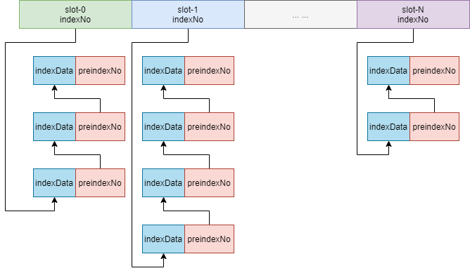
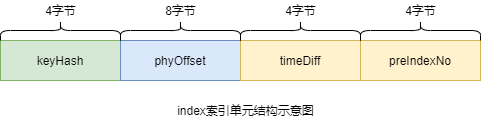
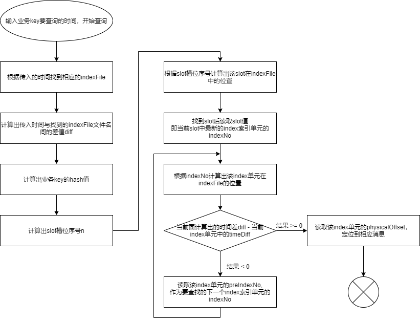

# 基本概念

## 消息（Message）

消息是指，消息系统所传输信息的物理载体，生产和消费数据的最小单位，每条消息必须属于一个主题。

## 主题（Topic）

Topic表示一类消息的集合，每个主题都包含若干条消息，$\textcolor{red}{每条消息只能属于一个主题} $，是RocketMQ进行消息订阅的基本单位。

一个生成者可以同时发送多种Topic的消息；而一个消费者只对某种特定的Topic感兴趣，即只可以订阅和消费一种Topic的消息。

## 标签（Tag）

为消息设置的标签，用于同一主题下区分不同类型的消息。来自同一业务单元的消息，可以根据不同业务目的在同一主题下设置不同标签。标签能够有效地保证代码的清晰度和连贯性，并优化RocketMQ提供的查询系统。消费者可以根据Tag实现对不同子主题的不同消费逻辑，实现更好的扩展性。

## 队列（Queue）

存储消息的物理实体。一个Topic中可以包含多个Queue，每个Queue中存放的就是该Topic的消息。一个Topic的Queue也被称为一个Topic中消息的分区（Partition）。

一个Topic的Queue中的消息只能被一个消费者组中的一个消费者消费。一个Queue中的消息不允许同一个消费者组中的多个消费者同时消费。

## 消息标识（MessageId/Key）

RocketMQ中每个消息拥有唯一的MessageId，且可以携带具有业务标识的Key，以方便对消息的查询。不过需要注意的是，MessageId有两个：在生产者send()消息时会自动生成一个MessageId（msgId），当消息到达Broker后，Broker也会自动生成一个MessageId(offsetMsgId)。msgId、offsetMsgId与key都称为消息标识。

- msgId：由Producer端生成，其生成规则为：
- - ProductIp + 进程IP + MessageClientIdSetter类的ClassLoader的hashCode + 当前时间 + AutomicInteger
- offsetMsgId：由broker端生成，其生成规则为：brokerIP + 物理分区的offset
- key：由用户指定的业务相关的唯一标识。


# 系统架构

## Producer

消息生成者，负责生产消息。Producer通过MQ的负载均衡模块选择相应的Broker集群队列进行消息投递，投递的过程支持快速失败并且低延迟。

RocketMQ中的消息生产者都是以生产者组的信息出现的。生产者组是同一类生成者的集合，这类Producer发送相同Topic类型的消息。

## Consumer

消息消费者，负责消费消息。一个消息消费者会从Broker服务器中获取到消息，并对消息进行相关业务处理。

RocketMQ中的消息消费者都是以$\textcolor{red}{消费者组}$的形式出现的。消费者组是同一类消费者的集合，这类Consumer消费的是同一个Topic类型的消息。消费者组使得在消息消费方面，实现负载均衡和容错的目标变得非常容易。

> 负载均衡是指Queue的负载均衡，而不是消息的负载均衡
>
> > 将一个Topic中的不同的Queue平均分配给同一个Consumer Group的不同Consumer

消费者组中的Consumer的数量应该小于等于Topic的Queue数量。如果超出Queue数量，则多出的Consumer将不能消费消息。一个Topic类型的消息可以被多个消费者组同时消费。

## Name Server

**功能介绍** 

NameServer是一个Broker与Topic路由的注册中心，支持Broker的动态注册与发现。

主要两个功能：

- $\textcolor{red}{Broker管理}$ ：接受Broker集群的注册信息并且保存下来作为路由信息的基本数据；提供心跳检测机制，检查Broker是否还存活。
- $\textcolor{red}{路由信息管理}$ ：每个NameServer中都保存着Broker集群的整个路由信息和用于客户端查询的队列信息。Producer和Consumer通过NameServer可以获取整个Broker集群的路由信息，从而进行消息的投递和消费。

**路由注册**

NameServer通常也是以集群的方式部署，不过，NameServer是无状态的，即NameServer集群中的各个节点间是无差异的，各个节点间相互不进行消息通讯。那各节点中的数据是如何进行数据同步的呢？在Broker节点启动时，轮训NameServer列表，与每个NameServer节点建立长连接，发起注册请求。在NameServer内部维护着一个Broker列表，用来动态存储Broker的信息。

Broker节点为了证明自己是活着的，为了维护与NameServer间的长连接，会将最新的信息以心跳包的方式上报给NameServer，每30秒发送一次心跳包后，会更新心跳时间戳，记录这个Broker的最新存活时间。

**路由剔除** 

由于Broker关机、宕机或网络抖动等原因，NameServer没有收到Broker的心跳，NameServer可能会将其从Broker列表中剔除。

NameServer中有一个定时任务，每隔10秒就会扫描一次Broker表，查看每一个Broker的最新心跳时间戳距离当前时间是否超过120秒，如果超过，则会判定Broker失效，然后将其从Broker列表中剔除。

**路由发现** 

BroketMQ的路由发现采用的是Pull模型。当Topic路由信息发生变化时，NameServer不会主动推送给客户端，而是客户端定时拉取主题最新的路由。默认客户端每30秒会拉取一次最新的路由。

> Push模型：推送模型。需要维护一个长连接，其实时性较好。
>
> Pull模型：拉取模型。存在的问题是，实时性较差。
>
> Long Polling模型：长轮询模型。其是对Push与Pull模型的整合，充分利用了这两种模型的优势，屏蔽了它们的劣势。

**客户端NameServer选择策略** 

客户端在配置时必须要写上NameServer集群的地址，那么客户端到底连接的是哪个NameServer节点呢？客户端首先会选取一个随机数，然后再与NameServer节点数量取模，此时得到的就是所要连接的节点索引，然后就会进行连接。如果连接失败，则会采用round-robin策略，逐个尝试着去连接其它节点。

> 客户端指的是Producer和Consumer

首先采取的是随机策略进行选择，失败后采用轮询策略。

> 扩展：Zookeeper Client是如何选择Zookeeper Server的？
>
> 简单来说就是，经历两次Shuffle，然后选择一台Zookeeper Server
>
> 详细说就是：将配置文件中的zk Server地址进行一次shuffle，然后随机选择一个。这个选择出的一般都是一个hosthome。然后获取到该hosthome对应空的所有ip，再对这些ip进行第二次shuffle，从shuffle过的结果中取第一个server地址进行连接。

## Broker

**功能介绍**

消息中转角色，负责存储消息、转发消息。Broker在RocketMQ系统中负责接收并存储从生产者发送来的消息，同时为消费者的拉取请求作准备。Broker同时也存储着消息相关的元数据，包括消费者组消费进度偏移offset、主题、队列等。

**模块组成** 



$\textcolor{red}{Remoting Module}$ :整个Broker的实体，负责处理来自Clients端的请求。而这个Broker实体则由以下模块构成。

$\textcolor{red}{Client Manager}$ ：客户端管理器。负责接收、解析客户端（Producer/Consumer）请求，管理客户端。例如，维护Consumer的Topic订阅消息。

$\textcolor{red}{Store Service} $ ：存储服务。提供方便简单的API接口，处理消息存储到物理硬盘和消息查询功能。

$\textcolor{red}{HA Service}$ ：高可用服务，提供Master Broker和Slave Broker之间的数据同步功能。

$\textcolor{red}{Index Service}$ ：索引服务。根据特定的Message Key，对投递到Broker的消息进行索引服务，同时也提供根据Message Key对消息进行快速查询的功能。

**集群部署** 

为了增强Broker性能与吞吐量，Broker一般都是以集群形式出现的。各集群节点中可能存放着相同Topic的不同Queue。不过，这里有个问题，如果某Broker节点宕机，如何保证数据不丢失呢？其解决方案是，将每个Broker集群节点进行横向扩展，即将Broker节点再建为一个HA集群，解决单点问题。

Broker节点集群是一个主从集群，即集群中具有Master与Slave两种角色。Master负责处理读写操作请求，Slave负责对Master中的数据进行备份。当Master挂掉了，Slave则会自动切换为Master去工作。所以这个Broker集群是主备集群。一个Master可以包含多个Slave，但一个Slave只能隶属于一个Master。 Master与Slave 的对应关系是通过指定相同的BrokerName、不同的BrokerId 来确定的。BrokerId为0表 示Master，非0表示Slave。每个Broker与NameServer集群中的所有节点建立长连接，定时注册Topic信息到所有NameServer。

## 工作流程

**具体流程** 

1）启动NameServer，NameServer启动后开始监听端口，等待Broker、Producer、Consumer连接。

2）启动Broker时，Broker会与所有的NameServer建立并保持长连接，然后每30秒向NameServer定时发送心跳包。

3）发送消息前，可以先创建Topic，创建Topic时需要指定该Topic要存储在哪些Broker上，当然，在创建Topic时也会将Topic与Broker的关系写入到NameServer中。不过，这步是可选的，也可以在发送消息时自动创建Topic。 

4）Producer发送消息，启动时先跟NameServer集群中的其中一台建立长连接，并从NameServer中获取路由信息，即当前发送的Topic消息的Queue与Broker的地址（IP+Port）的映射关系。然后根据算法策略从队选择一个Queue，与队列所在的Broker建立长连接从而向Broker发消息。当然，在获取到路由信息后，Producer会首先将路由信息缓存到本地，再每30秒从NameServer更新一次路由信息。

5）Consumer跟Producer类似，跟其中一台NameServer建立长连接，获取其所订阅Topic的路由信息，然后根据算法策略从路由信息中获取到其所要消费的Queue，然后直接跟Broker建立长连接，开始消费其中的消息Consumer在获取到路由信息后，同样也会每30秒从NameServer更新一次路由信息。不过不同于Producer的是，Consumer还会向Broker发送心跳，以确保Broker的存活状态。

**Topic的创建模式** 

手动创建Topic时，有两种模式：

- 集群模式：该模式下创建的Topic在该集群中，所有Broker中的Queue数量是相同的。
- Broker模式：该模式下创建的Topic在该集群中，每个Broker中的Queue数量可以不同。

自动创建Topic时，默认采用的是Broker模式，会为每个Broker默认创建4个Queue。 

**读/写队列** 

从物理上来讲，读/写队列是同一个队列。所以，不存在读/写队列数据同步问题。读/写队列是逻辑上进行区分的概念。一般情况下，读/写队列数量是相同的。例如，创建Topic时设置的写队列数量为8，读队列数量为4，此时系统会创建8个Queue，分别是0 1 2 3 4 5 6 7。Producer会将消息写入到这8个队列，但Consumer只会消费0 1 2 3这4个队列中的消息，4 5 6 7中的消息是不会被消费到的。

再如，创建Topic时设置的写队列数量为4，读队列数量为8，此时系统会创建8个Queue，分别是0 1 2 3 4 5 6 7。Producer会将消息写入到0 1 2 3 这4个队列，但Consumer只会消费0 1 2 3 4 5 6 7这8个队列中的消息，但是4 5 6 7中是没有消息的。此时假设Consumer Group中包含两个Consuer，Consumer1消 费0 1 2 3，而Consumer2消费4 5 6 7。但实际情况是，Consumer2是没有消息可消费的。

也就是说，当读/写队列数量设置不同时，总是有问题的。那么，为什么要这样设计呢？

其这样设计的目的是为了，方便Topic的Queue的缩容。

例如，原来创建的Topic中包含16个Queue，如何能够使其Queue缩容为8个，还不会丢失消息？可以动态修改写队列数量为8，读队列数量不变。此时新的消息只能写入到前8个队列，而消费都消费的却是16个队列中的数据。当发现后8个Queue中的消息消费完毕后，就可以再将读队列数量动态设置为8。整个缩容过程，没有丢失任何消息。

perm用于设置对当前创建Topic的操作权限：2表示只写，4表示只读，6表示读写。

# 集群搭建理论



**复制策略**

复制策略是Broker的Master与Slave间的数据同步方式。分为同步复制和异步复制：

- 同步复制：消息写入master后，master会等待slave同步数据成功后才向Producer返回成功ACK
- 异步复制：消息写入master后，master立即向Producer返回成功ACK，无需等待slave同步数据成功

> 异步复制策略会降低系统的写入延迟，RT变小，提高了系统的吞吐量

**刷盘策略**

刷盘策略指的是broker中消息的落盘方式，即消息发送到broker内存后消息持久化到磁盘的方式。分为同步刷盘和异步刷盘：

- 同步刷盘：当消息持久化到broker的磁盘后才算是消息写入成功。
- 异步刷盘：当消息写入到broker的内存后即表示消息写入成功，无需等待消息持久化的磁盘。

> 1）异步刷盘策略会降低系统的写入延迟，RT变小，提高了系统的吞吐量 
>
> 2）消息写入到Broker的内存，一般是写入到了PageCache 
>
> 3）对于异步 刷盘策略，消息会写入到PageCache后立即返回成功ACK。但并不会立即做落盘操 
>
> 作，而是当PageCache到达一定量时会自动进行落盘。

# RocketMQ工作原理

## 消息的生产

### 消息的生产过程

Producer可以将消息写入到某Broker中的某Queue中，其经历了如下过程：

- Producer发送消息之前，会先向NameServer发出获取消息Topic的路由消息的请求
- NameServer返回该Topic的路由表及Broker列表
- Producer根据代码中指定的Queue选择策略，从Queue列表中选出一个队列，用于后续存储消息
- Producer对消息做一些特殊处理，例如，消息本身超过4m，则会对其进行压缩
- Producer向选择出的Queue所在的Broker发出RPC请求，将消息发送到选择出的Queue

> 路由表：实际是一个Map，key为topic名称，value是一个QueueData实例列表。
>
> ​	简单来说：key为topic名称，value则为所有涉及该topic的BrokerName列表。
>
> > QueueData:一个Broker中该Topic的所有Queue对应一个QueueData。即，只要涉及到该Topic的Broker，一个Broker对应一个QueueData。
> >
> > QueueData包含BrokerName。
>
> Broker列表：实际上也是一个Map。key为BrokerName,value为BrokerName。
>
> > 一套brokerName名称相同的Master-Slave小集群对应一个BrokerData。
> >
> > BrokerData中包含BrokerName及一个map。该map的key为BrokerId，value为Broker对应的地址。
> >
> > > BrokerId为0表示该Broker为Master

### Queue选择算法

对于无序消息，其Queue选择算法，也称为消息投递算法，常见的有两种：

**轮询算法** 

默认选择算法，该算法保证了每个Queue中可以均匀的获取到消息。

**最小投递延迟算法**

该算法会统计每次消息投递的时间延迟，然后根据统计出的结果将消息投递到时间延迟最小的Queue。如果延迟相同，则采用轮询算法投递。

## 消息的存储

RocketMQ中消息存储在本地文件系统中，这些相关文件默认在当前用户主目录下的store目录中。


### commitlog文件

**目录与文件** 

commitlog目录中存放着mappedFile文件，当前Broker中的所有消息都是被刷盘到这个mappedFile文件中的。mappedFile文件大小为1G，文件名由20位十进制数构成，表示当前文件的一条消息的起始位移偏移量。

需要注意的是，一个Broker中仅包含一个commitlog目录，所有的mappedFile文件都是存在该目录文件中的。即无论当前Broker中存放着多少Topic消息，这些消息都是被顺序写入到mappedFile文件中的。也就是说，这些消息在Broker中存放时并没有被按照Topic进行分类存放。

> mappedFile文件是顺序读写的文件，所有其访问效率很高

**消息单元** 

mappedFile文件内容由一个个的消息单元构成。每个消息单元中包含消息总长度MsgLen、消息的物理位置physicalOffset、消息体内容body、消息体长度BodyLength、消息主题Topic、Topic长度TopicLength、消息生产者BornHost、消息发送时间戳BornTimestamp、消息所在的队列QueueId、消息在Queue中存储的偏移量QueueOffset等近20余项消息相关属性。

### consumerqueue

#### 目录与文件

为了提高效率，会为每个Topic在~/store/consumerqueue中创建一个目录，目录名为Topic名称。在该Topic目录下，会再为每个该Topic的Queue建立一个目录，目录名为queueId。每个目录中存放着若干consumerqueue文件，consumerqueue文件是commitlog的索引文件，可以根据consumerqueue定位到具体的消息。

consumerqueue文件名也由20位数字构成，表示当前文件的第一个索引条目的起始位移偏移量。与mappedFile文件名不同的是，其后续文件名是固定的。因为consumerqueue文件大小是固定不变的。

#### 索引条目 



每个consumerqueue文件可以包含30w个索引条目，每个索引条目包含了三个消息重要属性：消息在mappedFile文件中的偏移量CommitLog Offset、消息长度、消息Tag的hashcode值。这三个属性占20个字节，所以每个文件的大小是固定的30w*20字节。

> 一个consumerqueue文件中所有的Topic一定是相同的。但每条消息的Tag可能不一定

### 对文件的读写

#### 消息写入

一条消息进入到Broker后经历了以下几个过程才最终被持久化。

- Broker根据queueId，获取到该消息对应索引条目要在consumerqueue目录中的写入偏移量，即QueueOffset
- 将queueId、queueOffset等数据，与消息一起封为消息单元
- 将消息单元写入到commitlog
- 同时形成索引条目
- 将消息索引条目分发到相应的consumerqueue

#### 消息拉取

当Consumer来拉取消息时会经历以下几个步骤

- Consumer获取到其要消费消息所在Queue的$\textcolor{red}{消费偏移量offset}$ ，计算出其要消费消息的$\textcolor{red}{消息offset}$ 
- Consumer向Broker发送拉取请求，其中会包含其要拉取消息的Queue、消息offset及消息Tag
- Broker计算在该consumerqueue中的queueOffset
- 从该queueOffset处开始向后查找第一个指定Tag的索引条目。
- 解析该索引条目中的前8个字节，即可定位到该消息在commitlog中的commitlog offset
- 从对应commitlog offset中读取消息单元，并发送给Consumer

#### 性能提升

RocketMQ中，无论是消息本身还是消息索引，都是存储在磁盘上的。其不会影响消息的消费吗？当然不会。其实RocketMQ的性能在目前的MQ产品中性能是非常高的。因为系统通过一系列相关机制大大提升了性能。

首先，RocketMQ对文件的读写操作是通过mmap零拷贝进行的，将对文件的操作转化为直接对内存地址进行操作，从而极大地提高了文件的读写效率。

其次，consumerqueue中的数据是顺序存放的，还引入了PageCache的预读取机制，使得consumerqueue文件的读取几乎接近于内存读取，即使在消息堆积情况下也不会影响性能。

> PageCache机制：页缓存机制，是OS对文件的缓存机制，用于加速对文件的读写操作。一般来说，程序对文件进行顺序读写的速度几乎接近于内存读写速度，主要原因是由于OS使用PageCache机制对读写访问操作进行性能优化，将一部分的内存用作PageCache。
>
> > 写操作：OS会先将数据写入到PageCache中，随后会以异步方式由pdflush（page dirty flush）内核线程将Cache中的数据刷盘到物理磁盘
>
> > 读操作：若用户要读取数据，其首先会从PageCache中读取，若没有命中，则OS在从物理磁盘上加载该数据到PageCache的同时，也会顺序对其相邻数据块中的数据进行预读取。

RocketMQ中可能会影响性能的是对commitlog文件读取。因为commitlog文件来说，读取消息时会产生大量的随机访问，而随机访问会严重影响性能。不过，如果选择合适的系统IO调度算法，比如设置调度算法Deadline（采用SSD固态硬盘的话），随机读的性能也会有所提升。

### 与kafka的对比

RocketMQ的很多思想来源于kafka，其中commitlog与consumerqueue就是。

RocketMQ中的commitlog目录与commitqueue的结合就类似于kafka中的partition分区目录。mappedFile文件就类似于kafka中的segment段。

> kafka中的Topic的消息被分割为一个或多个partition。partition是一个物理概念，对应到系统上就是topic目录下的一个或多个目录。每个partition中包含的文件称为segment，是具体存放消息的文件。
>
> kafka中消息存放的目录结构是：topic目录下有partition目录，partition目录下有segment文件
>
> kafka中没有二级分类标签Tag这个概念
>
> kafka中无需索引文件。因为消息是直接写在partition中的，消费者也是直接从partition中读取数据的

## indexFile

除了通过通常的指定Topic进行消息消费外，RocketMQ还提供了根据key进行消息查询的功能。该查询是通过store目录中的index子目录中的indexFile进行索引实现的快速查询。当然，这个indexFile中的索引数据是在包含了key的消息被发送到Broker时写入的。如果消息中没有包含key，则不会写入。


### 索引条目结构

每个Broker中会包含一组indexFile，每个indexFile都是以一个时间戳命名的。每个indexFile文件由三部分构成；indexFile、Slot槽位、indexes索引数据。每个indexFile文件中包含500w个slot槽。而每个slot槽又可能会挂载很多的index索引单元。


indexHeader固定40个字节，其中存放着如下数据：



- beginTimestamp：该indexFile中第一条消息的存储时间
- endTimestamp：该indexFile中最后一条消息存储时间
- beginPhyoffset：该indexFile中第一条消息在commitlog中的偏移量commitlog offset
- endPhyoffset：该indexFile中最后一条消息在commitlog中的偏移量commitlog offset
- hashSlotCount：已经填充有index的slot数量
- indexCount：该indexFile中包含的索引个数（统计当前indexFile中所有slot槽下挂载的所有index索引单元的数量之和）

indexFile中最复杂的是Slots与indexes间的关系。在实际存储时，indexes是在Slots后面的，但便于理解，将它们的关系展示为如下形式：



key为hash值 %500w的结果即为slot槽位，然后将该slot值修改为index索引单元的indexNo，根据这个indexNo可以计算出该index单元在indexFile中的位置。不过，该取模结果的重复率是很高的，为了解决该问题，在每个index索引单元中增加了proIndexNo，用于指定该slot中当前index索引单元的前一个index索引单元。而slot中始终存放的是其最新的index索引单元的indexNo，这样的话，只要找到了slot就可以找到其最新的index索引单元，而通过这个index索引单元就可以找到其之前的所有index索引单元。

> indexNo是一个在indexFile中的流水号，从0开始依次递增。即在一个indexFile中所有indexNo是依次递增的

index索引单元默认20字节，其中存放着以下四个属性：



- keyHash：消息中指定的业务key的hash值
- phyOffset：当前key对应的消息在commitlog中的偏移量commitlog offset
- timeDiff：当前key对应消息的存储时间与当前indexFile创建时间的时间差
- proIndexNo：当前slot下当前index索引单元的前一个index索引单元的indexNo

### indexFile的创建

indexFile的文件名为当前文件被创建时的时间戳。这个时间戳有什么用处呢？

根据业务key进行查询时，查询条件除了key之外，还需要指定一个要查询的时间戳，表示要查询不大于该时间戳的最新的消息。这个时间戳文件名可以简化查询，提高查询效率。


indexFile文件是何时创建的？

- 当第一条带key的消息发送来后，系统发现没有indexFile，此时会创建第一个indexFile文件
- 当一个indexFile中挂载的index索引单元数量超出2000w个时，会创建新的indexFile。当带key的消息发送到来后，系统会找到最新的indexFile，并从其indexHeader的最后4字节中读取到indexCount。若indexCount>= 2000w时，会创建新的indexFile。

### 查询流程

当消费者通过业务key来查询相应的消息时，其需要经过一个相对复杂的查询流程。不过，在分析查询流程之前，首先需要清楚几个定位计算式子：

``` log
计算指定消息key的slot槽位序号：
slot槽位序号 = key的hash % 500w
```

```log
计算槽位序号为n的slot在indexFile中的起始位置：
slot(n)位置 = 40 + （n - 1）* 4
```

```log
计算indexNo为m的index在indexFile中的位置：
index(m)位置 = 40 + 500w * 4 + (m - 1) * 20
```

> 40为indexFile中indexHeader的字节数
>
> 500w * 4 是所有slots所占的字节数

具体查询流程如下：




## 消息的消费

消费者Broker中获取消息的方式有两种：pull拉取方式和push推动方式。消费者组对于消息消费的模式又分为两种：集群消费Clustering和广播消费Broadcasting。

### 推拉消费类型

#### 拉取式消费

Consumer主动从Broker中拉取消息，主动权由Consumer控制。一旦获取了批量消息，就会启动消费过程。不过，该方式的实时性较弱，即Broker中有了新的消息是消费者并不能及时发现并消费。

#### 推送式消费

该模式下Broker收到数据后会主动推送给Consumer。该消费模式一般实时性较高。

该消费类型是典型的发布-订阅模式，即Consumer向其关联的Queue注册了监听器，一旦发现有新的消息到来就会触发回调的执行，回调方法是Consumer去Queue中拉取消息。而这些都是基于Consumer与Broker间的长连接的。长连接的维护是需要消耗系统资源的。

#### 对比

- pull：需要应用去实现Queue的遍历，实时性差；但便于应用控制消息的拉取
- push：封装了对关联Queue的遍历，实时性强，但会占用较多的系统资源

### 消费模式

#### 广播模式

广播消费模式下，相同Consumer Group的每个Consumer实例都接收同一个Topic的全量消息。即每条消息都会被发送到Consumer Group中的每个Consumer。

#### 集群消费

广播消费模式下，相同Consumer Group的每个Consumer实例平摊同一个Topic的全量消息。即每条消息都会被发送到Consumer Group中的某个Consumer。

#### 消息进度保存

- 广播模式：消费进度保存在consumer端。因为广播模式下consumer Group中每个consumer都会消费所有消息，但它们的消费进度是不同。所以consumer各种保存各自的消费进度。
- 集群模式：消费进度保存在Broker中。consumer Group中的所有consumer共同消费同一个Topic中的消息，同一条消息只会被消费一次。消费进度会参加与到了消费的负载均衡中，故消费进度是需要共享的。

### Rebalance机制

#### 什么是Rebalance

Rebalance即再均衡，指的是，将一个Topic下的多个Queue在同一个Consumer Group中的多个Consumer间进行重新分配的过程。

Rebalance机制的本意是为了提升消息的并行消费能力。例如，一个Topic下5个队列，在只有1个消费者的情况下，这个消费者将负责消费这5个队列的消息。如果此时我们增加一个消费者，那么就可以给其中一个消费者分配2个队列，给另一个分配3个队列，从而提升消息的并行消费能力。

#### Rebalance限制

由于一个队列最多分配给一个消费者，因此当某个消费者组下的实例数量大于队列的数量时，多余的消费者实例将分配不到任何队列。

#### Rebalance危害

Rebalance的在提升消费能力的同时，也带来一些问题：

==消费暂停：== 在只有一个Consumer时，其负责消费所有队列；在新增了一个Consumer后会触发Rebalance的发生。此时原Consumer就需要暂停部分队列的消费，等到这些队列分配给新的Consumer后，这些暂停消费的队列才能继续被消费。

==消费重复：== Consumer在消费新分配给自己的队列时，必须接着之前Consumer提交的消费进度的offset继续消费。然而默认情况下，offset是异步提交的，这个异步性导致提交到Broker的offset与Consumer实际消费的消息并不一致。这个不一致的差值就是可能会重复消费这个消息。

==消费突刺：== 由于Rebalance可能导致重复消费，如果需要重复消费的消息过多，或者因为Rebalance暂停时间过长从而导致积压了部分消息。那么有可能会导致在Rebalance结束之后瞬间需要消费很多消息。

#### Rebalance产生的原因

- 消费者所订阅的Queue数量发生变化
- 消费者组消费者的数量发生变化

#### Rebalance过程

在Broker中维护着多个Map集合，这些集合中动态存放着当前Topic中Queue的消息、Consumer Group中Consumer实例的消息。一旦发现消费者所订阅的Queue数量发生变化，或消费组中消费者的数量发生变化，立即向Consumer Group中的每个实例发出Rebalance通知。

Consumer实例在接收到通知后会采用Queue分配算法自己获取到相应的Queue，即由Consumer实例自主进行Rebalance。