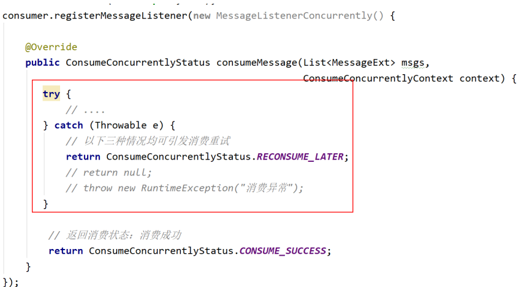

# 基本概念

## 消息（Message）

消息是指，消息系统所传输信息的物理载体，生产和消费数据的最小单位，每条消息必须属于一个主题。

## 主题（Topic）

Topic表示一类消息的集合，每个主题都包含若干条消息，$\textcolor{red}{每条消息只能属于一个主题} $，是RocketMQ进行消息订阅的基本单位。

一个生成者可以同时发送多种Topic的消息；而一个消费者只对某种特定的Topic感兴趣，即只可以订阅和消费一种Topic的消息。

## 标签（Tag）

为消息设置的标签，用于同一主题下区分不同类型的消息。来自同一业务单元的消息，可以根据不同业务目的在同一主题下设置不同标签。标签能够有效地保证代码的清晰度和连贯性，并优化RocketMQ提供的查询系统。消费者可以根据Tag实现对不同子主题的不同消费逻辑，实现更好的扩展性。

## 队列（Queue）

存储消息的物理实体。一个Topic中可以包含多个Queue，每个Queue中存放的就是该Topic的消息。一个Topic的Queue也被称为一个Topic中消息的分区（Partition）。

一个Topic的Queue中的消息只能被一个消费者组中的一个消费者消费。一个Queue中的消息不允许同一个消费者组中的多个消费者同时消费。

## 消息标识（MessageId/Key）

RocketMQ中每个消息拥有唯一的MessageId，且可以携带具有业务标识的Key，以方便对消息的查询。不过需要注意的是，MessageId有两个：在生产者send()消息时会自动生成一个MessageId（msgId），当消息到达Broker后，Broker也会自动生成一个MessageId(offsetMsgId)。msgId、offsetMsgId与key都称为消息标识。

- msgId：由Producer端生成，其生成规则为：
- - ProductIp + 进程IP + MessageClientIdSetter类的ClassLoader的hashCode + 当前时间 + AutomicInteger
- offsetMsgId：由broker端生成，其生成规则为：brokerIP + 物理分区的offset
- key：由用户指定的业务相关的唯一标识。


# 系统架构

## Producer

消息生成者，负责生产消息。Producer通过MQ的负载均衡模块选择相应的Broker集群队列进行消息投递，投递的过程支持快速失败并且低延迟。

RocketMQ中的消息生产者都是以生产者组的信息出现的。生产者组是同一类生成者的集合，这类Producer发送相同Topic类型的消息。

## Consumer

消息消费者，负责消费消息。一个消息消费者会从Broker服务器中获取到消息，并对消息进行相关业务处理。

RocketMQ中的消息消费者都是以$\textcolor{red}{消费者组}$的形式出现的。消费者组是同一类消费者的集合，这类Consumer消费的是同一个Topic类型的消息。消费者组使得在消息消费方面，实现负载均衡和容错的目标变得非常容易。

> 负载均衡是指Queue的负载均衡，而不是消息的负载均衡
>
> > 将一个Topic中的不同的Queue平均分配给同一个Consumer Group的不同Consumer

消费者组中的Consumer的数量应该小于等于Topic的Queue数量。如果超出Queue数量，则多出的Consumer将不能消费消息。一个Topic类型的消息可以被多个消费者组同时消费。

## Name Server

**功能介绍** 

NameServer是一个Broker与Topic路由的注册中心，支持Broker的动态注册与发现。

主要两个功能：

- $\textcolor{red}{Broker管理}$ ：接受Broker集群的注册信息并且保存下来作为路由信息的基本数据；提供心跳检测机制，检查Broker是否还存活。
- $\textcolor{red}{路由信息管理}$ ：每个NameServer中都保存着Broker集群的整个路由信息和用于客户端查询的队列信息。Producer和Consumer通过NameServer可以获取整个Broker集群的路由信息，从而进行消息的投递和消费。

**路由注册**

NameServer通常也是以集群的方式部署，不过，NameServer是无状态的，即NameServer集群中的各个节点间是无差异的，各个节点间相互不进行消息通讯。那各节点中的数据是如何进行数据同步的呢？在Broker节点启动时，轮训NameServer列表，与每个NameServer节点建立长连接，发起注册请求。在NameServer内部维护着一个Broker列表，用来动态存储Broker的信息。

Broker节点为了证明自己是活着的，为了维护与NameServer间的长连接，会将最新的信息以心跳包的方式上报给NameServer，每30秒发送一次心跳包后，会更新心跳时间戳，记录这个Broker的最新存活时间。

**路由剔除** 

由于Broker关机、宕机或网络抖动等原因，NameServer没有收到Broker的心跳，NameServer可能会将其从Broker列表中剔除。

NameServer中有一个定时任务，每隔10秒就会扫描一次Broker表，查看每一个Broker的最新心跳时间戳距离当前时间是否超过120秒，如果超过，则会判定Broker失效，然后将其从Broker列表中剔除。

**路由发现** 

BroketMQ的路由发现采用的是Pull模型。当Topic路由信息发生变化时，NameServer不会主动推送给客户端，而是客户端定时拉取主题最新的路由。默认客户端每30秒会拉取一次最新的路由。

> Push模型：推送模型。需要维护一个长连接，其实时性较好。
>
> Pull模型：拉取模型。存在的问题是，实时性较差。
>
> Long Polling模型：长轮询模型。其是对Push与Pull模型的整合，充分利用了这两种模型的优势，屏蔽了它们的劣势。

**客户端NameServer选择策略** 

客户端在配置时必须要写上NameServer集群的地址，那么客户端到底连接的是哪个NameServer节点呢？客户端首先会选取一个随机数，然后再与NameServer节点数量取模，此时得到的就是所要连接的节点索引，然后就会进行连接。如果连接失败，则会采用round-robin策略，逐个尝试着去连接其它节点。

> 客户端指的是Producer和Consumer

首先采取的是随机策略进行选择，失败后采用轮询策略。

> 扩展：Zookeeper Client是如何选择Zookeeper Server的？
>
> 简单来说就是，经历两次Shuffle，然后选择一台Zookeeper Server
>
> 详细说就是：将配置文件中的zk Server地址进行一次shuffle，然后随机选择一个。这个选择出的一般都是一个hosthome。然后获取到该hosthome对应空的所有ip，再对这些ip进行第二次shuffle，从shuffle过的结果中取第一个server地址进行连接。

## Broker

**功能介绍**

消息中转角色，负责存储消息、转发消息。Broker在RocketMQ系统中负责接收并存储从生产者发送来的消息，同时为消费者的拉取请求作准备。Broker同时也存储着消息相关的元数据，包括消费者组消费进度偏移offset、主题、队列等。

**模块组成** 


$\textcolor{red}{Remoting Module}$ :整个Broker的实体，负责处理来自Clients端的请求。而这个Broker实体则由以下模块构成。

$\textcolor{red}{Client Manager}$ ：客户端管理器。负责接收、解析客户端（Producer/Consumer）请求，管理客户端。例如，维护Consumer的Topic订阅消息。

$\textcolor{red}{Store Service} $ ：存储服务。提供方便简单的API接口，处理消息存储到物理硬盘和消息查询功能。

$\textcolor{red}{HA Service}$ ：高可用服务，提供Master Broker和Slave Broker之间的数据同步功能。

$\textcolor{red}{Index Service}$ ：索引服务。根据特定的Message Key，对投递到Broker的消息进行索引服务，同时也提供根据Message Key对消息进行快速查询的功能。

**集群部署** 

为了增强Broker性能与吞吐量，Broker一般都是以集群形式出现的。各集群节点中可能存放着相同Topic的不同Queue。不过，这里有个问题，如果某Broker节点宕机，如何保证数据不丢失呢？其解决方案是，将每个Broker集群节点进行横向扩展，即将Broker节点再建为一个HA集群，解决单点问题。

Broker节点集群是一个主从集群，即集群中具有Master与Slave两种角色。Master负责处理读写操作请求，Slave负责对Master中的数据进行备份。当Master挂掉了，Slave则会自动切换为Master去工作。所以这个Broker集群是主备集群。一个Master可以包含多个Slave，但一个Slave只能隶属于一个Master。 Master与Slave 的对应关系是通过指定相同的BrokerName、不同的BrokerId 来确定的。BrokerId为0表 示Master，非0表示Slave。每个Broker与NameServer集群中的所有节点建立长连接，定时注册Topic信息到所有NameServer。

## 工作流程

**具体流程** 

1）启动NameServer，NameServer启动后开始监听端口，等待Broker、Producer、Consumer连接。

2）启动Broker时，Broker会与所有的NameServer建立并保持长连接，然后每30秒向NameServer定时发送心跳包。

3）发送消息前，可以先创建Topic，创建Topic时需要指定该Topic要存储在哪些Broker上，当然，在创建Topic时也会将Topic与Broker的关系写入到NameServer中。不过，这步是可选的，也可以在发送消息时自动创建Topic。 

4）Producer发送消息，启动时先跟NameServer集群中的其中一台建立长连接，并从NameServer中获取路由信息，即当前发送的Topic消息的Queue与Broker的地址（IP+Port）的映射关系。然后根据算法策略从队选择一个Queue，与队列所在的Broker建立长连接从而向Broker发消息。当然，在获取到路由信息后，Producer会首先将路由信息缓存到本地，再每30秒从NameServer更新一次路由信息。

5）Consumer跟Producer类似，跟其中一台NameServer建立长连接，获取其所订阅Topic的路由信息，然后根据算法策略从路由信息中获取到其所要消费的Queue，然后直接跟Broker建立长连接，开始消费其中的消息Consumer在获取到路由信息后，同样也会每30秒从NameServer更新一次路由信息。不过不同于Producer的是，Consumer还会向Broker发送心跳，以确保Broker的存活状态。

**Topic的创建模式** 

手动创建Topic时，有两种模式：

- 集群模式：该模式下创建的Topic在该集群中，所有Broker中的Queue数量是相同的。
- Broker模式：该模式下创建的Topic在该集群中，每个Broker中的Queue数量可以不同。

自动创建Topic时，默认采用的是Broker模式，会为每个Broker默认创建4个Queue。 

**读/写队列** 

从物理上来讲，读/写队列是同一个队列。所以，不存在读/写队列数据同步问题。读/写队列是逻辑上进行区分的概念。一般情况下，读/写队列数量是相同的。例如，创建Topic时设置的写队列数量为8，读队列数量为4，此时系统会创建8个Queue，分别是0 1 2 3 4 5 6 7。Producer会将消息写入到这8个队列，但Consumer只会消费0 1 2 3这4个队列中的消息，4 5 6 7中的消息是不会被消费到的。

再如，创建Topic时设置的写队列数量为4，读队列数量为8，此时系统会创建8个Queue，分别是0 1 2 3 4 5 6 7。Producer会将消息写入到0 1 2 3 这4个队列，但Consumer只会消费0 1 2 3 4 5 6 7这8个队列中的消息，但是4 5 6 7中是没有消息的。此时假设Consumer Group中包含两个Consuer，Consumer1消 费0 1 2 3，而Consumer2消费4 5 6 7。但实际情况是，Consumer2是没有消息可消费的。

也就是说，当读/写队列数量设置不同时，总是有问题的。那么，为什么要这样设计呢？

其这样设计的目的是为了，方便Topic的Queue的缩容。

例如，原来创建的Topic中包含16个Queue，如何能够使其Queue缩容为8个，还不会丢失消息？可以动态修改写队列数量为8，读队列数量不变。此时新的消息只能写入到前8个队列，而消费都消费的却是16个队列中的数据。当发现后8个Queue中的消息消费完毕后，就可以再将读队列数量动态设置为8。整个缩容过程，没有丢失任何消息。

perm用于设置对当前创建Topic的操作权限：2表示只写，4表示只读，6表示读写。

# 集群搭建理论


**复制策略**

复制策略是Broker的Master与Slave间的数据同步方式。分为同步复制和异步复制：

- 同步复制：消息写入master后，master会等待slave同步数据成功后才向Producer返回成功ACK
- 异步复制：消息写入master后，master立即向Producer返回成功ACK，无需等待slave同步数据成功

> 异步复制策略会降低系统的写入延迟，RT变小，提高了系统的吞吐量

**刷盘策略**

刷盘策略指的是broker中消息的落盘方式，即消息发送到broker内存后消息持久化到磁盘的方式。分为同步刷盘和异步刷盘：

- 同步刷盘：当消息持久化到broker的磁盘后才算是消息写入成功。
- 异步刷盘：当消息写入到broker的内存后即表示消息写入成功，无需等待消息持久化的磁盘。

> 1）异步刷盘策略会降低系统的写入延迟，RT变小，提高了系统的吞吐量 
>
> 2）消息写入到Broker的内存，一般是写入到了PageCache 
>
> 3）对于异步 刷盘策略，消息会写入到PageCache后立即返回成功ACK。但并不会立即做落盘操 
>
> 作，而是当PageCache到达一定量时会自动进行落盘。

# RocketMQ工作原理

## 消息的生产

### 消息的生产过程

Producer可以将消息写入到某Broker中的某Queue中，其经历了如下过程：

- Producer发送消息之前，会先向NameServer发出获取消息Topic的路由消息的请求
- NameServer返回该Topic的路由表及Broker列表
- Producer根据代码中指定的Queue选择策略，从Queue列表中选出一个队列，用于后续存储消息
- Producer对消息做一些特殊处理，例如，消息本身超过4m，则会对其进行压缩
- Producer向选择出的Queue所在的Broker发出RPC请求，将消息发送到选择出的Queue

> 路由表：实际是一个Map，key为topic名称，value是一个QueueData实例列表。
>
> ​	简单来说：key为topic名称，value则为所有涉及该topic的BrokerName列表。
>
> > QueueData:一个Broker中该Topic的所有Queue对应一个QueueData。即，只要涉及到该Topic的Broker，一个Broker对应一个QueueData。
> >
> > QueueData包含BrokerName。
>
> Broker列表：实际上也是一个Map。key为BrokerName,value为BrokerName。
>
> > 一套brokerName名称相同的Master-Slave小集群对应一个BrokerData。
> >
> > BrokerData中包含BrokerName及一个map。该map的key为BrokerId，value为Broker对应的地址。
> >
> > > BrokerId为0表示该Broker为Master

### Queue选择算法

对于无序消息，其Queue选择算法，也称为消息投递算法，常见的有两种：

**轮询算法** 

默认选择算法，该算法保证了每个Queue中可以均匀的获取到消息。

**最小投递延迟算法**

该算法会统计每次消息投递的时间延迟，然后根据统计出的结果将消息投递到时间延迟最小的Queue。如果延迟相同，则采用轮询算法投递。

## 消息的存储

RocketMQ中消息存储在本地文件系统中，这些相关文件默认在当前用户主目录下的store目录中。


### commitlog文件

**目录与文件** 

commitlog目录中存放着mappedFile文件，当前Broker中的所有消息都是被刷盘到这个mappedFile文件中的。mappedFile文件大小为1G，文件名由20位十进制数构成，表示当前文件的一条消息的起始位移偏移量。

需要注意的是，一个Broker中仅包含一个commitlog目录，所有的mappedFile文件都是存在该目录文件中的。即无论当前Broker中存放着多少Topic消息，这些消息都是被顺序写入到mappedFile文件中的。也就是说，这些消息在Broker中存放时并没有被按照Topic进行分类存放。

> mappedFile文件是顺序读写的文件，所有其访问效率很高

**消息单元** 

mappedFile文件内容由一个个的消息单元构成。每个消息单元中包含消息总长度MsgLen、消息的物理位置physicalOffset、消息体内容body、消息体长度BodyLength、消息主题Topic、Topic长度TopicLength、消息生产者BornHost、消息发送时间戳BornTimestamp、消息所在的队列QueueId、消息在Queue中存储的偏移量QueueOffset等近20余项消息相关属性。

### consumerqueue

#### 目录与文件

为了提高效率，会为每个Topic在~/store/consumerqueue中创建一个目录，目录名为Topic名称。在该Topic目录下，会再为每个该Topic的Queue建立一个目录，目录名为queueId。每个目录中存放着若干consumerqueue文件，consumerqueue文件是commitlog的索引文件，可以根据consumerqueue定位到具体的消息。

consumerqueue文件名也由20位数字构成，表示当前文件的第一个索引条目的起始位移偏移量。与mappedFile文件名不同的是，其后续文件名是固定的。因为consumerqueue文件大小是固定不变的。

#### 索引条目 


每个consumerqueue文件可以包含30w个索引条目，每个索引条目包含了三个消息重要属性：消息在mappedFile文件中的偏移量CommitLog Offset、消息长度、消息Tag的hashcode值。这三个属性占20个字节，所以每个文件的大小是固定的30w*20字节。

> 一个consumerqueue文件中所有的Topic一定是相同的。但每条消息的Tag可能不一定

### 对文件的读写

#### 消息写入

一条消息进入到Broker后经历了以下几个过程才最终被持久化。

- Broker根据queueId，获取到该消息对应索引条目要在consumerqueue目录中的写入偏移量，即QueueOffset
- 将queueId、queueOffset等数据，与消息一起封为消息单元
- 将消息单元写入到commitlog
- 同时形成索引条目
- 将消息索引条目分发到相应的consumerqueue

#### 消息拉取

当Consumer来拉取消息时会经历以下几个步骤

- Consumer获取到其要消费消息所在Queue的$\textcolor{red}{消费偏移量offset}$ ，计算出其要消费消息的$\textcolor{red}{消息offset}$ 
- Consumer向Broker发送拉取请求，其中会包含其要拉取消息的Queue、消息offset及消息Tag
- Broker计算在该consumerqueue中的queueOffset
- 从该queueOffset处开始向后查找第一个指定Tag的索引条目。
- 解析该索引条目中的前8个字节，即可定位到该消息在commitlog中的commitlog offset
- 从对应commitlog offset中读取消息单元，并发送给Consumer

#### 性能提升

RocketMQ中，无论是消息本身还是消息索引，都是存储在磁盘上的。其不会影响消息的消费吗？当然不会。其实RocketMQ的性能在目前的MQ产品中性能是非常高的。因为系统通过一系列相关机制大大提升了性能。

首先，RocketMQ对文件的读写操作是通过mmap零拷贝进行的，将对文件的操作转化为直接对内存地址进行操作，从而极大地提高了文件的读写效率。

其次，consumerqueue中的数据是顺序存放的，还引入了PageCache的预读取机制，使得consumerqueue文件的读取几乎接近于内存读取，即使在消息堆积情况下也不会影响性能。

> PageCache机制：页缓存机制，是OS对文件的缓存机制，用于加速对文件的读写操作。一般来说，程序对文件进行顺序读写的速度几乎接近于内存读写速度，主要原因是由于OS使用PageCache机制对读写访问操作进行性能优化，将一部分的内存用作PageCache。
>
> > 写操作：OS会先将数据写入到PageCache中，随后会以异步方式由pdflush（page dirty flush）内核线程将Cache中的数据刷盘到物理磁盘
>
> > 读操作：若用户要读取数据，其首先会从PageCache中读取，若没有命中，则OS在从物理磁盘上加载该数据到PageCache的同时，也会顺序对其相邻数据块中的数据进行预读取。

RocketMQ中可能会影响性能的是对commitlog文件读取。因为commitlog文件来说，读取消息时会产生大量的随机访问，而随机访问会严重影响性能。不过，如果选择合适的系统IO调度算法，比如设置调度算法Deadline（采用SSD固态硬盘的话），随机读的性能也会有所提升。

### 与kafka的对比

RocketMQ的很多思想来源于kafka，其中commitlog与consumerqueue就是。

RocketMQ中的commitlog目录与commitqueue的结合就类似于kafka中的partition分区目录。mappedFile文件就类似于kafka中的segment段。

> kafka中的Topic的消息被分割为一个或多个partition。partition是一个物理概念，对应到系统上就是topic目录下的一个或多个目录。每个partition中包含的文件称为segment，是具体存放消息的文件。
>
> kafka中消息存放的目录结构是：topic目录下有partition目录，partition目录下有segment文件
>
> kafka中没有二级分类标签Tag这个概念
>
> kafka中无需索引文件。因为消息是直接写在partition中的，消费者也是直接从partition中读取数据的

## indexFile

除了通过通常的指定Topic进行消息消费外，RocketMQ还提供了根据key进行消息查询的功能。该查询是通过store目录中的index子目录中的indexFile进行索引实现的快速查询。当然，这个indexFile中的索引数据是在包含了key的消息被发送到Broker时写入的。如果消息中没有包含key，则不会写入。


### 索引条目结构

每个Broker中会包含一组indexFile，每个indexFile都是以一个时间戳命名的。每个indexFile文件由三部分构成；indexFile、Slot槽位、indexes索引数据。每个indexFile文件中包含500w个slot槽。而每个slot槽又可能会挂载很多的index索引单元。


indexHeader固定40个字节，其中存放着如下数据：


- beginTimestamp：该indexFile中第一条消息的存储时间
- endTimestamp：该indexFile中最后一条消息存储时间
- beginPhyoffset：该indexFile中第一条消息在commitlog中的偏移量commitlog offset
- endPhyoffset：该indexFile中最后一条消息在commitlog中的偏移量commitlog offset
- hashSlotCount：已经填充有index的slot数量
- indexCount：该indexFile中包含的索引个数（统计当前indexFile中所有slot槽下挂载的所有index索引单元的数量之和）

indexFile中最复杂的是Slots与indexes间的关系。在实际存储时，indexes是在Slots后面的，但便于理解，将它们的关系展示为如下形式：


key为hash值 %500w的结果即为slot槽位，然后将该slot值修改为index索引单元的indexNo，根据这个indexNo可以计算出该index单元在indexFile中的位置。不过，该取模结果的重复率是很高的，为了解决该问题，在每个index索引单元中增加了proIndexNo，用于指定该slot中当前index索引单元的前一个index索引单元。而slot中始终存放的是其最新的index索引单元的indexNo，这样的话，只要找到了slot就可以找到其最新的index索引单元，而通过这个index索引单元就可以找到其之前的所有index索引单元。

> indexNo是一个在indexFile中的流水号，从0开始依次递增。即在一个indexFile中所有indexNo是依次递增的

index索引单元默认20字节，其中存放着以下四个属性：


- keyHash：消息中指定的业务key的hash值
- phyOffset：当前key对应的消息在commitlog中的偏移量commitlog offset
- timeDiff：当前key对应消息的存储时间与当前indexFile创建时间的时间差
- proIndexNo：当前slot下当前index索引单元的前一个index索引单元的indexNo

### indexFile的创建

indexFile的文件名为当前文件被创建时的时间戳。这个时间戳有什么用处呢？

根据业务key进行查询时，查询条件除了key之外，还需要指定一个要查询的时间戳，表示要查询不大于该时间戳的最新的消息。这个时间戳文件名可以简化查询，提高查询效率。


indexFile文件是何时创建的？

- 当第一条带key的消息发送来后，系统发现没有indexFile，此时会创建第一个indexFile文件
- 当一个indexFile中挂载的index索引单元数量超出2000w个时，会创建新的indexFile。当带key的消息发送到来后，系统会找到最新的indexFile，并从其indexHeader的最后4字节中读取到indexCount。若indexCount>= 2000w时，会创建新的indexFile。

### 查询流程

当消费者通过业务key来查询相应的消息时，其需要经过一个相对复杂的查询流程。不过，在分析查询流程之前，首先需要清楚几个定位计算式子：

``` log
计算指定消息key的slot槽位序号：
slot槽位序号 = key的hash % 500w
```

```log
计算槽位序号为n的slot在indexFile中的起始位置：
slot(n)位置 = 40 + （n - 1）* 4
```

```log
计算indexNo为m的index在indexFile中的位置：
index(m)位置 = 40 + 500w * 4 + (m - 1) * 20
```

> 40为indexFile中indexHeader的字节数
>
> 500w * 4 是所有slots所占的字节数

具体查询流程如下：


## 消息的消费

消费者Broker中获取消息的方式有两种：pull拉取方式和push推动方式。消费者组对于消息消费的模式又分为两种：集群消费Clustering和广播消费Broadcasting。

### 推拉消费类型

#### 拉取式消费

Consumer主动从Broker中拉取消息，主动权由Consumer控制。一旦获取了批量消息，就会启动消费过程。不过，该方式的实时性较弱，即Broker中有了新的消息是消费者并不能及时发现并消费。

#### 推送式消费

该模式下Broker收到数据后会主动推送给Consumer。该消费模式一般实时性较高。

该消费类型是典型的发布-订阅模式，即Consumer向其关联的Queue注册了监听器，一旦发现有新的消息到来就会触发回调的执行，回调方法是Consumer去Queue中拉取消息。而这些都是基于Consumer与Broker间的长连接的。长连接的维护是需要消耗系统资源的。

#### 对比

- pull：需要应用去实现Queue的遍历，实时性差；但便于应用控制消息的拉取
- push：封装了对关联Queue的遍历，实时性强，但会占用较多的系统资源

### 消费模式

#### 广播模式

广播消费模式下，相同Consumer Group的每个Consumer实例都接收同一个Topic的全量消息。即每条消息都会被发送到Consumer Group中的每个Consumer。

#### 集群消费

广播消费模式下，相同Consumer Group的每个Consumer实例平摊同一个Topic的全量消息。即每条消息都会被发送到Consumer Group中的某个Consumer。

#### 消息进度保存

- 广播模式：消费进度保存在consumer端。因为广播模式下consumer Group中每个consumer都会消费所有消息，但它们的消费进度是不同。所以consumer各种保存各自的消费进度。
- 集群模式：消费进度保存在Broker中。consumer Group中的所有consumer共同消费同一个Topic中的消息，同一条消息只会被消费一次。消费进度会参加与到了消费的负载均衡中，故消费进度是需要共享的。

### Rebalance机制

#### 什么是Rebalance

Rebalance即再均衡，指的是，将一个Topic下的多个Queue在同一个Consumer Group中的多个Consumer间进行重新分配的过程。

Rebalance机制的本意是为了提升消息的并行消费能力。例如，一个Topic下5个队列，在只有1个消费者的情况下，这个消费者将负责消费这5个队列的消息。如果此时我们增加一个消费者，那么就可以给其中一个消费者分配2个队列，给另一个分配3个队列，从而提升消息的并行消费能力。

#### Rebalance限制

由于一个队列最多分配给一个消费者，因此当某个消费者组下的实例数量大于队列的数量时，多余的消费者实例将分配不到任何队列。

#### Rebalance危害

Rebalance的在提升消费能力的同时，也带来一些问题：

==消费暂停：== 在只有一个Consumer时，其负责消费所有队列；在新增了一个Consumer后会触发Rebalance的发生。此时原Consumer就需要暂停部分队列的消费，等到这些队列分配给新的Consumer后，这些暂停消费的队列才能继续被消费。

==消费重复：== Consumer在消费新分配给自己的队列时，必须接着之前Consumer提交的消费进度的offset继续消费。然而默认情况下，offset是异步提交的，这个异步性导致提交到Broker的offset与Consumer实际消费的消息并不一致。这个不一致的差值就是可能会重复消费这个消息。

==消费突刺：== 由于Rebalance可能导致重复消费，如果需要重复消费的消息过多，或者因为Rebalance暂停时间过长从而导致积压了部分消息。那么有可能会导致在Rebalance结束之后瞬间需要消费很多消息。

#### Rebalance产生的原因

- 消费者所订阅的Queue数量发生变化
- 消费者组消费者的数量发生变化

#### Rebalance过程

在Broker中维护着多个Map集合，这些集合中动态存放着当前Topic中Queue的消息、Consumer Group中Consumer实例的消息。一旦发现消费者所订阅的Queue数量发生变化，或消费组中消费者的数量发生变化，立即向Consumer Group中的每个实例发出Rebalance通知。

Consumer实例在接收到通知后会采用Queue分配算法自己获取到相应的Queue，即由Consumer实例自主进行Rebalance。

### Queue分配算法

一个Topic中的Queue只能由Consumer Group中的一个Consumer进行消费，而一个Consumer可以同时消费多个Queue中的消息。那么Queue与Consumer间的配对关系是如何确定的，即Queue要分配给哪个Consumer进行消费，也是有算法策略的。常见的有四种策略。这些策略是通过在创建Consumer时的构造器传过去的。

#### 平均分配策略


该算法是要根据avg=QueueCount / ConsumerCount的计算结果进行分配的。如果能够整除，则按顺序将avg个Queue逐个分配给Consumer；如果不能整除，则将多余出的Queue按照Consumer顺序逐个分配。

#### 环形平均策略

环形平均算法是，根据消费者的顺序，依次在由queue队列组成的环形图中逐个分配。

#### 一致性hash策略

该算法会将consumer的hash值作为Node节点存放到hash环上，然后将queue的hash值也分放到hash环上，通过顺时针方向，距离queue最近的那个consumer就是该queue要分配的consumer。

> 存在的问题：分配不均

#### 同机房策略

该算法会根据queue的部署机房位置和consumer的位置，过滤出当前consumer相同机房的queue。然后按照平均分配策略或环形平均策略对同机房queue进行分配。如果没有同机房queue，则按照平均分配策略或环形平均策略对所有queue进行分配。

#### 对比

两种平均分配策略的分配效率较高，一致性hash策略较低。因为一致性hash算法较复杂。另外，一致性hash策略分配的结果也很大可能存在不平均的情况。

一致性hash算法存在的意义：

其可以有效减少由于消费者扩容或缩容所带来的大量Rebalance。


### 至少一次原则

RocketMQ有一个原则：每条消息必须要被成功消费一次。

什么是成功消费呢？Consumer在消费完消息后会向其消费进度记录器提交其消费消息的offset，offset被成功记录到记录器中，那么这条消费就被成功消费了。

## 订阅关系的一致性

订阅关系的一致性指的是，同一个消费组（Group ID相同）下所有Consumer实例所订阅的Topic与Tag及对消息的处理逻辑必须完全一致。否则，消息消费的逻辑就会混乱，甚至导致消息丢失。


### 正确订阅关系

多个消费者组订阅了多个Topic，并且每个消费者组里的多个消费者实例的订阅关系保持了一致。

### 错误订阅关系

一个消费者组订阅了多个Topic，但是该消费者组里的多个Consumer实例的订阅关系并没有保持一致。

#### 订阅了不同Topic

#### 订阅 了不同Tag

#### 订阅了不同数量的Topic


## offset管理

> 指的是Consumer的消费进度offset

消费进度offset是用来记录每个Queue的不同消费组的消费进度的。根据消费进度记录器的不同，可以分为两种模式：本地模式和远程模式


### offset本地管理模式

当消费模式为广播模式时，offset使用本地模式存储。因为每条消息会被所有的消费者消费，每个消费者管理自己的消费进度，各个消费者之间不存在消费进度的交集。

Consumer在广播模式下offset相关数据以json的形式持久化到Consumer本地磁盘文件中，默认文件路径为当前用户主目录下的rocketmq_offsets/${clientId}/group/Offsets.json。其中{clientId}为当前消费者id，默认为ip@DEFAULT；Group为消费者组名称。


### offset远程管理模式

当消费模式为集群模式时，offset使用远程模式管理。因为所有Consumer实例对消息采用的是负载均衡消费，所有Consumer共享Queue的消费进度。

Consumer在集群消费模式下offset相关数据以json的形式持久化到Broker磁盘文件中，文件路径为当前用户主目录下的store/config/consumerOffset.json。

Broker启动时会加载这个文件，并写入到一个双层Map。外层map的key为topic@group,value为内层map。内层map的key为queueId，value为offset。当发生Rebalance时，新的Consumer会从该Map中获取到相应的数据来继续消费。

> 主要是为了保证Rebalance机制

### offset用途

消费者是如何知道其要消费的？消费者要消费的第一条消息的起始位置是用户自己通过consumer.setConsumerFromWhere()方法指定的。

在Consumer启动后，其要消费的第一条消息的起始位置常用的有三种，这三种位置可以通过枚举类型常量设置。这枚举类型为ConsumerFromWhere。


当消费完一批消息后，Consumer会提交其消费进度offset给Broker，Broker在收到消费进度后将其更新到那个双层Map及consumerOffset.json文件中，然后向该Consumer进行ACK，而ACK内容中包含三项数据：当前消费队列的最小offset（minOffset）、最大offset（maxOffset）、及下次消费的起始offset（nextBeginOffset）。

### 重试队列

当RocketMQ对消息的消费出现异常时，会将发生异常的消息的offset提交到Broker中的重试队列。系统在发生消息消费异常对会对当前的Topic创建一个重试队列，该队列以%RETRY%开头，到达重试时间后进行消费重试。

### offset的同步提交与异步提交

集群消费模式下，Consumer消费完消息后会向Broker提交消费进度offset，其提交方式为两种：

同步提交：消费者在消费完一批消息后会向broker提交这些消息的offset，然后等待broker的成功响应。若在等待超时之前收到了成功响应，则继续读取下一批消息进行消费。若没有收到响应，则会重新提交，直到获取到响应。而在这个等待过程中，消费者是阻塞的。其严重影响了消费者的吞吐量。

异步提交：消费者在消费完一批消息后向broker提交offset，但无需等待broker的成功响应，可以继续读取并消费下一批消息。这种方式增加了消费者的吞吐量。但需要注意，broker在收到提交的offset后，还是会向消费者进行响应的。

## 消费幂等

### 什么是消费幂等

当出现消费者对某条消息重复消费的情况时，重复消费的结果与消费异常的结果是相同的，并且多次消费并未对业务系统产生任何负面影响，那么这个消费过程就是消费幂等的。

> 幂等：若某操作执行多次与执行一次对系统产生的影响是相同的，则称该操作是幂等的。

在互联网应用中，尤其在网络不稳定的情况下，消息很有可能出现重复消费发送或重复消费。如果重复的消息可能会影响业务处理，那么就应该做消息幂等处理。

### 消息重复的场景分析

什么情况下可能会出现消息被重复消费呢？常见的有以下三种情况：

#### 发送时消息重复

当一条消息已经被成功发送到Broker并完成持久化，此时出现了网络闪断，从而导致Broker对Producer应答失败。如果此时Producer意识到消息发送失败并尝试再次发送消息，此时Broker中就可能会出现两条内容并且MessageID也相同的消息，那么后续Consumer就一定会消费两次该消息。

#### 消费时消息重复

消息已投递到Consumer并完成业务处理，当Consumer给Broker反馈应答时网络闪断，Broker没有接收到消费成功响应。为了保证消息至少被消费一次的原则，Broker将在网络恢复后再次尝试投递之前已被处理过的消息。此时消费者就会收到与之前处理过的内容相同、Message ID也相同的消息。

#### Rebalance时消息重复

当Consumer Group中的Consumer数量发生变化时，或其订阅的Topic的Queue数量发生变化时，会触发Rebalance，此时Consumer可能会收到曾经被消费过的消息。

### 通用解决方案

#### 两要素

幂等解决方案的设计中涉及到两项要素：幂等令牌，与唯一性处理。只要充分利用好这两要素，就可以设计出好的幂等解决方案。

- 幂等令牌：是生产者和消费者两者中的既定协议，通常指具备唯⼀业务标识的字符串。例如，订单号、流水号。一般由Producer随着消息一同发送来的。
- 唯一性处理：服务端通过采用⼀定的算法策略，保证同⼀个业务逻辑不会被重复执行成功多次。例如，对同一笔订单的多次支付操作，只会成功一次。

#### 解决方案

对于常见的系统，幂等性操作的通用性解决方案是：

1. 首先通过缓存去重。在缓存中如果已经存在了某幂等令牌，则说明本次操作是重复性操作；若缓存没有命中，则进入下一步。
2. 在唯一性处理之前，先在数据库中查询幂等令牌作为索引的数据是否存在。若存在，则说明本次操作为重复性操作；若不存在，则进入下一步。
3. 在同一事务中完成三项操作：唯一性处理后，将幂等令牌写入到缓存，并将幂等令牌作为唯一索引的数据写入到DB中。

#### 解决方案举例

以支付场景为例：

1.  当支付请求到达后，首先在Redis缓存中却获取key为支付流水号的缓存value。若value不空，则说明本次支付是重复操作，业务系统直接返回调用侧重复支付标识；若value为空，则进入下一步操作
2.  到DBMS中根据支付流水号查询是否存在相应实例。若存在，则说明本次支付是重复操作，业务系统直接返回调用侧重复支付标识；若不存在，则说明本次操作是首次操作，进入下一步完成唯一性处理
3.  在分布式事务中完成三项操作：
4.  - 完成支付任务
   - 将当前支付流水号作为key，任意字符串作为value，通过set(key, value, expireTime)将数据写入到Redis缓存
   - 将当前支付流水号作为主键，与其它相关数据共同写入到DBMS

### 消费幂等的实现

消费幂等的解决方案很简单：为消息指定不会重复的唯一标识。因为Message ID有可能出现重复的情况，所以真正安全的幂等处理，不建议以Message ID作为处理依据。最好的方式是以业务唯一标识作为幂等处理的关键依据，而业务的唯一标识可以通过消息Key设置。

## 消息堆积与消费延迟

### 概念

消息处理流程中，如果Consumer的消费速度跟不上Producer的发送速度，MQ中未处理的消息会越来越多（进的多出的少），这部分消息就被称为堆积消息。消息出现堆积进而会造成消息的消费延迟。以下场景需要重点关注消息堆积和消费延迟问题：

- 业务系统上下游能力不匹配造成的持续堆积，且无法自行恢复。
- 业务系统对消息的消费实时性要求较高，即使是短暂的堆积造成的消费延迟也无法接受。

### 产生的原因


Consumer使用长轮询Pull模式消费消息时，分为以下两个阶段：

#### 消息拉取

Consumer通过长轮询Pull模式批量拉取的方式从服务端获取消息，将拉取到的消息缓存到本地缓冲队列中。对于拉取式消费，在内网环境下会有很高的吞吐量，所以这一阶段一般不会成为消息堆积的瓶颈。

> 一个单线程单分区的低规格主机(Consumer，4C8G)，其可达到几万的TPS。如果是多个分区多个线程，则可以轻松达到几十万的TPS。

#### 消息消费

Consumer将本地缓存的消息提交到消费线程中，使用业务消费逻辑对消息进行处理，处理完毕后获取到一个结果。这是真正的消息消费过程。此时Consumer的消费能力就完全依赖于消息的消费耗时和消费并发度了。如果由于业务处理逻辑复杂等原因，导致处理单条消息的耗时较长，则整体的消息吞吐量肯定不会高，此时就会导致Consumer本地缓冲队列达到上限，停止从服务端拉取消息。

#### 结论

消息堆积的主要瓶颈在于客户端的消费能力，而消费能力由消费耗时和消费并发度决定。注意，消费耗时的优先级要高于消费并发度。即在保证了消费耗时的合理性前提下，再考虑消费并发度问题。

### 消费耗时

影响消息处理时长的主要因素是代码逻辑。而代码逻辑中可能会影响处理时长代码主要有两种类型：CPU内部计算型代码和外部I/O操作型代码。

通常情况下代码中如果没有复杂的递归和循环的话，内部计算耗时相对外部I/O操作来说几乎可以忽略。所以外部IO型代码是影响消息处理时长的主要症结所在。

> 关于下游系统调用逻辑需要进行提前梳理，掌握每个调用操作预期的耗时，这样做是为了能够 判断消费逻辑中IO操作的耗时是否合理。通常消息堆积是由于下游系统出现了服务异常或达到 了DBMS容量限制，导致消费耗时增加。 

> 服务异常，并不仅仅是系统中出现的类似500这样的代码错误，而可能是更加隐蔽的问题。例 如，网络带宽问题。 

> 达到了DBMS容量限制，其也会引发消息的消费耗时增加。

### 消费并发度

一般情况下，消费者端的消费并发度由单节点线程数和节点数量共同决定，其值为单节点线程数*节点数量。不过，通常需要优先调整单节点的线程数，若单机硬件资源达到了上限，则需要通过横向扩展来提高消费并发度。

> 单节点线程数，即单个Consumer所包含的线程数量 
>
> 节点数量，即Consumer Group所包含的Consumer数量 

> 对于普通消息、延时消息及事务消息，并发度计算都是单节点线程数*节点数量。但对于顺序 消息则是不同的。顺序消息的消费并发度等于TopicQueue分区数量。 
>
> 1）全局顺序消息：该类型消息的Topic只有一个Queue分区。其可以保证该Topic的所有消息被顺序消费。为了保证这个全局顺序性，Consumer Group中在同一时刻只能有一个Consumer的一 个线程进行消费。所以其并发度为1。 
>
> 2）分区顺序消息：该类型消息的Topic有多个Queue分区。其仅可以保证该Topic的每个Queue 分区中的消息被顺序消费，不能保证整个Topic中消息的顺序消费。为了保证这个分区顺序性， 每个Queue分区中的消息在Consumer Group中的同一时刻只能有一个Consumer的一个线程进行 消费。即，在同一时刻最多会出现多个Queue分蘖有多个Consumer的多个线程并行消费。所以 其并发度为Topic的分区量。

### 单机线程数计算

对于一台主机中线程池中线程数的设置需要谨慎，不能盲目直接调大线程数，设置过大的线程数反而会带来大量的线程切换的开销。理想环境下单节点的最优线程数计算模型为：C *（T1 + T2）/ T1。

- C：CPU内核数
- T1：CPU内部逻辑计算耗时
- T2：外部IO操作耗时

> 最优线程数 = C *（T1 + T2）/ T1 = C * T1/T1 + C * T2/T1 = C + C * T2/T1

> 注意，该计算出的数值是理想状态下的理论数据，在生产环境中，不建议直接使用。而是根据 当前环境，先设置一个比该值小的数值然后观察其压测效果，然后再根据效果逐步调大线程数，直至找到在该环境中性能最佳时的值。

### 如何避免

为了避免在业务使用时出现非预期的消息堆积和消费延迟问题，需要在前期设计阶段对整个业务逻辑进行完善的排查和梳理。其中最重要的就是梳理消息的消费耗时和设置消息消费的并发度。

#### 梳理消息的消费耗时

通过压测获取消息的消费耗时，并对耗时较高的操作的代码逻辑进行分析。梳理消息的消费耗时需要关注以下信息：

- 消息消费逻辑的计算复杂度是否过高，代码是否存在无限循环和递归等缺陷。
- 消息消费逻辑中的I/O操作是否是必须的，能否用本地缓存等方案规避。
- 消费逻辑中的复杂耗时的操作是否可以做异步化处理。如果可以，是否会造成逻辑错乱。

#### 设置消费并发度

对于消息消费并发度的计算，可以通过以下两步实施：

- 逐步调大单个Consumer节点的线程数，并观测节点的系统指标，得到单个节点最优的消费线程数和消息吞吐量。
- 根据上下游链路的流量峰值计算出需要设置的节点数

> 节点数 = 流量峰值 / 单个节点消息吞吐量

## 消息的清理

消息被消费过后会被清理掉吗？不会的。

消息是被顺序存储在commitlog文件的，且消息大小不定长，所以消息的清理是不可能以消息为单位进行清理的，而是以commitlog文件为单位进行清理的。否则会急剧下降清理效率，并实现逻辑复杂。

commitlog文件存在一个过期时间，默认为72小时，即三天。除了用户手动清理外，在以下情况下也会被自动清理，无论文件中的消息是否被消费过：

- 文件过期，且到达清理时间点（默认为凌晨4点）后，自动清理过期文件
- 文件过期，且磁盘空间占用率已达过期清理警戒线（默认75%）后，无论是否达到清理时间点，都会自动清理过期文件
- 磁盘占用率达到清理警戒线（默认85%）后，开始按照设定好的规则清理文件，无论是否过期。默认会从最老的文件开始清理
- 磁盘占用率达到系统危险警戒线（默认90%）后，Broker将拒绝消息写入

> 需要注意以下几点： 
>
> 1）对于RocketMQ系统来说，删除一个1G大小的文件，是一个压力巨大的IO操作。在删除过程 中，系统性能会骤然下降。所以，其默认清理时间点为凌晨4点，访问量最小的时间。也正因如果，我们要保障磁盘空间的空闲率，不要使系统出现在其它时间点删除commitlog文件的情况。 
>
> 2）官方建议RocketMQ服务的Linux文件系统采用ext4。因为对于文件删除操作，ext4要比ext3性 能更好 

# RocketMQ应用

## 普通消息

### 消息发送分类

Producer对于消息的发送方式也有多种选择，不同的方式会产生不同的系统效果。

#### 同步发送消息

同步发送消息是指，Producer发出⼀条消息后，会在收到MQ返回的ACK之后才发下⼀条消息。该方式的消息可靠性最高，但消息发送效率太低。


#### 异步发送消息

异步发送消息是指，Producer发出消息后无需等待MQ返回ACK，直接发送下⼀条消息。该方式的消息可靠性可以得到保障，消息发送效率也可以。


#### 单向发送消息

单向发送消息是指，Producer仅负责发送消息，不等待、不处理MQ的ACK。该发送方式时MQ也不返回ACK。该方式的消息发送效率最高，但消息可靠性较差。


## 顺序消息

### 什么是顺序消息

顺序消息指的是，严格按照消息的发送顺序进行消费的消息(FIFO)。

默认情况下生产者会把消息以Round Robin轮询方式发送到不同的Queue分区队列；而消费消息时会从多个Queue上拉取消息，这种情况下的发送和消费是不能保证顺序的。如果将消息仅发送到同一个Queue中，消费时也只从这个Queue上拉取消息，就严格保证了消息的顺序性。

### 为什么需要顺序消息

例如，现在有TOPIC ORDER_STATUS (订单状态)，其下有4个Queue队列，该Topic中的不同消息用于描述当前订单的不同状态。假设订单有状态：未支付、已支付、发货中、发货成功、发货失败。

根据以上订单状态，生产者从时序上可以生成如下几个消息：

订单T0000001:未支付 --> 订单T0000001:已支付 --> 订单T0000001:发货中 --> 订单T0000001:发货失败

发送到MQ中顺序可能出现多次随机组合情况

### 有序性分类

根据有序范围的不同，RocketMQ可以严格地保证两种消息的有序性：分区有序与全局有序。

#### 全局有序性

当发送和消费参与的Queue只有一个时所保证的有序是整个Topic中消息的顺序， 称为全局有序。 


> 在创建Topic时指定Queue的数量。有三种指定方式： 
>
> 1）在代码中创建Producer时，可以指定其自动创建的Topic的Queue数量 
>
> 2）在RocketMQ可视化控制台中手动创建Topic时指定Queue数量 
>
> 3）使用mqadmin命令手动创建Topic时指定Queue数量

#### 分区有序性

如果有多个Queue参与，其仅可保证在该Queue分区队列上的消息顺序，则称为分区有序。


> 如何实现Queue的选择？在定义Producer时我们可以指定消息队列选择器，而这个选择器是我们自己实现了MessageQueueSelector接口定义的。 
>
> 在定义选择器的选择算法时，一般需要使用选择key。这个选择key可以是消息key也可以是其它数据。但无论谁做选择key，都不能重复，都是唯一的。
>
> 一般性的选择算法是，让选择key（或其hash值）与该Topic所包含的Queue的数量取模，其结果即为选择出的Queue的QueueId。 
>
> 取模算法存在一个问题：不同选择key与Queue数量取模结果可能会是相同的，即不同选择key的 消息可能会出现在相同的Queue，即同一个Consuemr可能会消费到不同选择key的消息。这个问 题如何解决？一般性的作法是，从消息中获取到选择key，对其进行判断。若是当前Consumer需 要消费的消息，则直接消费，否则，什么也不做。这种做法要求选择key要能够随着消息一起被Consumer获取到。此时使用消息key作为选择key是比较好的做法。
>
> 以上做法会不会出现如下新的问题呢？不属于那个Consumer的消息被拉取走了，那么应该消费 该消息的Consumer是否还能再消费该消息呢？同一个Queue中的消息不可能被同一个Group中的 不同Consumer同时消费。所以，消费现一个Queue的不同选择key的消息的Consumer一定属于不同的Group。而不同的Group中的Consumer间的消费是相互隔离的，互不影响的。

## 延时消息

### 什么是延时消息

当消息写入到Broker后，在指定的时长后才可被消费处理的消息，称为延时消息。

采用RocketMQ的延时消息可以实现定时任务的功能，而无需使用定时器。典型的应用场景是，电商交易中超时未支付关闭订单的场景，12306平台订票超时未支付取消订票的场景。

### 延时等级

延时消息的延迟时长不支持随意时长的延迟，是通过特定的延迟等级来指定的。延时等级定义在RocketMQ服务端的MessageStoreConfig类中的如下变量中：

```java
private String messageDelayLevel = 1s 5s 10s 30s 1m 2m 3m 4m 5m 6m 7m 8m 9m 10m 20m 30m 1h 2h 1d
```

即，若指定的延时等级为3，则表示延迟时长为10s，即延迟等级是从1开始计数的。当然，如果需要自定义的延时等级，可以通过在broker加载的配置中新增如下配置（例如下面增加了1天这个等级1d）。配置文件在RocketMQ安装目录下的conf目录中。

### 延时消息实现原理


#### 修改消息

Producer将消息发送到Broker后，Broker会首先将消息写入到commitlog文件，然后需要将其分发到相应的consumequeue。不过，在分发之前，系统会先判断消息中是否带有延时等级。若没有，则直接正常分发；若有则需要经历一个复杂的过程：

- 修改消息的Topic为SCHEDULE_TOPIC_XXXX
- 根据延时等级，在consumequeue目录中SCHEDULE_TOPIC_XXXX主题下创建出相应的queueId目录与consumequeue文件（如果没有这些目录与文件的话）。

> 延迟等级delayLevel与queueId的对应关系为queueId = delayLevel -1 
>
> 需要注意，在创建queueId目录时，并不是一次性地将所有延迟等级对应的目录全部创建完毕， 而是用到哪个延迟等级创建哪个目录

- 修改消息索引单元内容。索引单元中的Message Tag HashCode部分原本存放的是消息的Tag的 Hash值。现修改为消息的投递时间。投递时间是指该消息被重新修改为原Topic后再次被写入到commitlog中的时间。投递时间 = 消息存储时间 + 延时等级时间。消息存储时间指的是消息被发送到Broker时的时间戳。
- 将消息索引写入到SCHEDULE_TOPIC_XXXX主题下相应的consumequeue中 

> SCHEDULE_TOPIC_XXXX目录中各个延时等级Queue中的消息是如何排序的？
>
> 是按照消息投递时间排序的。一个Broker中同一等级的所有延时消息会被写入到consumequeue 目录中SCHEDULE_TOPIC_XXXX目录下相同Queue中。即一个Queue中消息投递时间的延迟等级时间是相同的。那么投递时间就取决于于消息存储时间了。即按照消息被发送到Broker的时间进行排序的。

#### 投递延时消息

Broker内部有⼀个延迟消息服务类ScheuleMessageService，其会消费SCHEDULE_TOPIC_XXXX中的消息，即按照每条消息的投递时间，将延时消息投递到⽬标Topic中。不过，在投递之前会从commitlog中将原来写入的消息再次读出，并将其原来的延时等级设置为0，即原消息变为了一条不延迟的普通消息。然后再次将消息投递到目标Topic中。

> ScheuleMessageService在Broker启动时，会创建并启动一个定时器TImer，用于执行相应的定时 任务。系统会根据延时等级的个数，定义相应数量的TimerTask，每个TimerTask负责一个延迟等级消息的消费与投递。每个TimerTask都会检测相应Queue队列的第一条消息是否到期。若第 一条消息未到期，则后面的所有消息更不会到期（消息是按照投递时间排序的）；若第一条消息到期了，则将该消息投递到目标Topic，即消费该消息。

#### 将消息重新写入commitlog

延迟消息服务类ScheuleMessageService将延迟消息再次发送给了commitlog，并再次形成新的消息索引条目，分发到相应Queue。 

## 事务消息

### 问题引入

这里的一个需求场景是：工行用户A向建行用户B转账1万元。

我们可以使用同步消息来处理该需求场景：


1. 工行系统发送一个给B增款1万元的同步消息M给Broker
2. 消息被Broker成功接收后，向工行系统发送成功ACK 
3. 工行系统收到成功ACK后从用户A中扣款1万元
4. 建行系统从Broker中获取到消息M 
5. 建行系统消费消息M，即向用户B中增加1万元

### 解决思路

解决思路是，让第1、2、3步具有原子性，要么全部成功，要么全部失败。即消息发送成功后，必须要保证扣款成功。如果扣款失败，则回滚发送成功的消息。而该思路即使用事务消息。这里要使用分布式事务解决方案。


使用事务消息来处理该需求场景：

1. 事务管理器TM向事务协调器TC发起指令，开启全局事务
2. 工行系统发一个给B增款1万元的事务消息M给TC 
3. TC会向Broker发送半事务消息prepareHalf，将消息M预提交到Broker。此时的建行系统是看不到Broker中的消息M的 


4. Broker会将预提交执行结果Report给TC。 
5. 如果预提交失败，则TC会向TM上报预提交失败的响应，全局事务结束；如果预提交成功，TC会调用工行系统的回调操作，去完成工行用户A的预扣款1万元的操作
6. 工行系统会向TC发送预扣款执行结果，即本地事务的执行状态
7. TC收到预扣款执行结果后，会将结果上报给TM。 
8. TM会根据上报结果向TC发出不同的确认指令

- - 若预扣款成功（本地事务状态为COMMIT_MESSAGE），则TM向TC发送Global Commit指令
- - 若预扣款失败（本地事务状态为ROLLBACK_MESSAGE），则TM向TC发送Global Rollback指令
- - 若现未知状态（本地事务状态为UNKNOW），则会触发工行系统的本地事务状态回查操作。回查操作会将回查结果，即COMMIT_MESSAGE或ROLLBACK_MESSAGE Report给TC。TC将结果上报给TM，TM会再向TC发送最终确认指令Global Commit或Global Rollback 

9. TC在接收到指令后会向Broker与工行系统发出确认指令

- - TC接收的若是Global Commit指令，则向Broker与工行系统发送Branch Commit指令。此时Broker中的消息M才可被建行系统看到；此时的工行用户A中的扣款操作才真正被确认
- - TC接收到的若是Global Rollback指令，则向Broker与工行系统发送Branch Rollback指令。此时Broker中的消息M将被撤销；工行用户A中的扣款操作将被回滚

### 基础

#### 分布式事务

对于分布式事务，通俗地说就是，一次操作由若干分支操作组成，这些分支操作分属不同应用，分布在不同服务器上。分布式事务需要保证这些分支操作要么全部成功，要么全部失败。分布式事务与普通事务一样，就是为了保证操作结果的一致性。

#### 事务消息

 RocketMQ提供了类似X/Open XA的分布式事务功能，通过事务消息能达到分布式事务的最终一致。XA是一种分布式事务解决方案，一种分布式事务处理模式。

#### 半事务消息

暂不能投递的消息，发送方已经成功地将消息发送到了Broker，但是Broker未收到最终确认指令，此时该消息被标记成“暂不能投递”状态，即不能被消费者看到。处于该种状态下的消息即半事务消息。

#### 本地事务状态

Producer回调操作执行的结果为本地事务状态，其会发送给TC，而TC会再发送给TM。TM会根据TC发送来的本地事务状态来决定全局事务确认指令。

#### 消息回查


消息回查，即重新查询本地事务的执行状态。本例就是重新到DB中查看预扣款操作是否执行成功。

> 引发消息回查的原因最常见的有两个： 
>
> 1)回调操作返回UNKNWON 
>
> 2)TC没有接收到TM的最终全局事务确认指令 

#### RocketMQ中的消息回查设置

关于消息回查，有三个常见的属性设置。它们都在broker加载的配置文件中设置，例如：

- transactionTimeout=20，指定TM在20秒内应将最终确认状态发送给TC，否则引发消息回查。默认为60秒 
- transactionCheckMax=5，指定最多回查5次，超过后将丢弃消息并记录错误日志。默认15次。
- transactionCheckInterval=10，指定设置的多次消息回查的时间间隔为10秒。默认为60秒。


## 批量消息

### 批量发送消息

#### 发送限制

生产者进行消息发送时可以一次发送多条消息，这可以大大提升Producer的发送效率。不过需要注意以下几点：

- 批量发送的消息必须具有相同的Topic
- 批量发送的消息必须具有相同的刷盘策略
- 批量发送的消息不能是延时消息与事务消息

#### 批量发送大小

默认情况下，一批发送的消息总大小不能超过4MB字节。如果想超出该值，有两种解决方案：

- 方案一：将批量消息进行拆分，拆分为若干不大于4M的消息集合分多次批量发送
- 方案二：在Producer端与Broker端修改属性
- - Producer端需要在发送前设置Producer的maxMessageSize属性
  - Broker端需要修改其加载的配置文件中的maxMessageSize属性

#### 生产者发送的消息大小

生产者通过send()方法发送的Message，并不是直接将Message序列化后发送到网络上的，而是通过这个Message生成一个字符串发送出去的。这个字符串由四部分构成：Topic、消息body、消息日志（占20字节），及用于描述消息的一堆属性key-value。这些属性中包含例如生成者地址、生成时间、要发送的QueueId等。最终写入到Broker中消息单元中的数据都是来自于这些属性。

### 批量消费消息

#### 修改批量属性

Consumer的MessageListenerConcurrently监听接口的consumerMessage()方法的第一个参数为消息列表，但默认情况下每次只能消费一条消息。若要使其一次可以消费多条消息，则可以通过修改Consumer的consumerMessageBatchMaxSize属性来指定。不过，该值不能超过32。因为默认情况下消费者每次可以拉取的消息最多是32条。若修改一次拉取的最大值，则可以通过修改Consumer的pullBatchSize属性来指定。

#### 存在的问题

Consumer的pullBatchSize属性与consumerMessageBatchMaxSize属性是否设置的越大越好？

当然不是。

- pullBatchSize值设置的越大，Consumer每拉取一次需要的时间就会越长，且在网络上传输出现问题的可能性就越高。若在拉取过程中出现了问题，那么本批次所有消息都需要重写拉取。
- consumerMessageBatchMaxSize值设置的越大，Consumer的消息并发消费能力越低，且这批被消费的消息具有相同的消费结果。因为consumerMessageBatchMaxSize指定的一批消息只会使用一个线程进行处理，且在处理过程中只要有一个消息处理异常，则这批消息需要全部重新再次消费处理。


## 消息过滤

消息者在进行消息订阅时，除了可以指定要订阅消息的Topic外，还可以对指定Topic中的消息根据指定条件进行过滤，即可以订阅比Topic更加细粒度的消息类型。

对指定Topic消息的过滤有两种过滤方法：Tag过滤和SQL过滤。

#### Tag过滤

通过consumer的subscribe()方法指定要订阅消息的Tag。如果订阅多个Tag消息，Tag间使用或运算符（||）连接。

#### SQL过滤

SQL过滤是一种通过特定表达式对事先埋入到消息中的用户属性进行筛选过滤的方式。通过SQL过滤，可以实现对消息的复杂过滤。不过，只有使用PUSH模式的消费者才能使用SQL过滤。

SQL过滤表达式中支持多种常量类型与运算符。

支持的常量类型：

- 数值：123,3.1415
- 字符：'abc'、'aaa' 必须用单引号包裹起来
- 布尔：True、false
- NULL

支持的运算符有：

- 数值比较：>,>=,<,<=,BETWEEN,=
- 字符比较：=,<>,IN
- 逻辑运算：AND,OR,NOT
- NULL判断：IS NULL , IS NOT NULL


默认情况下Broker没有开启消息的SQL过滤功能，需要在Broker加载的配置文件中添加如下属性，以开

启该功能：

```properties
enablePropertyFilter = true
```

在启动Broker时需要指定这个修改过的配置文件。例如对于单机Broker的启动，其修改的配置文件是conf/broker.conf，启动时使用如下命令：

```
sh bin/mqbroker -n localhost:9876 -c conf/broker.conf &
```

## 消息发送重试机制

### 说明

Producer对发送失败的消息进行重新发送的机制，称为消息发送重试机制，也称为消息重投机制。

对于消息重投，需要注意以下几点：

- 生产者在发送消息时，若采用同步或异步发送方式，发送失败会重试，但oneway消息发送方式发送失败是没有重试机制的
- 只有普通消息具有发送重试机制，顺序消息是没有的
- 消息重投机制可以保证消息尽可能发送成功、不丢失，但可能会造成消息重复。消息重复在RocketMQ中是无法避免的问题
- 消息重复在一般情况下不会发生，当出现消息量大、网络抖动，消息重复就会成为大概率事件
- producer主动重发、consumer负载变化（发生Rebalance，不会导致消息重复，但可能出现重复消费）也会导致重复消息
- 消息重复无法避免，但要避免消息的重复消费。
- 避免消息重复消费的解决方案是，为消息添加唯一标识（例如消息key），使消费者对消息进行消费判断来避免重复消费
- 消息发送重试有三种策略可以选择：同步发送失败策略、异步发送失败策略、消息刷盘失败策略

### 同步发送失败策略

对于普通消息，消息发送默认采用round-robin策略来选择所发送到的队列。如果发送失败，默认重试2次。但在重试时是不会选择上次发送失败的Broker，而是选择其它Broker。当然，若只有一个Broker其也只能发送到该Broker，但其会尽量发送到该Broker上的其它Queue。

```java
// 创建一个producer，参数为Producer Group名称 
DefaultMQProducer producer = new DefaultMQProducer("pg"); 
// 指定nameServer地址 
producer.setNamesrvAddr("rocketmqOS:9876"); 
// 设置同步发送失败时重试发送的次数，默认为2次 
producer.setRetryTimesWhenSendFailed(3); 
// 设置发送超时时限为5s，默认3s 
producer.setSendMsgTimeout(5000);
```

同时，Broker还具有失败隔离功能，使Producer尽量选择未发生过发送失败的Broker作为目标Broker。其可以保证其它消息尽量不发送到问题Broker，为了提升消息发送效率，降低消息发送耗时。

> 思考：让我们自己实现失败隔离功能，如何来做？ 
>
> 1）方案一：Producer中维护某JUC的Map集合，其key是发生失败的时间戳，value为Broker实 例。Producer中还维护着一个Set集合，其中存放着所有未发生发送异常的Broker实例。选择目 标Broker是从该Set集合中选择的。再定义一个定时任务，定期从Map集合中将长期未发生发送异常的Broker清理出去，并添加到Set集合。 
>
> 2）方案二：为Producer中的Broker实例添加一个标识，例如是一个AtomicBoolean属性。只要该Broker上发生过发送异常，就将其置为true。选择目标Broker就是选择该属性值为false的Broker。再定义一个定时任务，定期将Broker的该属性置为false。 
>
> 3）方案三：为Producer中的Broker实例添加一个标识，例如是一个AtomicLong属性。只要该Broker上发生过发送异常，就使其值增一。选择目标Broker就是选择该属性值最小的Broker。若 该值相同，采用轮询方式选择。

如果超过重试次数，则抛出异常，由Producer去保证消息不丢。当然当生产者出现RemotingException、MQClientException和MQBrokerException时，Producer会自动重投消息。

### 异步发送失败策略

异步发送失败重试时，异步重试不会选择其他broker，仅在同一个broker上做重试，所以该策略无法保证消息不丢。

```java
DefaultMQProducer producer = new DefaultMQProducer("pg");
producer.setNamesrvAddr("rocketmqOS:9876"); 
// 指定异步发送失败后不进行重试发送 
producer.setRetryTimesWhenSendAsyncFailed(0);
```

### 消息刷盘失败策略

消息刷盘超时（Master或Slave）或slave不可用（slave在做数据同步时向master返回状态不是SEND_OK）时，默认是不会将消息尝试发送到其他Broker的。不过，对于重要消息可以通过在Broker的配置文件设置retryAnotherBrokerWhenNotStoreOK属性为true来开启。

## 消息消费重试机制

###  顺序消息的消费重试

对于顺序消息，当Consumer消费消息失败后，为了保证消息的顺序性，其会自动不断地进行消息重试，直到消费成功。消费重试默认间隔时间为1000毫秒。重试期间应用会出现消息消费被阻塞的情况。

```java
DefaultMQPushConsumer consumer = new DefaultMQPushConsumer("cg"); 
// 顺序消息消费失败的消费重试时间间隔，单位毫秒，默认为1000，其取值范围为[10, 30000] 
consumer.setSuspendCurrentQueueTimeMillis(100);
```

由于对顺序消息的重试是无休止的，不间断的，直至消费成功，所以，对于顺序消息的消费， 务必要保证应用能够及时监控并处理消费失败的情况，避免消费被永久性阻塞。 

### 无序消息的消费重试

对于无序消息（普通消息、延时消息、事务消息），当Consumer消费消息失败时，可以通过设置返回状态达到消息重试的效果。不过需要注意，无序消息的重试只对集群消费方式生效，广播消费方式不提供失败重试特性。即对于广播消费，消费失败后，失败消息不再重试，继续消费后续消息。

### 消费重试次数与间隔

对于无序消息集群消费下的重试消费，每条消息默认最多重试16次，但每次重试的间隔时间是不同的，会逐渐变长。每次重试的间隔时间如下表。

| 重试次数 | 与上次重试的间隔时间 | 重试次数 | 与上次重试的间隔时间 |
| ---- | ---------- | ---- | ---------- |
| 1    | 10秒        | 9    | 7分钟        |
| 2    | 30秒        | 10   | 8分钟        |
| 3    | 1分钟        | 11   | 9分钟        |
| 4    | 2分钟        | 12   | 10分钟       |
| 5    | 3分钟        | 13   | 20分钟       |
| 6    | 4分钟        | 14   | 30分钟       |
| 7    | 5分钟        | 15   | 1小时        |
| 8    | 6分钟        | 16   | 2小时        |

```java
// 修改消费重试次数 
consumer.setMaxReconsumeTimes(10);
```

- 若修改值小于16，则按照指定间隔进行重试 
- 若修改值大于16，则超过16次的重试时间间隔均为2小时 

### 重试队列

对于需要重试消费的消息，并不是Consumer在等待了指定时长后再次去拉取原来的消息进行消费，而是将这些需要重试消费的消息放入到了一个特殊Topic的队列中，而后进行再次消费的。这个特殊的队列就是重试队列。

当出现需要进行重试消费的消息时，Broker会为每个消费组都设置一个Topic名称为%RETRY%consumerGroup@consumerGroup 的重试队列。

> 1）这个重试队列是针对消息才组的，而不是针对每个Topic设置的（一个Topic的消息可以让多 个消费者组进行消费，所以会为这些消费者组各创建一个重试队列） 
>
> 2）只有当出现需要进行重试消费的消息时，才会为该消费者组创建重试队列 

Broker对于重试消息的处理是通过延时消息实现的。先将消息保存到SCHEDULE_TOPIC_XXXX延迟队列中，延迟时间到后，会将消息投递到%RETRY%consumerGroup@consumerGroup重试队列中。

#### 消费重试配置方式



集群消费方式下，消息消费失败后若希望消费重试，则需要在消息监听器接口的实现中明确进行如下三

种方式之一的配置：

- 方式1：返回ConsumeConcurrentlyStatus.RECONSUME_LATER（推荐）
- 方式2：返回Null
- 方式3：抛出异常

#### 消费不重试配置方式


集群消费方式下，消息消费失败后若不希望消费重试，则在捕获到异常后同样也返回与消费成功后的相同的结果，即ConsumeConcurrentlyStatus.CONSUME_SUCCESS，则不进行消费重试。

### 死信队列

#### 什么是死信队列

当一条消息初次消费失败，消息队列会自动进行消费重试；达到最大重试次数后，若消费依然失败，则表明消费者在正常情况下无法正确地消费该消息，此时，消息队列不会立刻将消息丢弃，而是将其发送到该消费者对应的特殊队列中。这个队列就是死信队列（Dead-Letter Queue，DLQ），而其中的消息则称为死信消息（Dead-Letter Message，DLM）。

#### 死信队列的特征

死信队列具有如下特征：

- 死信队列中的消息不会再被消费者正常消费，即DLQ对于消费者是不可见的
- 死信存储有效期与正常消息相同，均为 3 天（commitlog文件的过期时间），3 天后会被自动删除
- 死信队列就是一个特殊的Topic，名称为%DLQ%consumerGroup@consumerGroup ，即每个消费者组都有一个死信队列
- 如果⼀个消费者组未产生死信消息，则不会为其创建相应的死信队列

#### 死信消息的处理

实际上，当⼀条消息进入死信队列，就意味着系统中某些地方出现了问题，从而导致消费者无法正常消费该消息，比如代码中原本就存在Bug。因此，对于死信消息，通常需要开发人员进行特殊处理。最关键的步骤是要排查可疑因素，解决代码中可能存在的Bug，然后再将原来的死信消息再次进行投递消费。