# 创建型模式

## 单例(Singleton)模式

==一个单一的类，负责创建自己的对象，同时确保系统中只有单个被创建。== 

**单例特点：** 

- 某个类只能有一个实例；（构造器私有）
- 它必须自行创建这个实例；（自己编写实例化逻辑）
- 它必须自行向整个系统提供这个实例；（对外提供实例化方法）

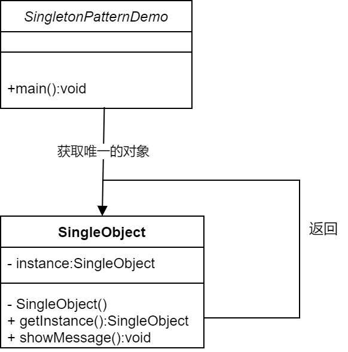

**应用场景**

- 什么场景用到？
- - 多线程中的线程池
  - 数据库的连接池
  - 系统环境信息
  - 上下文（ServletContext）
- 面试问题
- - 系统环境信息（System.getProperties()）？
  - Spring中怎么保持组件单例的？
  - ServletContext是什么？是单例吗？怎么保证？
  - ApplicationContext是什么？是单例吗？怎么保证？
  - 数据库连接池一般怎么创建出来的，怎么保证单实例？

## 原型(Prototype)模式

==原型模式是用于创建重复的对象，同时又能保证性能。== 

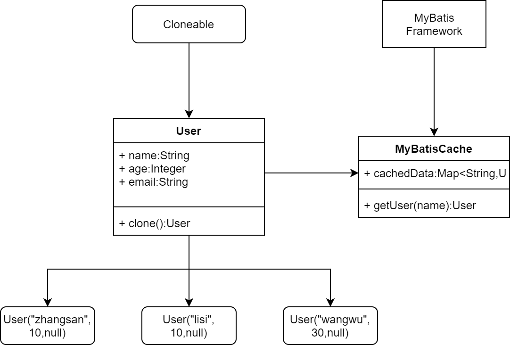

## 工厂(Factory)模式

==工厂模式提供了一种创建对象的最佳方式。我们不必关心对对象的创建细节，只需根据不同情况获取不同产品即可。== 

### 简单工厂模式

三个角色：

- Factory：工厂模式，WuLinFactory
- Product：抽象产品角色，Car
- ConcreteProduct：具体产品角色，VanCar、MiniCar

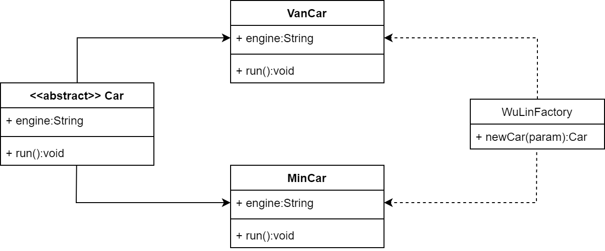

### 工厂方法

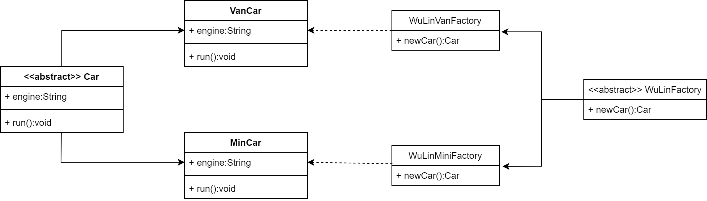

### 抽象工厂

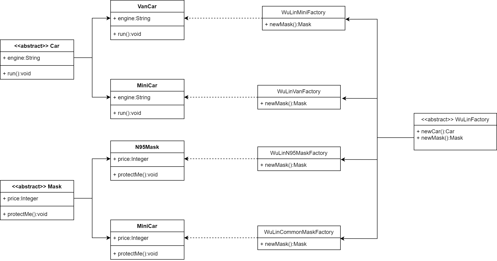

## 建造者(Builder)模式

产品角色（Product）：Phone

抽象者模式（Builder）：AbstractPhoneBuilder

具体建造者（Concrete Builder）：PhoneBuilder

> 链式调用：将void修改成AbstractPhoneBuilder

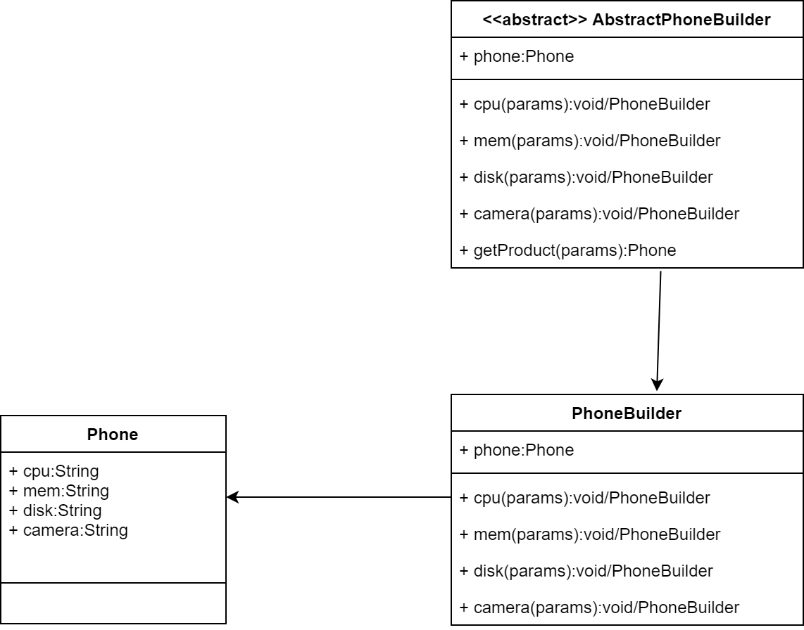

# 结构型模式

## 适配器(Structural Pattern)模式

- 将==一个接口转换== 成客户希望的==另一个接口== ，适配器模式使接口不兼容的那些类可以一起工作，适配器模式分为类结构型模式（继承）和对象结构型模式（组合）两种，前者（继承）类之间的耦合度比之后者高，且要求程序员了解现有组件库中的相关组件的内部结构，所以应用相对比较少些。
- 别名也可以是Wrapper，包装器

适配器模式（Adapter）包含以下主要角色。

- 目标（Target）接口：可以是抽象类或接口，客户希望直接用的接口
- 适配者（Adaptee）类：隐藏的转换接口
- 适配器（Adapter）类：它是一个转换器，突然继承或引用适配器的对象，把适配者接口转换成目标接口。

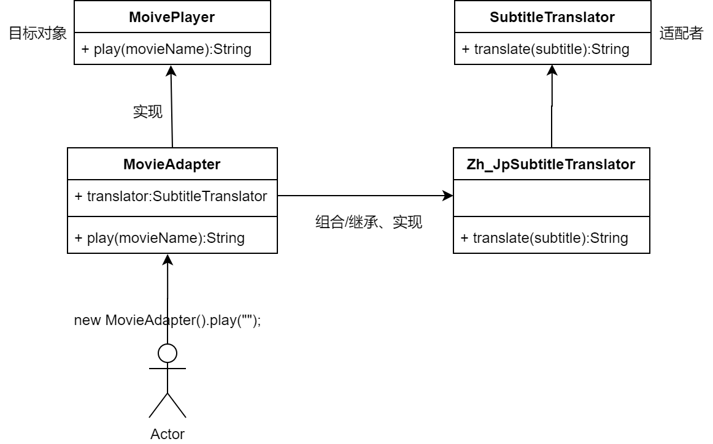

## 桥接模式（Bridge Pattern）

- ==将抽象与实现解耦，使两者都可以独立变化。== 
- 在现象生活中，某些类具有两个或多个维度的变化，如图形可以按形状分，又可以按颜色分。如何设置类似于PS这样的软件，能画不同形状和不同颜色的图形呢？如果用继承方式，m种形状和n种颜色的图形就有m*n种，不但对应的子类很多，而且扩展困难。不同颜色和字体的文字，不同品牌和功率的汽车。
- ==桥接将继承转为关联，降低类之间的耦合度，减少代码量。== 
- 桥接模式包含以下主要角色：
- - 抽象化（Abstraction）角色：定义抽象类，并包含一个对实现化对象的引用。
  - 扩展抽象化（Refined Abstraction）角色：是抽象化角色的子类，实现父类中的业务方法，并通过组合关系调用实现化角色中的业务方法。
  - 实现化（Implementor）角色：定义实现化角色的定义，供扩展抽象化角色调用。
  - 具体实现化（Concrete Implementor）角色：给出实现化角色接口的具体实现。

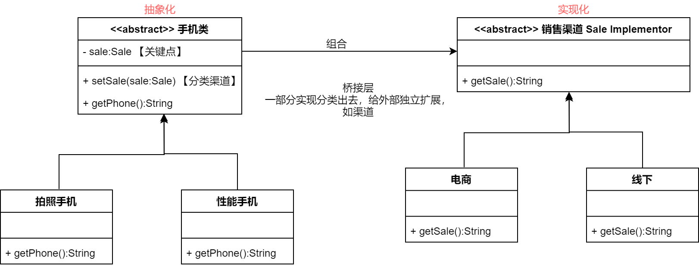

## 装饰器模式（Decorator/Wrapper Pattern）

- 适配器是连接两个类，==可以增强一个类，装饰器是增强一个类== 
- 向一个现有的对象添加新功能，同时又不改变其结构。属于对象结构型模式
- 创建了一个装饰类，用来包装原有的类，并在保持类方法签名完整性的前提下，提供了额外的功能

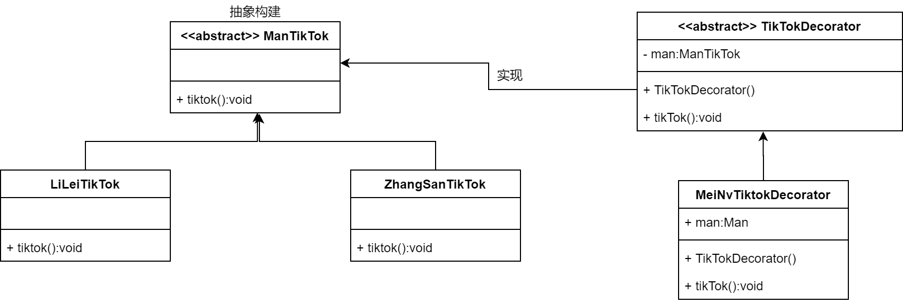

## 代理模式（Proxy Pattern）

- 代理模式，给某一个对象提供一个代理，并由==代理对象控制对原对象的引用== ，对象结构型模式。这种也是静态代理。

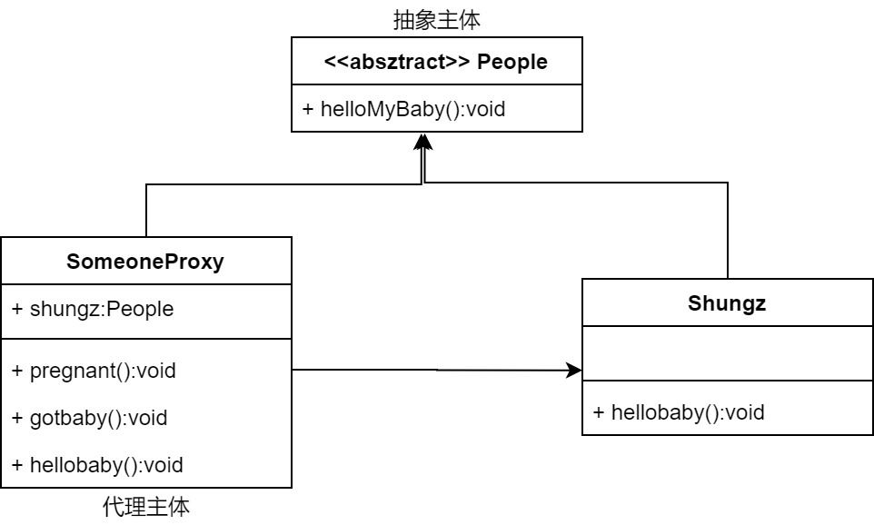

## 组合模式（Composite Pattern）

- 把一组相似的对象当作一个单一的对象。如：树形菜单

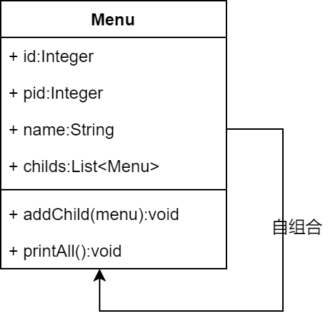

## 外观模式（Facade Pattern）

- 外观模式又叫作门面模式，是一种通过为多个复杂的子系统提供一个一致的接口，而使这些子系统更加容易被访问的模式。

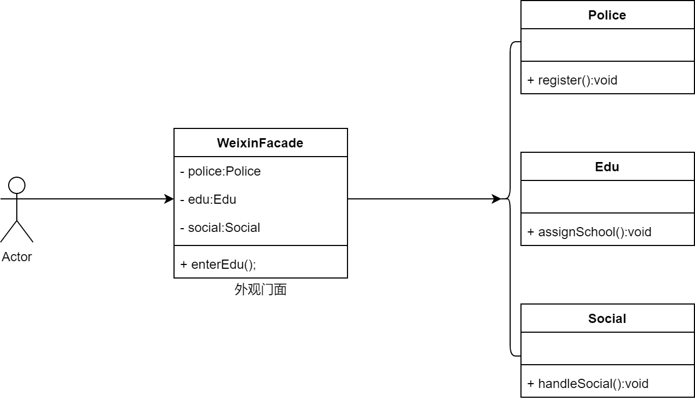

## 享元模式（Flyweight Pattern）

- 享元模式，运用共享技术有效地支持大量细粒度对象的复用。系统只使用少量的对象，而这些对象都很相似，状态变化很小，可以实现对象的多次复用。对象结构型
- 在享元模式中==可以共享的相同内容称为内部状态（IntrinsicState）== ，而那些需要外部环境来设置的==不能共享的内容称为外部状态（Extrinsic State）== ，由于区分了内部状态和外部状态，因此可以通过设置不同的外部状态使得相同的对象可以具有一些不同的特征，而相同的内部状态是可以共享的。
- 在享元模式中通常会出现工厂模式，需要创建一个==享元工厂来负责维护一个享元池（Flyweight Pool）== 用于存储具有相同内部状态的享元对象。
- 包括的角色
- - Flyweight：抽象享元类
  - ConcreteFlyweight：具体享元类
  - UnsharedConcreteFlyweight：非共享具体享元类
  - FlyweightFactory：享元工厂类

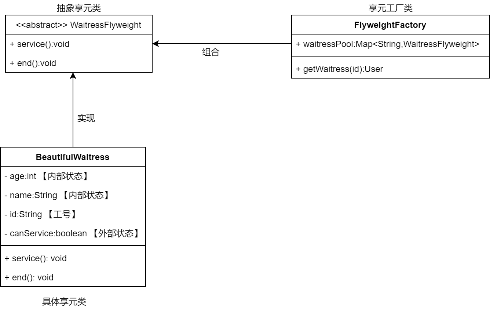

# 行为型模式

## 模板方法（Template Method）

- 在模板模式中，一个抽象类公开定义了执行它的方法的方式模板。它的子类可以按需要重写方法实现，但调用将以抽象类中的定义方式进行。
- 包含角色
- - 抽象类/抽象模板(Abstract Class)
  - 具体实现子类/具体实现(Concrete Class)

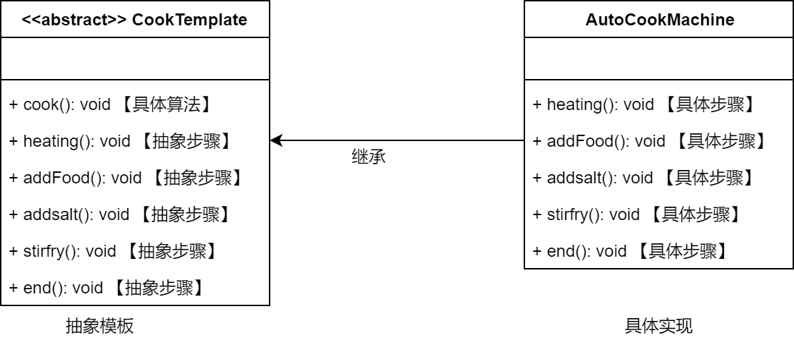

## 策略（Strategy）模式

- 策略模式定义了一系列算法，并将每个算法封装起来，使它们可以相互替换，且算法的变化不会影响使用算法的客户。属于对象行为模式。
- 主要角色：
- - 抽象策略类：公共接口，各种不同的算法以不同的方式实现这个接口，环境角色使用这个接口调用不同的算法，一般使用接口或抽象类实现。
  - 具体策略类：实现了抽象策略定义的接口，提供具体的算法实现。
  - 环境类：持有一个策略类的引用，最终给客户端调用。

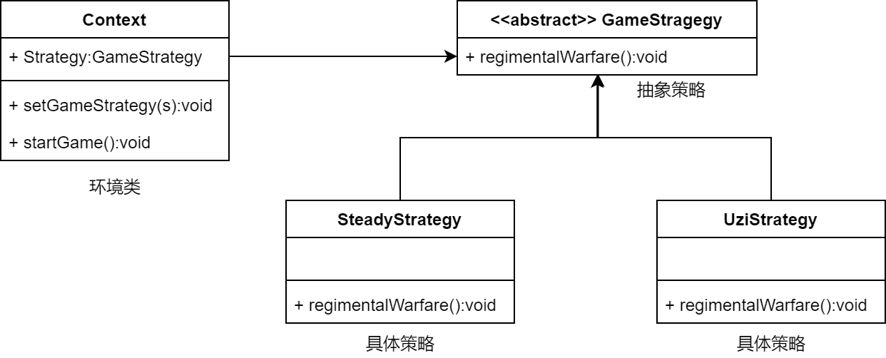

## 状态（State）模式

- 对有状态的对象，把复杂的“判断逻辑”提取到不同的状态对象中，允许状态对象在其内部状态发生改变时改变其行为。
- 主要角色：
- - 环境类（Context）角色：也称为上下文，它定义了客户端需要的接口，内部维护一个当前状态，并负责具体状态的切换。
  - 抽象状态（State）角色：定义一个接口，用以封装环境对象中的特定状态所对应的行为，可以有一个或多个行为。
  - 具体状态（Concrete State）角色：实现抽象状态所对应的行为，并且在需要的情况下进行状态切换。

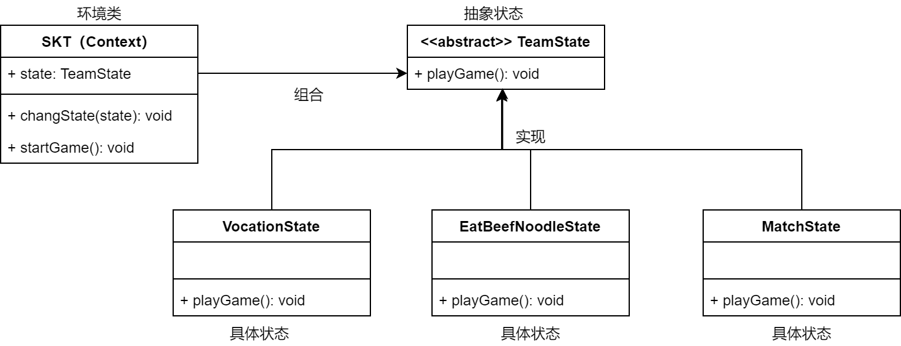

## 中介者（Mediator）模式

- 用一个中介对象来封装一系列的对象交互，中介者使各对象不需要显示地相互引用，减少对象间混乱的依赖关系，从而使其耦合松散，而且可以独立地改变它们之间的交互。对象行为型模式。
- 角色：
- - Mediator：抽象中介者
  - ConcreteMediator：具体中介者
  - Colleague：抽象同事类
  - ConcreteColleague：具体同事类

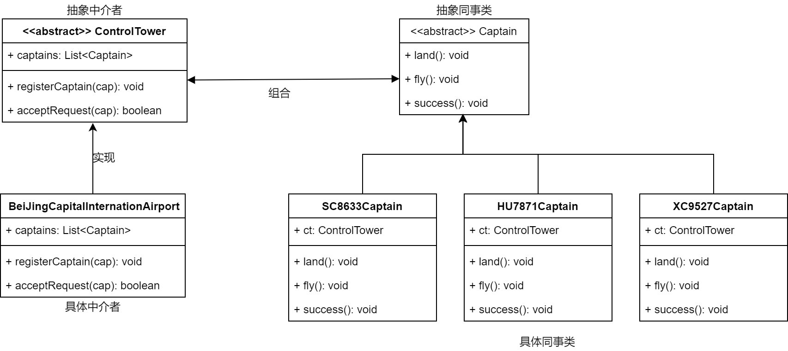

## 观察者（Observer）模式

- 定义对象间的一种**一对多依赖关系** ，使得每**当一个对象状态发生改变** 时，其相关**依赖对象皆得到通知** 并被自动更新。
- 观察者模式又叫做发布-订阅（Public/Subscribe）模式、模型-视图（Mode/View）模式、源-监听器（Source/Listener）模式或从属者（Dependents）模式。
- 角色：
- - Subject：目标
  - ConcreteSubject：具体目标
  - Observer：观察者
  - ConcreteObserver：具体观察者

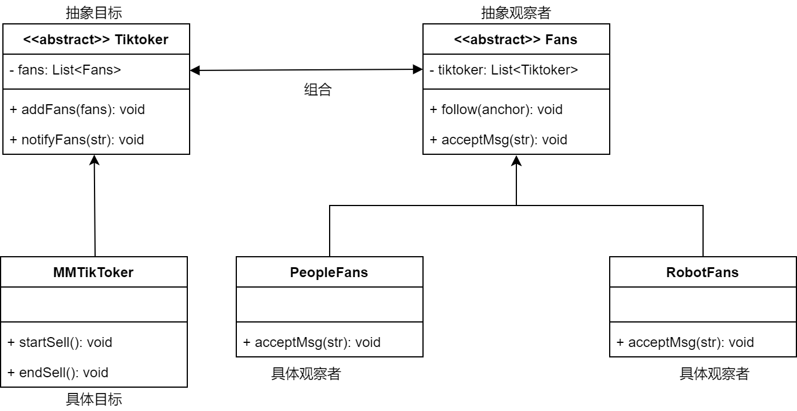

## 解释器（Interpreter）模式 （很少用到）

- 给**分析对象定义一个语言，并定义该语言的文法表示，再设计一个解释器来解释语言中的句子** 。也就是说，用编译语言的方式来分析应用中的实例。这种模式实现了文法表达式处理的接口，该接口解释一个特定的上下文。类行为模式
- 角色：
- - 抽象表达式（Abstract Expression）角色：
  - - 定义解释器的接口，约定解释器的解释操作，主要包含解释方法interpret()
  - 终结符表达式（Terminal Expression）角色：
  - - 是抽象表达式的子类，用来实现方法中与终结符相关的操作，文法中的每一个终结符都有一个具体终结符表达式，。
  - 非终结符表达式（Nonterminal Expression）角色：
  - - 也是抽象表达式的子类，用来实现文法中与非终结符相关的操作，文法中的每条规则都应于一个非终结符表达式。
  - 环境（Context）角色：
  - - 通常包含各个解释器需要的数据或是公共的功能
  - 客户端（Client）
  - - 主要任务是将需要分析的句子或表达式转换成使用解释器对象描述的抽象语法树，然后调用解释器的解释方法，当然也可以通过环境间接访问解释器的解释方法。

## 备忘录（Memento）模式

- 在不破坏封装性的前提下，捕获一个对象的内部状态，并在该对象之外保存这个状态，以便以后当需要时能够将该对象恢复到原先保存的状态。该模式又叫快照模式，对象行为型模式
- 角色：
- - 发起人在（Originator）角色：记录当前时刻的内部状态信息，提供创建备忘录和恢复备忘录数据的功能，实现其他业务功能，它可以访问备忘录里的所有信息。
  - 备忘录（Memento）角色：负责存储发起人的内部状态，在需要的时候提供这些内部状态给发起人。
  - 管理者（Caretaker）角色：对备忘录进行管理，提供保存与获取备忘录的功能，但其不能对备忘录的内容进行访问与修改。

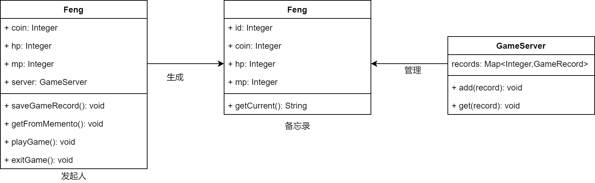

## 命令模式（Command）模式

- 将一个请求封装为一个对象，使发出请求的责任和执行请求的责任分割开。这两者之间通过命令对象进行沟通，这样方便将命令对象进行存储、传递、调用、增加与管理。
- 主要角色：
- - 抽象命令类（Command）角色：声明执行命令的接口，拥有执行命令的抽象方法execute()。
- - 具体命令类（Concrete Command）角色：是抽象命令类的具体实现类，它拥有接收者对象，并通过调用接收者的功能来完成命令要执行的操作。
  - 实现类/接收者（Receiver）角色：执行命令功能的相关操作，是具体命令对象业务的真正实现者。
  - 调用者/请求者（Invoke）角色：是请求的发送者，它通常拥有很多的命令对象，并通过访问命令对象来执行相关请求，它不直接访问接收者。

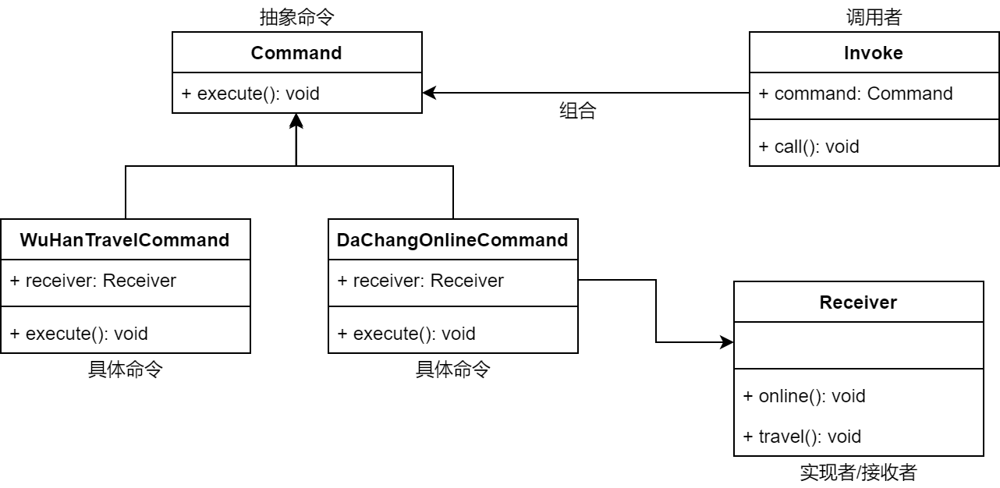

## 迭代器（Iterator）模式

- 提供一个对象（迭代器）来顺序访问聚合对象（迭代数据）中的一系列数据，而不暴露聚合对象的内部表示。对象行为型模式。
- 角色：
- - 抽象聚合（Aggregate）角色：定义存储、添加、删除聚合对象以及创建迭代器对象的接口。
  - 具体聚合（ConcreteAggregate）角色：实现抽象聚合类，放回一个具体迭代器的实例。
  - 抽象迭代器（Iterator）角色：定义访问和遍历聚合元素的接口，通常包含hasNext()、first()、next()等方法。
  - 具体迭代器（ConcreteIterator）角色：实现类抽象迭代器接口中所定义的方法，完成对聚合对象的遍历，记录遍历的当前位置。

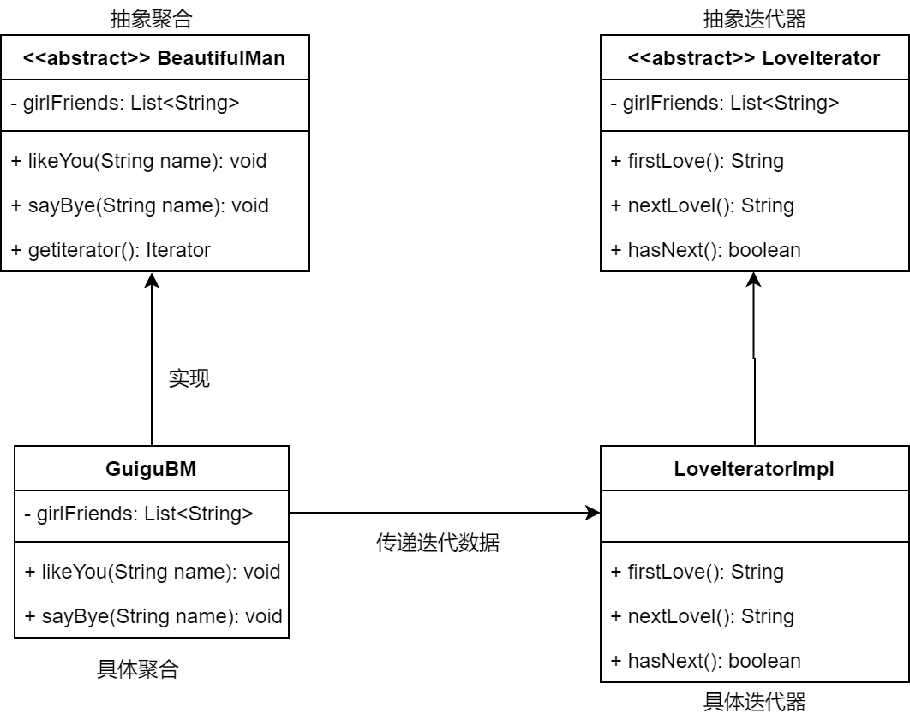

